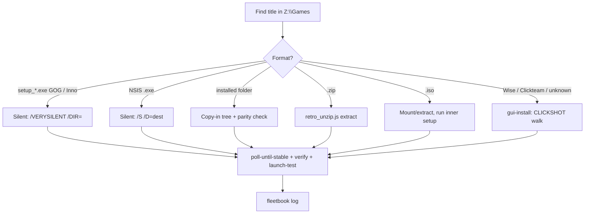

# Install a game from the share onto a fleet box

Goal: take any title from the SMB share's Games library and get it installed and
launch-verified on one or many fleet machines — **headless when the installer has
a working silent switch, GUI-click-walk when it doesn't.**

**Before you start, search the fleetbook** (`scripts/retro_fleetbook.py search
<game or installer type>`) — we may already have the exact recipe (e.g. the
Tribes 2 Wise-installer trap). **After a successful install, log it**
(`retro_fleetbook.py log --host <ip> --summary "..." --recipe <slug>`), and add a
recipe if the title needed a non-obvious step.

## The share (know this)

- **UNC:** `\\192.168.1.122\files` — the fleet maps it as **`Z:`** (creds
  `voidsstr` / `password`). On the dev host it's also gio-mounted at
  `/run/user/1000/gvfs/smb-share:server=192.168.1.122,share=files,user=admin`
  (run `gio mount smb://192.168.1.122/files` first if the path is stale).
- **Library root:** `Z:\Games\` — **~4,195 titles, ~311 GB.** A machine-readable
  index lives at `Z:\Games\_games_index.json` (schema `retro-fleet-games-index/2`:
  `current_library.games[]` with `title/category/size_mb/files`, plus
  `fleet_gpus[]` giving each box's GPU tier). Read it to answer "what's available"
  and to hardware-match a title to a box.

| `Z:\Games\` subdir | What's in it | Typical install |
|---|---|---|
| `GOG` | 23 GOG `setup_*.exe` (InnoSetup) | **silent** `/VERYSILENT /DIR=` |
| `Windows XP` | 201 XP-era titles: setup.exe, ISOs, ZIPs, installed dirs | mixed — detect per item |
| `Windows 98 & Earlier` | 13 titles that WON'T run on XP | 9x boxes only |
| `Freeware & Open Source` | 79 (by genre: FPS-Arena, RPG-Roguelike, …) | NSIS/Inno/Wise/zip |
| `Demos & Shareware` | 132 demos | usually silent-capable |
| `DOS` | 3,670 DOS titles | **use the DOS lane** (DOSGAME.EXE), not this skill |
| `Benchmarks & Tech Demos` | 51 | — |
| `Mods & Patches`, `Magazine Cover Discs` | overlays / disc rips | case-by-case |
| `Installed` | pre-extracted game folders | **copy-in** (no installer) |

Fleet GPU tiers (from the index — match the game to the box): `.124` Voodoo3
(Glide/DX6), `.143` Voodoo5 (Glide/DX6+FSAA), `.133` GeForce4 (DX8), `.240`
GeForce 6800 (DX9), `.123` Radeon HD (DX9), `.145` Intel HD. Don't put a
DX9-only title on a Voodoo box.

## Workflow

1. **Find the source.** Locate the title under `Z:\Games\...`. Use
   `_games_index.json` or `dir /s /b "Z:\Games\*<name>*"` from the box (or `ls`
   the gvfs mount on the host). Note whether it's a `setup_*.exe`, a plain
   `.exe`, an `.iso`, a `.zip`, or an already-installed **folder**.
2. **Pick the target box(es)** and hardware-check against the GPU tier. Skip a box
   that's mid-benchmark or running a fullscreen game (screenshots come back
   garbled and the extra IO skews driver work).
3. **Make the share reachable.** A box's `Z:` can go stale (`net use` shows
   *Unavailable*). `install_lib.remap_share()` (or `net use Z: \\192.168.1.122\files
   /user:voidsstr password`) fixes it. On Win7 the mapping is usually fine but
   **HKLM/`C:\` root writes are UAC-denied** — see gotchas.
4. **Detect the installer type** (`install_lib.detect`) and choose the path:
   - **Headless / silent** (preferred — no watching):
     - **GOG / InnoSetup** (`setup_*.exe`): `/VERYSILENT /SUPPRESSMSGBOXES
       /NORESTART /NOICONS /DIR="<dest>"`
     - **NSIS**: `/S /D=<dest>` (the `/D=` MUST be last and unquoted)
     - **Already-installed folder**: just **copy the tree in** (no installer).
     - **ZIP**: extract with `retro_unzip.js` (no unzip tool on old Windows —
       `cscript //nologo retro_unzip.js <zip> <dest>`; ships in `provisioning/`).
     - **ISO**: mount/extract, then run the `setup.exe` inside (silent if it is).
   - **GUI click-walk** (installer has no silent switch — Wise, Clickteam,
     InstallShield, or an unknown `.exe`): **invoke the `gui-install` skill.**
     `LAUNCH` the installer, then drive it with `FastUI` `CLICKSHOT`/`SCREENDIFF`
     deltas, reading each dialog and clicking Next/Agree/Install. Compute button
     coords from the `WINLIST` rect (the window centers per-resolution). **Raise a
     dialog by its title bar first** if a stray Explorer/screensaver window is
     eating clicks. **Skip email/ad/pre-order pages; never submit the user's info.**
5. **Wait for completion by measuring, not sleeping** — poll the dest folder's
   byte total until stable across 2 reads (`install_lib.poll_until_stable`).
6. **Verify** key files exist + file-count parity (`install_lib.verify`,
   `count_files`), then **smoke-test the launch**: `EXEC cmd /c cd /d "<dir>" ^&^&
   start "" <game>.exe`, wait, `PROCLIST` for the process, then `PROCKILL` it.
   Only after verifying, delete staged installers.
7. **Log to the fleetbook** and, for many boxes, parallelize the mechanical stages
   (`install_lib.parallel`-style) while walking any GUI installer per box.

## `install_lib.py` (the mechanical helpers)

```
detect(c, path)              -> (kind, note)   name + content sniff (Nullsoft/Inno/Wise/…)
writable_root(c)             -> (drive,root,temp)  handles dual-boot D: and Win7 UAC
remap_share(c) / share_ok(c) repair/verify the Z: mapping
install_silent(c,src,dest,kind)  GOG/Inno/NSIS silent run
install_copy_in(c,src,dest)  copy an installed folder (xcopy→robocopy fallback)
poll_until_stable / count_files / folder_bytes / verify(c,dest,key_files)
```
CLI for quick one-offs:
```bash
python3 .claude/skills/game-install/install_lib.py <ip> detect  "Z:\\Games\\GOG\\setup_tyrian_2000_3.01_(76355).exe"
python3 .claude/skills/game-install/install_lib.py <ip> install "Z:\\Games\\GOG\\setup_tyrian...exe" --dest "C:\\Games\\Tyrian2000"
python3 .claude/skills/game-install/install_lib.py <ip> writable   # find a write-safe root
```

## Per-box gotchas (hard-won — don't relearn these)

- **`copy /Y` a single file from the share works even >32 MB** (UPLOAD is capped
  at 32 MB/frame). But **relaying a whole FOLDER box→share→box HANGS `xcopy` on
  XP** — re-stage the installer per box instead of copying a tree over SMB.
- **`xcopy` is broken on several fleet XP boxes** (returns RC=0 but copies
  nothing). `install_lib.install_copy_in` falls back to `robocopy`, then verifies
  file-count parity before trusting it. Plain `copy *.*` per subdir also works.
- **Dual-boot boxes run Windows on `D:`** while `C:` is the old Win9x volume
  (`.124`). `%ProgramFiles%`/`%TEMP%` are on D:, so **install to the same volume as
  `%TEMP%`** or a post-extract `move` becomes a slow, half-failing cross-volume
  copy. `install_lib.writable_root` picks the right drive.
- **Win7 + UAC (`.246`)**: the agent runs at **Medium integrity** — it can't write
  `C:\` root or HKLM, and launching an installer trips UAC's installer-detection,
  which puts a `consent.exe` prompt on the **secure desktop that screenshots and
  WINLIST cannot see or click.** Silent/copy-in installs into `C:\Games` (which IS
  writable) may work; anything needing elevation or a GUI installer is **blocked**
  until UAC is turned off at the console. Don't reboot to "fix" it (auto-login is
  off there → strands the box).
- **The "silent installer is a lie" (Wise)**: some Wise setups (e.g. Tribes 2's
  `tribes2gsi.exe`) extract to `%TEMP%\tempinstall\<Game>` and then **exit without
  moving it** — the window vanishes and the dest stays 0 bytes, looking like a
  failure. Finish it by moving `%TEMP%\tempinstall\<Game>` into place yourself.
- **GUI installs: `LAUNCH` (not `EXEC`)** for the installer (EXEC runs it hidden
  and blocks). Use **`EXECW <secs>`** for long silent installs/copies (EXEC caps
  at 60 s). GUI games launch via `EXEC cmd /c cd /d "<dir>" ^&^& start "" game.exe`.
- **GOG installers spawn a child and return early.** `setup_*.exe` extracts a
  `_*.tmp` child that does the real work, so the `EXECW` on the parent returns
  **before** the install finishes and an immediate `dir` shows an empty/absent
  dest. **Poll the dest until stable** (the skill does this) — don't conclude
  "failed" from an early check. A harmless `Access violation ... suppressed
  message box` at the very end of the Inno log is cosmetic; look for
  `Installation process succeeded` instead. Verified on `.133` 2026-08-04
  (Stargunner: `/VERYSILENT /DIR="C:\Games\Stargunner"` → 113 MB, 40 files).
- **GOG DOS/old titles are DOSBox-wrapped.** The playable exe is the box's own
  (`STARGUN.EXE` under a `DOSBOX\` subdir) launched via `dosbox*.conf`, not a
  single top-level `game.exe`. Launch the GOG `Launch <title>.lnk`/the wrapper,
  or the DOSBox conf — key-file verification should target the real game exe
  inside, not assume `<title>.exe` at the root.
- **Verify before you delete.** Confirm key exe + file-count parity before removing
  any staged installer. Never clean up unconditionally.

## Related

- `gui-install` skill — the real-time CLICKSHOT/SCREENDIFF click-walk engine
  (`FastUI`, `install_lib.py` there). This skill defers all screen-clicking to it.
- DOS titles → the **DOS lane** (`scripts/dosgames/DOSGAME.EXE`), not this skill.
- `onboard-machine` — bulk hardware-appropriate game staging + wallpaper.
- Provenance: install only legally-sourceable titles (freeware, open-source,
  officially-freed, GOG-owned, or the user's own discs) — same policy as the
  game-library pipe; flag anything with torrent/repack markers.
- Fleet map, share creds, agent command reference: repo `CLAUDE.md`.

