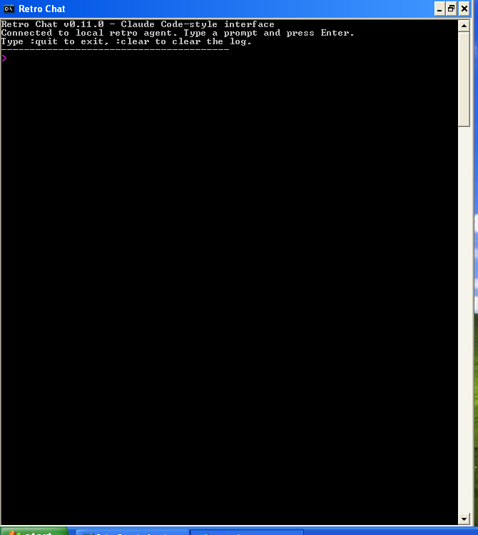
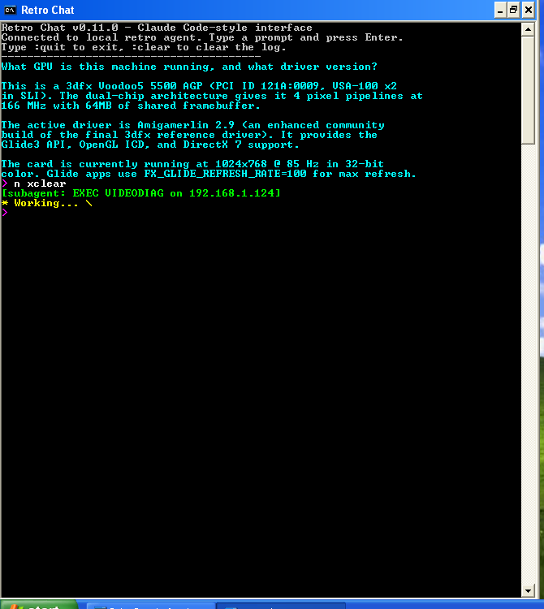
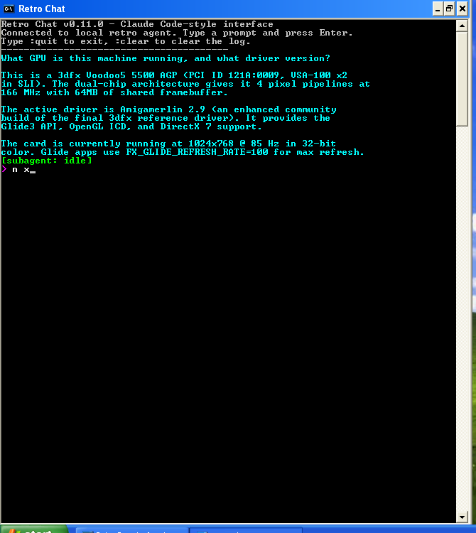

# Retro Agent — AI-Powered Remote Management for Retro PCs

**Give your Pentium II a smarter assistant than most developers had in 2003.**

A ~200KB C binary that runs on Windows 98 SE, 2000, and XP (plus Linux). It exposes system info, file IO, registry, process control, UI automation, and hardware diagnostics over a simple TCP protocol — designed from the ground up to be operated by LLMs.

Connect from Python, pipe it to Claude or GPT, and suddenly your vintage hardware has a state-of-the-art AI that can diagnose why your Sound Blaster isn't working, install NVIDIA drivers via GUI automation, or configure your Voodoo 5500 for optimal Glide performance.

The built-in **Retro Chat** client takes it further: type a prompt directly on the retro PC's console, and a Claude Code subagent on your modern dev box processes it with the *full Claude toolbox* — then streams the response back to your 16-color Win98 terminal.

## Retro Chat — AI on a 25-year-old OS

| Welcome screen | Claude is working | Response rendered |
|---|---|---|
|  |  |  |
| *Launch `retro_chat.exe` on any retro PC.* | *Green = what the AI is doing right now. Yellow = waiting for first token.* | *Response streams in real-time, word-wrapped for the console.* |

### How the chat pipe works

```
   Retro PC (Win98/2K/XP)                          Your dev box (Linux/macOS)
 ┌─────────────────────────────────┐      LAN      ┌────────────────────────────────┐
 │  retro_chat.exe  ──localhost──► │               │  retro_chat_daemon.py          │
 │                                 │               │  (pure network multiplexer)    │
 │  retro_agent.exe ◄──── TCP ─────┤───────────────┤         │                      │
 │   (chatproxy + status bus +     │   port 9898   │         ▼ /tmp/retro-chat/     │
 │    long-polling events)         │               │  inbox/*.json  outbox/*.json   │
 └─────────────────────────────────┘               │   status_outbox/*.json         │
                                                   │         │                      │
                                                   │         ▼                      │
                                                   │  Claude Code background agent  │
                                                   │  (full tools: Read, Bash,      │
                                                   │   Grep, RetroConnection, etc.) │
                                                   └────────────────────────────────┘
```

Three threads run inside `retro_chat.exe`, each on its own socket:
- **`LOG_WAIT`** long-poller — streams response chunks with sub-100ms latency
- **`STATUS_WAIT`** long-poller — shows `[subagent: ...]` live activity in green
- A local spinner thread that animates `* Working... |/-\` with zero network traffic

Zero polling overhead. Zero CPU when idle. The kernel parks each socket in `recv()` until there's something to show.

---

## What Can You Do With It?

### Diagnose Hardware Problems

```
You: "My Sound Blaster isn't working after I installed the new video card"

Claude: I'll check your audio setup...
  [subagent: SYSINFO]
  [subagent: AUDIOINFO]
  [subagent: PCISCAN]
  [subagent: REGREAD HKLM System\CurrentControlSet\...]

Your system has a Sound Blaster 16 (PCI ID 1274:1371) but no
wave driver is loaded. The IRQ conflict with your new GeForce
is preventing the driver from initializing.

I've updated the PCI resource assignments and reloaded the
driver. Try playing a WAV file now.
```

### Install Drivers via GUI Automation

The agent can see the screen, click buttons, and type keystrokes — so it can walk through any installer that requires user interaction:

```python
# Upload the driver installer
await conn.send_command('LAUNCH C:\\TEMP\\nvidia_setup.exe')
await asyncio.sleep(3)

# See what's on screen
bmp = await conn.command_binary('SCREENSHOT 0')

# Click "Next" at coordinates the LLM identified
await conn.send_command('UICLICK 450 380')

# Use Tab + Space for tricky dialogs where clicks don't register
await conn.send_command('UIKEY TAB')
await conn.send_command('UIKEY SPACE')
```

### Manage a Fleet of Retro PCs

```python
from client.retro_discovery import discover_retro_pcs

# Find every retro agent on the LAN
pcs = await discover_retro_pcs(timeout=3.0)
for pc in pcs:
    print(f"{pc.hostname} at {pc.ip} — {pc.os}")

# Run diagnostics on each
for pc in pcs:
    conn = RetroConnection(pc.ip, 9898)
    await conn.connect(SECRET, timeout=15.0)
    _, data = await conn.send_command('SYSINFO')
    info = json.loads(data.decode())
    print(f"  RAM: {info['memory']['total_mb']}MB, "
          f"OS: {info['os']['product']}")
    await conn.close()
```

### Configure Game Settings Remotely

```python
# Read the current Quake 3 config
text = await conn.command_text(
    r'EXEC type "C:\Quake III Arena\baseq3\q3config.cfg"'
)

# Upload a patched config with optimal settings
with open('q3config_optimized.cfg', 'rb') as f:
    payload = f.read()
await conn.send_command(
    r'UPLOAD C:\Quake III Arena\baseq3\q3config.cfg',
    binary_payload=payload
)
```

### Monitor System Health

```python
# Check disk health
_, data = await conn.send_command('SMARTINFO')
smart = json.loads(data.decode())
for disk in smart.get('disks', []):
    print(f"Disk {disk['model']}: temp={disk.get('temperature')}C")

# Check video card
_, data = await conn.send_command('VIDEODIAG')
video = json.loads(data.decode())
print(f"GPU: {video['adapters'][0]['name']}")
print(f"Driver: {video['adapters'][0]['driver_version']}")
print(f"Resolution: {video['display']['resolution']}")
```

### Automate Software Installation

```python
# Copy installer from a network share
await conn.command_text(
    r'EXEC copy "\\server\share\game_setup.exe" C:\TEMP\setup.exe'
)

# Launch the installer (LAUNCH for GUI, never EXEC)
await conn.send_command(r'LAUNCH C:\TEMP\setup.exe')

# Wait for it to appear, then automate the install wizard
await asyncio.sleep(5)
bmp = await conn.command_binary('SCREENSHOT 0')
# ... LLM analyzes screenshot, clicks through wizard ...
```

### Fix Win98 Boot Problems

```python
# The built-in SYSFIX command handles common Win98 issues
text = await conn.command_text('SYSFIX check')
print(text)  # Shows what needs fixing

text = await conn.command_text('SYSFIX apply')
print(text)  # Applies all fixes:
             #   - vcache limit for >512MB RAM
             #   - swap file configuration
             #   - DMA settings
             #   - autologon setup
```

### Take and Analyze Screenshots

```python
from PIL import Image
import io

# Capture the screen at full resolution
bmp_data = await conn.command_binary('SCREENSHOT 0')

# Convert raw BMP to PNG for analysis
img = Image.open(io.BytesIO(bmp_data))
img.save('screen.png')

# Crop a specific region for detail
detail = img.crop((100, 100, 500, 400))
detail.save('detail.png')

# Pass to a vision model for analysis
# (Claude, GPT-4V, etc. can read the PNG directly)
```

### Registry Surgery

```python
# Read a registry value
_, data = await conn.send_command(
    r'REGREAD HKLM SOFTWARE\Microsoft\Windows\CurrentVersion\Run'
)
run_keys = json.loads(data.decode())
print(f"Startup programs: {run_keys.get('values', [])}")

# Write a registry value
await conn.send_command(
    r'REGWRITE HKLM SOFTWARE\MyApp\Settings\Volume 75 REG_DWORD'
)

# Delete a registry key
await conn.send_command(
    r'REGDELETE HKLM SOFTWARE\UnwantedApp'
)
```

---

## Architecture

```
                    TCP :9898               UDP :9899
  ┌──────────┐    <------------->    ┌─────────────────┐
  |  Client   |    commands/         |   retro_agent    |
  | (Python)  |    responses         |  (C, ~200KB)     |---> broadcasts
  └──────────┘                       └─────────────────┘    discovery
                                            |
                                     Win98/XP/2K/Linux
```

**Agent** (`agent/`): Cross-compiled C binary for Windows (MinGW-w64, i586 target). Runs as console app or NT service. ~200KB, no runtime dependencies beyond system DLLs.

**Linux Agent** (`agent-linux/`): Native C binary for x86_64 and ARM. Subset of Windows commands adapted for POSIX.

**Python Client** (`client/`): Async TCP client library. Handles framing, authentication, command dispatch, and LAN discovery.

## Protocol

Length-prefixed binary frames over TCP:

```
Send:    [uint32 LE length][payload bytes]
Receive: [uint32 LE length][status_byte][data bytes]

Status bytes:
  0x00 = text response (ASCII)
  0x01 = binary response (screenshots, file downloads)
  0xFF = error (ASCII error message)
```

Authentication: first frame must be `AUTH <secret>`. Set the secret with `-s <secret>` when starting the agent.

Discovery: agents broadcast `RETRO|hostname|ip|port|os|cpu|ram_mb|os_family` on UDP 9899 every 30 seconds.

## Command Reference

### System Info
| Command | Description | Response |
|---------|-------------|----------|
| `PING` | Health check | `PONG` |
| `SYSINFO` | CPU, memory, OS, drives, uptime | JSON |
| `VIDEODIAG` | Video card, driver, PCI IDs, resolution, DirectX | JSON |
| `AUDIOINFO` | Audio device enumeration | JSON |
| `SMARTINFO` | S.M.A.R.T. disk health | JSON |
| `DISPLAYCFG get` | Display resolution, color depth, refresh rate | JSON |
| `DISPLAYCFG set <w> <h> <bpp> [hz]` | Change display mode | JSON |
| `PCISCAN` | PCI device enumeration with vendor/device IDs | JSON |

### Execution
| Command | Description | Response |
|---------|-------------|----------|
| `EXEC <cmd>` | Run hidden, capture stdout/stderr, block (60s timeout) | text |
| `LAUNCH <cmd>` | Run visible, return immediately | JSON `{pid, command}` |

**Important:** Use `EXEC` for CLI commands that produce text output. Use `LAUNCH` for GUI apps (installers, games, etc.). Using `EXEC` for a GUI app runs it invisibly and blocks the agent.

### Process Control
| Command | Description |
|---------|-------------|
| `PROCLIST` | JSON list of running processes |
| `PROCKILL <pid>` | Terminate process by PID |
| `QUIT` | Stop agent gracefully (for updates) |
| `SHUTDOWN` | Power off machine |
| `REBOOT` | Restart machine |

### File Operations
| Command | Description |
|---------|-------------|
| `DIRLIST <path>` | JSON directory listing (name, size, modified, attributes) |
| `UPLOAD <path>` | Upload file (two-frame: command + binary payload) |
| `DOWNLOAD <path>` | Download file (binary response) |
| `MKDIR <path>` | Create directory (recursive) |
| `DELETE <path>` | Delete file |
| `FILECOPY <src>\|<dst>` | Copy file (pipe-delimited src and dst) |

### UI Automation (Windows)
| Command | Description |
|---------|-------------|
| `SCREENSHOT <quality>` | Capture screen as raw 24-bit BMP. 0=full, 1=half, 2=quarter |
| `UICLICK <x> <y> [button]` | Click at coordinates (left/right/middle) |
| `UIDRAG <x1> <y1> <x2> <y2>` | Drag from one point to another |
| `UIKEY <keyname>` | Send keystroke (e.g. `TAB`, `ENTER`, `ALT SPACE`) |
| `WINLIST` | JSON list of visible windows (hwnd, title, class, rect) |

### Registry (Windows)
| Command | Description |
|---------|-------------|
| `REGREAD <root> <path>` | Read value or enumerate keys |
| `REGWRITE <root> <path> <value> <type>` | Write value (REG_SZ, REG_DWORD, etc.) |
| `REGDELETE <root> <path>` | Delete value or key |

### Network (Windows)
| Command | Description |
|---------|-------------|
| `NETMAP <unc> [drive] [user] [pass]` | Map network share |
| `NETUNMAP <drive>` | Disconnect mapped drive |

### Hardware & Diagnostics (Windows)
| Command | Description |
|---------|-------------|
| `DRVSNAPSHOT` | Capture driver configuration state |
| `SYSFIX [check\|apply]` | Check/apply Win98 system fixes (vcache, swap, DMA, autologon) |
| `XPACTIVATE [check\|apply]` | Check/apply Windows XP activation bypass |

### Chat Proxy (Claude Code interface)
| Command | Direction | Purpose |
|---------|-----------|---------|
| `PROMPT_PUSH <text>` | client -> agent | Submit a user prompt |
| `PROMPT_WAIT [timeout_ms]` | daemon -> agent | Long-poll for next prompt |
| `LOG_APPEND <text>` | daemon -> agent | Stream response text to the log buffer |
| `LOG_WAIT <offset> [timeout_ms]` | client -> agent | Long-poll for new response content |
| `STATUS_SET <text>` | daemon -> agent | Set the subagent activity indicator |
| `STATUS_WAIT <seq> [timeout_ms]` | client -> agent | Long-poll for status changes |
| `LOG_CLEAR` | any | Reset prompt, log, and status |
| `PROXY_GET` / `PROXY_SET <host>` | any | Read/write the owning dev box IP |

### Linux-Only
| Command | Description |
|---------|-------------|
| `PKGINSTALL <name>` | Install package (auto-detects apt/yum/pacman) |
| `PKGLIST` | List installed packages |
| `SVCINSTALL` | Manage systemd services |

## Getting Started

### 1. Build the Agent

Requires `i686-w64-mingw32-gcc` (MinGW-w64 cross-compiler):

```bash
cd agent && make clean && make
# Output: retro_agent.exe (~200KB)
```

For Linux targets:
```bash
cd agent-linux && make clean && make
# ARM cross-compile: make arm
```

### 2. Deploy to Retro PCs

Copy the binary and run it:

```cmd
:: On the retro PC
copy \\your-server\share\retro_agent.exe C:\RETRO_AGENT\retro_agent.exe
C:\RETRO_AGENT\retro_agent.exe -s your-secret-here
```

Or use the provided installer batch:
```cmd
:: Edit install_agent.bat first to set your share path and secret
\\your-server\share\install_agent.bat
```

The installer copies the agent + chat client, registers both for autostart, and configures auto-update.

### 3. Connect from Python

```python
import asyncio
from client.retro_protocol import RetroConnection

async def main():
    conn = RetroConnection('10.0.0.50', 9898)  # your agent's IP
    await conn.connect('your-secret-here', timeout=15.0)

    # Get system info
    status, data = await conn.send_command('SYSINFO')
    print(data.decode('ascii'))

    # Run a command
    text = await conn.command_text('EXEC dir C:\\WINDOWS')
    print(text)

    # Take a screenshot
    bmp_data = await conn.command_binary('SCREENSHOT 0')

    await conn.close()

asyncio.run(main())
```

### 4. Set Up the Chat Client (Optional)

On the retro PC, launch the chat client:
```cmd
C:\RETRO_AGENT\retro_chat.exe
```

On your dev box, start the daemon:
```bash
python3 agent/tools/retro_chat_daemon.py &
```

Then run a Claude Code background subagent to process prompts from `/tmp/retro-chat/inbox` and write responses to `/tmp/retro-chat/outbox`. The daemon handles all network IO.

### Agent Flags

| Flag | Description |
|------|-------------|
| `-s <secret>` | Authentication secret (**always set this** — don't use the default) |
| `-p <port>` | TCP port (default: 9898) |
| `-l <logfile>` | Enable file logging |
| `-m` | Force multiplex mode (required for Win98) |
| `-t` | Force threaded mode (NT only) |

## Security

- **Always set a custom secret** with `-s <secret>`. The default is intentionally weak and meant only for initial testing.
- The agent listens on **all interfaces**. In production, restrict access via firewall rules or run on an isolated LAN.
- The agent can execute arbitrary commands, read/write files, and modify the registry. **Only deploy on machines you trust the connecting client to fully control.**
- SMB share credentials in the provisioning scripts are placeholders. Edit them for your environment before deploying.
- The chat proxy (`PROMPT_PUSH`, `LOG_APPEND`, etc.) has no additional authentication beyond the agent secret. Anyone who can connect to the agent can read and write chat messages.

## Auto-Update

The agent checks for newer binaries on a configurable network share ~15 seconds after startup:

1. Compares local binary size vs. share copy
2. If different: downloads new binary to temp location, writes a restart batch, and exits
3. The batch waits for the old process to die, swaps the binary, and relaunches

The chat client (`retro_chat.exe`) is also auto-updated by the agent — it kills the running chat process, copies the new binary, and relaunches.

Configure the update paths in the registry:
```
HKLM\Software\RetroAgent\UpdatePath     = \\your-server\share\retro_agent.exe
HKLM\Software\RetroAgent\ChatUpdatePath = \\your-server\share\retro_chat.exe
```

Or use the installer, which sets these automatically.

## Releasing New Versions

```bash
# Agent
cd agent
make release                  # patch bump
make release BUMP=minor       # minor bump
make release BUMP=major       # major bump

# Chat client
cd agent/tools
make release                  # patch bump
make release BUMP=minor       # minor bump
```

Each release tags the build, compiles, and uploads both a versioned binary (for rollback) and a "latest" pointer (for auto-update).

**Note:** Edit `SMB_CREDS` and `SMB_BASE` in the Makefiles to match your network share.

## Win98 Known Issues

### vcache / MaxFileCache (Critical)

Windows 98 with >512MB RAM requires `MaxFileCache=262144` in `[vcache]` section of `C:\WINDOWS\SYSTEM.INI`. Without this, the disk cache exhausts VxD address space, causing "Windows Protection Error" on boot. The agent's `SYSFIX apply` command fixes this automatically.

### Ghost PCI Entries

Removed hardware leaves registry entries under `HKLM\Enum\PCI` that claim resources and block PnP detection of new cards. Use `PCISCAN` to identify ghosts, then delete via uploaded `.reg` files.

### Win98 RST Crash

Abrupt TCP disconnects (RST packets) can crash Win98's Winsock implementation. Always close connections gracefully. If running the agent behind Docker or a reverse proxy, ensure clean TCP FIN shutdown.

### EXEC and Paths with Spaces

On Win98, `EXEC` wraps commands with `COMMAND.COM /C` which breaks on paths with spaces, even when quoted. Use 8.3 short names (`C:\PROGRA~1` instead of `C:\Program Files`) or the `DIRLIST` command (which handles spaces correctly).

## LLM Integration Patterns

### Diagnostic Workflow

An LLM receives a problem description and autonomously investigates:

1. `SYSINFO` + `AUDIOINFO` / `VIDEODIAG` / `PCISCAN` to understand hardware
2. `REGREAD` to check driver configuration
3. `SCREENSHOT` to see the current display state
4. `REGWRITE` / `UPLOAD` / `EXEC` to apply fixes
5. Verify the fix with another round of diagnostics

### GUI Automation Workflow

For software that requires a graphical installer:

1. `UPLOAD` or `EXEC copy` to get the installer onto the machine
2. `LAUNCH` the installer (never `EXEC` for GUI apps)
3. Loop: `SCREENSHOT` -> vision model analyzes -> `UICLICK`/`UIKEY` to interact
4. Post-install cleanup via `.reg` file uploads
5. `REBOOT` and verify

### Fleet Management Workflow

For managing multiple retro PCs:

1. `discover_retro_pcs()` to find all agents on the LAN
2. Connect to each, run `SYSINFO` / `PCISCAN` / `VIDEODIAG` for inventory
3. Push updates via `UPLOAD` + auto-update mechanism
4. Monitor health via periodic `PING` checks

### Key Constraints

- **EXEC vs LAUNCH**: EXEC blocks and captures output. LAUNCH returns immediately. Wrong choice hangs the agent.
- **FILECOPY delimiter**: Uses pipe `|` between source and destination, not space.
- **REGREAD format**: `REGREAD HKLM Path\\To\\Key` (root abbreviation + path, space-separated).
- **Screenshot format**: Raw 24-bit BMP. Convert to PNG with Pillow before passing to a vision model.
- **Timeouts**: Default 60s for commands, 120s for binary responses.
- **REBOOT/SHUTDOWN are destructive**: Retro machines may require physical access to recover.

## Project Structure

```
retro-agent/
+-- agent/                  # Windows agent (C, MinGW cross-compiled)
|   +-- Makefile
|   +-- src/                # C source files
|   +-- tools/              # retro_chat client (C) + daemon (Python)
|   +-- lib/
|       +-- libmsvcrt.a     # Patched import lib (Win98 compatible)
+-- agent-linux/            # Linux agent (C, native)
|   +-- Makefile
|   +-- src/
+-- client/                 # Python async client library
|   +-- retro_protocol.py   # TCP protocol client (RetroConnection)
|   +-- retro_discovery.py  # UDP LAN discovery
+-- provisioning/           # Installation scripts and registry templates
|   +-- win98/
+-- docs/
    +-- images/             # Screenshots for this README
    +-- case-studies/       # Real-world diagnostic walkthroughs
```

## Contributing

The agent is designed to be extended with new commands. Each command is a C function that receives a socket and arguments, dispatched via the command table in `handlers.c`. Add your handler, register it in the table, and rebuild.

The chat proxy protocol is intentionally simple (JSON files in directories) so you can plug in any LLM backend — not just Claude. Write a script that reads from `inbox/`, calls your model, and writes to `outbox/`. The daemon handles the network transport.

## License

MIT
