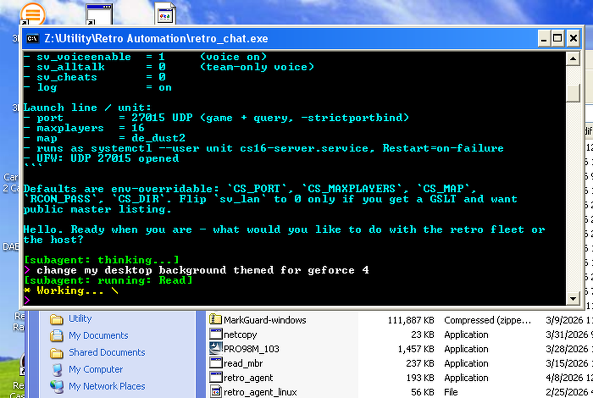
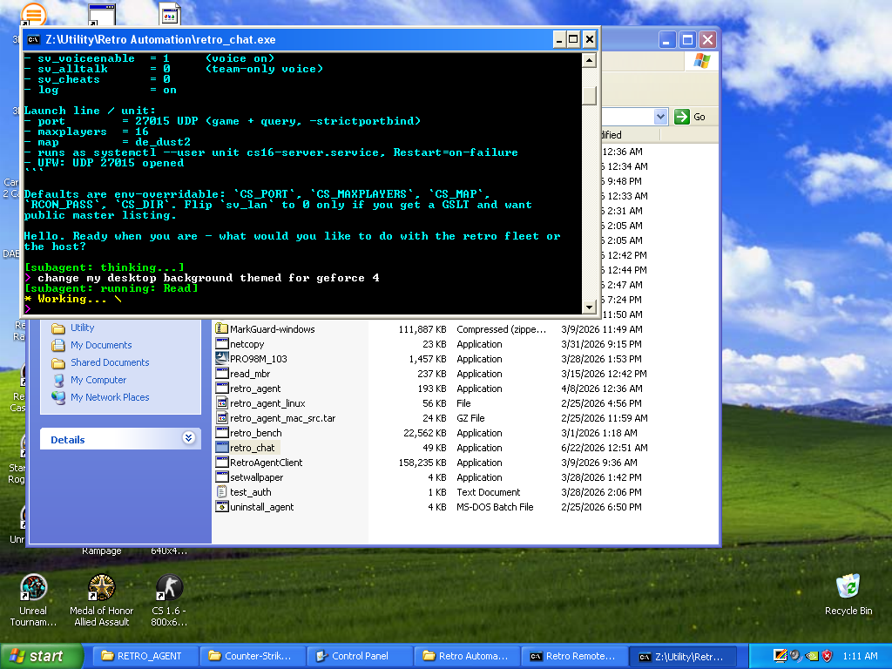
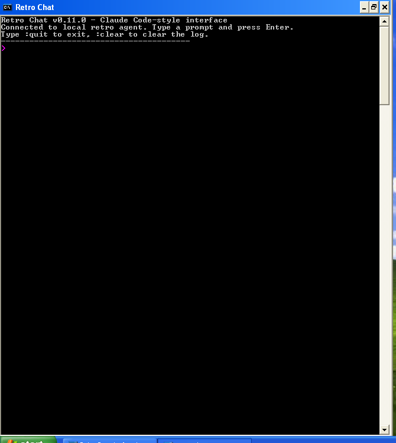
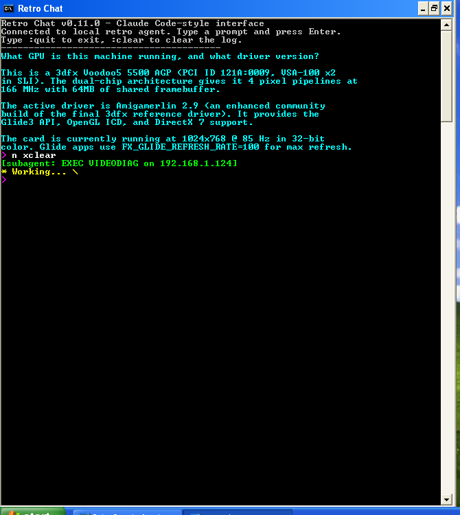
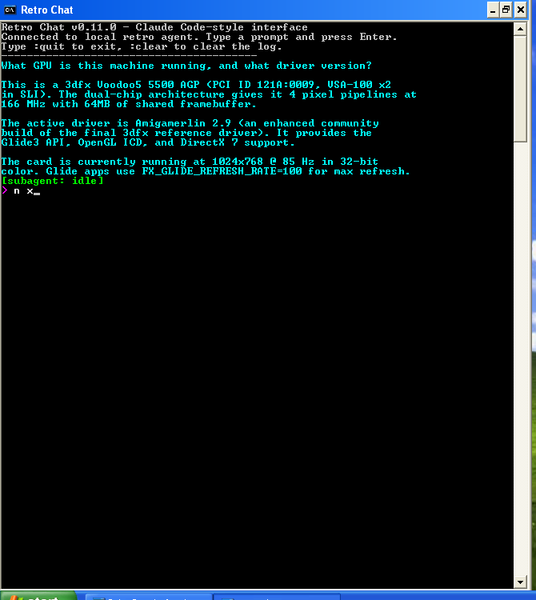

# Retro Agent — AI-Powered Remote Management for Retro PCs

**Give your Pentium II a smarter assistant than most developers had in 2003.**

> ### 🚀 retro3dfx: an open-source 3dfx Voodoo driver stack, optimized past what 3dfx shipped
>
> Using this agent as the remote harness, we built and tuned a **complete Voodoo 3/4/5 driver stack** — XP kernel display driver, Glide, and a Mesa-based OpenGL ICD — **based on genuinely open source code** (3dfx's 2000 Glide open release and the MIT-licensed Mesa), and iterated on it with a fully tracked benchmark→optimize→measure loop until it **beat the community-standard AmigaMerlin driver on real hardware** (and the era 3dfx official ICD at 1024x768). See [retro3dfx — An Open-Source Driver Stack for 3dfx Voodoo Cards](#retro3dfx--an-open-source-driver-stack-for-3dfx-voodoo-cards) and [The Driver Optimization Process](#the-driver-optimization-process).

> ### 🖥️ New: the Retro Chat **brain** — a full Claude agent, on a 25‑year‑old OS
>
> A standalone Claude agent (built on the [Claude Agent SDK](https://code.claude.com/docs/en/agent-sdk/overview) — the same engine behind Claude Code) runs as an **auto‑starting service** on your modern box. Type a prompt on the retro PC's console and it answers with the **full Claude toolset** (read/edit files, run commands, search the web) and can **operate the rest of the fleet** — no Claude Code window open anywhere.



*Real usage on a Windows XP box (`192.168.1.133`): the user types **"change my desktop background themed for geforce 4"** and the agent goes to work — reading files and running tools on the machine — with live status (`[subagent: running: Read]`) and a spinner streaming back to the 16‑color console.*



*`retro_chat.exe` running natively on the XP desktop, driving a real task on the very machine it runs on.*

---

A ~200KB C binary that runs on Windows 98 SE, 2000, and XP (plus Linux). It exposes system info, file IO, registry, process control, UI automation, and hardware diagnostics over a simple TCP protocol — designed from the ground up to be operated by LLMs.

Connect from Python, pipe it to Claude or GPT, and suddenly your vintage hardware has a state-of-the-art AI that can diagnose why your Sound Blaster isn't working, install NVIDIA drivers via GUI automation, or configure your Voodoo 5500 for optimal Glide performance.

The built-in **Retro Chat** client takes it further: type a prompt directly on the retro PC's console, and the **Retro Chat brain** — a standalone Claude agent on your modern dev box — processes it with the *full Claude toolbox*, then streams the response back to your 16-color Win98 terminal. The brain runs as an auto‑starting service and needs no Claude Code session open; see [`scripts/README-chat-brain.md`](scripts/README-chat-brain.md).

## Retro Chat — AI on a 25-year-old OS

| Welcome screen | Claude is working | Response rendered |
|---|---|---|
|  |  |  |
| *Launch `retro_chat.exe` on any retro PC.* | *Green = what the AI is doing right now. Yellow = waiting for first token.* | *Response streams in real-time, word-wrapped for the console.* |

### How the chat pipe works

```
   Retro PC (Win98/2K/XP)                          Your dev box (Linux/macOS)
 ┌─────────────────────────────────┐      LAN      ┌────────────────────────────────┐
 │  retro_chat.exe  ──localhost──► │               │  retro_chat_daemon.py          │
 │                                 │               │  (pure network multiplexer)    │
 │  retro_agent.exe ◄──── TCP ─────┤───────────────┤         │                      │
 │   (chatproxy + status bus +     │   port 9898   │         ▼ /tmp/retro-chat/     │
 │    long-polling events)         │               │  inbox/*.json  outbox/*.json   │
 └─────────────────────────────────┘               │   status_outbox/*.json         │
                                                   │         │                      │
                                                   │         ▼                      │
                                                   │  retro_chat_brain.py           │
                                                   │  (Claude Agent SDK service)    │
                                                   │  full tools: Read, Bash, Grep, │
                                                   │  WebSearch + mcp__retro__* fleet│
                                                   └────────────────────────────────┘
```

The **brain** (`scripts/retro_chat_brain.py`) and the **daemon** both run as
`systemctl --user` services that auto‑start on boot — install once with
`bash scripts/install-chat-services.sh`. Full details: [`scripts/README-chat-brain.md`](scripts/README-chat-brain.md).

Three threads run inside `retro_chat.exe`, each on its own socket:
- **`LOG_WAIT`** long-poller — streams response chunks with sub-100ms latency
- **`STATUS_WAIT`** long-poller — shows `[subagent: ...]` live activity in green
- A local spinner thread that animates `* Working... |/-\` with zero network traffic

Zero polling overhead. Zero CPU when idle. The kernel parks each socket in `recv()` until there's something to show.

---

## What Can You Do With It?

### Diagnose Hardware Problems

```
You: "My Sound Blaster isn't working after I installed the new video card"

Claude: I'll check your audio setup...
  [subagent: SYSINFO]
  [subagent: AUDIOINFO]
  [subagent: PCISCAN]
  [subagent: REGREAD HKLM System\CurrentControlSet\...]

Your system has a Sound Blaster 16 (PCI ID 1274:1371) but no
wave driver is loaded. The IRQ conflict with your new GeForce
is preventing the driver from initializing.

I've updated the PCI resource assignments and reloaded the
driver. Try playing a WAV file now.
```

### Install Drivers via GUI Automation

The agent can see the screen, click buttons, and type keystrokes — so it can walk through any installer that requires user interaction:

```python
# Upload the driver installer
await conn.send_command('LAUNCH C:\\TEMP\\nvidia_setup.exe')
await asyncio.sleep(3)

# See what's on screen
bmp = await conn.command_binary('SCREENSHOT 0')

# Click "Next" at coordinates the LLM identified
await conn.send_command('UICLICK 450 380')

# Use Tab + Space for tricky dialogs where clicks don't register
await conn.send_command('UIKEY TAB')
await conn.send_command('UIKEY SPACE')
```

### Manage a Fleet of Retro PCs

```python
from client.retro_discovery import discover_retro_pcs

# Find every retro agent on the LAN
pcs = await discover_retro_pcs(timeout=3.0)
for pc in pcs:
    print(f"{pc.hostname} at {pc.ip} — {pc.os}")

# Run diagnostics on each
for pc in pcs:
    conn = RetroConnection(pc.ip, 9898)
    await conn.connect(SECRET, timeout=15.0)
    _, data = await conn.send_command('SYSINFO')
    info = json.loads(data.decode())
    print(f"  RAM: {info['memory']['total_mb']}MB, "
          f"OS: {info['os']['product']}")
    await conn.close()
```

### Monitor System Health

```python
# Check disk health
_, data = await conn.send_command('SMARTINFO')
smart = json.loads(data.decode())
for disk in smart.get('disks', []):
    print(f"Disk {disk['model']}: temp={disk.get('temperature')}C")

# Check video card
_, data = await conn.send_command('VIDEODIAG')
video = json.loads(data.decode())
print(f"GPU: {video['adapters'][0]['name']}")
print(f"Driver: {video['adapters'][0]['driver_version']}")
print(f"Resolution: {video['display']['resolution']}")
```

### Automate Software Installation

```python
# Copy installer from a network share
await conn.command_text(
    r'EXEC copy "\\server\share\app_setup.exe" C:\TEMP\setup.exe'
)

# Launch the installer (LAUNCH for GUI, never EXEC)
await conn.send_command(r'LAUNCH C:\TEMP\setup.exe')

# Wait for it to appear, then automate the install wizard
await asyncio.sleep(5)
bmp = await conn.command_binary('SCREENSHOT 0')
# ... LLM analyzes screenshot, clicks through wizard ...
```

### Fix Win98 Boot Problems

```python
# The built-in SYSFIX command handles common Win98 issues
text = await conn.command_text('SYSFIX check')
print(text)  # Shows what needs fixing

text = await conn.command_text('SYSFIX apply')
print(text)  # Applies all fixes:
             #   - vcache limit for >512MB RAM
             #   - swap file configuration
             #   - DMA settings
             #   - autologon setup
```

### Take and Analyze Screenshots

```python
from PIL import Image
import io

# Capture the screen at full resolution
bmp_data = await conn.command_binary('SCREENSHOT 0')

# Convert raw BMP to PNG for analysis
img = Image.open(io.BytesIO(bmp_data))
img.save('screen.png')

# Crop a specific region for detail
detail = img.crop((100, 100, 500, 400))
detail.save('detail.png')

# Pass to a vision model for analysis
# (Claude, GPT-4V, etc. can read the PNG directly)
```

### Registry Surgery

```python
# Read a registry value
_, data = await conn.send_command(
    r'REGREAD HKLM SOFTWARE\Microsoft\Windows\CurrentVersion\Run'
)
run_keys = json.loads(data.decode())
print(f"Startup programs: {run_keys.get('values', [])}")

# Write a registry value
await conn.send_command(
    r'REGWRITE HKLM SOFTWARE\MyApp\Settings\Volume 75 REG_DWORD'
)

# Delete a registry key
await conn.send_command(
    r'REGDELETE HKLM SOFTWARE\UnwantedApp'
)
```

---

## Architecture

```
                    TCP :9898               UDP :9899
  ┌──────────┐    <------------->    ┌─────────────────┐
  |  Client   |    commands/         |   retro_agent    |
  | (Python)  |    responses         |  (C, ~200KB)     |---> broadcasts
  └──────────┘                       └─────────────────┘    discovery
                                            |
                                     Win98/XP/2K/Linux
```

**Agent** (`agent/`): Cross-compiled C binary for Windows (MinGW-w64, i586 target). Runs as console app or NT service. ~200KB, no runtime dependencies beyond system DLLs.

**Linux Agent** (`agent-linux/`): Native C binary for x86_64 and ARM. Subset of Windows commands adapted for POSIX.

**Python Client** (`client/`): Async TCP client library. Handles framing, authentication, command dispatch, and LAN discovery.

## Protocol

Length-prefixed binary frames over TCP:

```
Send:    [uint32 LE length][payload bytes]
Receive: [uint32 LE length][status_byte][data bytes]

Status bytes:
  0x00 = text response (ASCII)
  0x01 = binary response (screenshots, file downloads)
  0xFF = error (ASCII error message)
```

Authentication: first frame must be `AUTH <secret>`. Set the secret with `-s <secret>` when starting the agent.

Discovery: agents broadcast `RETRO|hostname|ip|port|os|cpu|ram_mb|os_family` on UDP 9899 every 30 seconds.

## Command Reference

### System Info
| Command | Description | Response |
|---------|-------------|----------|
| `PING` | Health check | `PONG` |
| `SYSINFO` | CPU, memory, OS, drives, uptime | JSON |
| `VIDEODIAG` | Video card, driver, PCI IDs, resolution, DirectX | JSON |
| `AUDIOINFO` | Audio device enumeration | JSON |
| `SMARTINFO` | S.M.A.R.T. disk health | JSON |
| `DISPLAYCFG get` | Display resolution, color depth, refresh rate | JSON |
| `DISPLAYCFG set <w> <h> <bpp> [hz]` | Change display mode | JSON |
| `PCISCAN` | PCI device enumeration with vendor/device IDs | JSON |

### Execution
| Command | Description | Response |
|---------|-------------|----------|
| `EXEC <cmd>` | Run hidden, capture stdout/stderr, block (60s timeout) | text |
| `LAUNCH <cmd>` | Run visible, return immediately | JSON `{pid, command}` |

**Important:** Use `EXEC` for CLI commands that produce text output. Use `LAUNCH` for GUI apps (installers, games, etc.). Using `EXEC` for a GUI app runs it invisibly and blocks the agent.

### Process Control
| Command | Description |
|---------|-------------|
| `PROCLIST` | JSON list of running processes |
| `PROCKILL <pid>` | Terminate process by PID |
| `QUIT` | Stop agent gracefully (for updates) |
| `SHUTDOWN` | Power off machine |
| `REBOOT` | Restart machine |

### File Operations
| Command | Description |
|---------|-------------|
| `DIRLIST <path>` | JSON directory listing (name, size, modified, attributes) |
| `UPLOAD <path>` | Upload file (two-frame: command + binary payload) |
| `DOWNLOAD <path>` | Download file (binary response) |
| `MKDIR <path>` | Create directory (recursive) |
| `DELETE <path>` | Delete file |
| `FILECOPY <src>\|<dst>` | Copy file (pipe-delimited src and dst) |

### UI Automation (Windows)
| Command | Description |
|---------|-------------|
| `SCREENSHOT <quality>` | Capture screen as raw 24-bit BMP. 0=full, 1=half, 2=quarter |
| `UICLICK <x> <y> [button]` | Click at coordinates (left/right/middle) |
| `UIDRAG <x1> <y1> <x2> <y2>` | Drag from one point to another |
| `UIKEY <keyname>` | Send keystroke (e.g. `TAB`, `ENTER`, `ALT SPACE`) |
| `WINLIST` | JSON list of visible windows (hwnd, title, class, rect) |

### Registry (Windows)
| Command | Description |
|---------|-------------|
| `REGREAD <root> <path>` | Read value or enumerate keys |
| `REGWRITE <root> <path> <value> <type>` | Write value (REG_SZ, REG_DWORD, etc.) |
| `REGDELETE <root> <path>` | Delete value or key |

### Network (Windows)
| Command | Description |
|---------|-------------|
| `NETMAP <unc> [drive] [user] [pass]` | Map network share |
| `NETUNMAP <drive>` | Disconnect mapped drive |

### Hardware & Diagnostics (Windows)
| Command | Description |
|---------|-------------|
| `DRVSNAPSHOT` | Capture driver configuration state |
| `SYSFIX [check\|apply]` | Check/apply Win98 system fixes (vcache, swap, DMA, autologon) |
| `LICSTATUS` | Report Windows activation/license status (read-only; like `slmgr /xpr`) |

### Chat Proxy (Claude Code interface)
| Command | Direction | Purpose |
|---------|-----------|---------|
| `PROMPT_PUSH <text>` | client -> agent | Submit a user prompt |
| `PROMPT_WAIT [timeout_ms]` | daemon -> agent | Long-poll for next prompt |
| `LOG_APPEND <text>` | daemon -> agent | Stream response text to the log buffer |
| `LOG_WAIT <offset> [timeout_ms]` | client -> agent | Long-poll for new response content |
| `STATUS_SET <text>` | daemon -> agent | Set the subagent activity indicator |
| `STATUS_WAIT <seq> [timeout_ms]` | client -> agent | Long-poll for status changes |
| `LOG_CLEAR` | any | Reset prompt, log, and status |
| `PROXY_GET` / `PROXY_SET <host>` | any | Read/write the owning dev box IP |

### Linux-Only
| Command | Description |
|---------|-------------|
| `PKGINSTALL <name>` | Install package (auto-detects apt/yum/pacman) |
| `PKGLIST` | List installed packages |
| `SVCINSTALL` | Manage systemd services |

## Getting Started

### 1. Build the Agent

Requires `i686-w64-mingw32-gcc` (MinGW-w64 cross-compiler):

```bash
cd agent && make clean && make
# Output: retro_agent.exe (~200KB)
```

For Linux targets:
```bash
cd agent-linux && make clean && make
# ARM cross-compile: make arm
```

### 2. Deploy to Retro PCs

Copy the binary and run it:

```cmd
:: On the retro PC
copy \\your-server\share\retro_agent.exe C:\RETRO_AGENT\retro_agent.exe
C:\RETRO_AGENT\retro_agent.exe -s your-secret-here
```

Or use the provided installer batch:
```cmd
:: Edit install_agent.bat first to set your share path and secret
\\your-server\share\install_agent.bat
```

The installer copies the agent + chat client, registers both for autostart, and configures auto-update.

### 3. Connect from Python

```python
import asyncio
from client.retro_protocol import RetroConnection

async def main():
    conn = RetroConnection('10.0.0.50', 9898)  # your agent's IP
    await conn.connect('your-secret-here', timeout=15.0)

    # Get system info
    status, data = await conn.send_command('SYSINFO')
    print(data.decode('ascii'))

    # Run a command
    text = await conn.command_text('EXEC dir C:\\WINDOWS')
    print(text)

    # Take a screenshot
    bmp_data = await conn.command_binary('SCREENSHOT 0')

    await conn.close()

asyncio.run(main())
```

### 4. Set Up the Chat Client (Optional)

On the retro PC, launch the chat client:
```cmd
C:\RETRO_AGENT\retro_chat.exe
```

On your dev box, start the daemon:
```bash
python3 agent/tools/retro_chat_daemon.py &
```

Then run a Claude Code background subagent to process prompts from `/tmp/retro-chat/inbox` and write responses to `/tmp/retro-chat/outbox`. The daemon handles all network IO.

### Agent Flags

| Flag | Description |
|------|-------------|
| `-s <secret>` | Authentication secret (**always set this** — don't use the default) |
| `-p <port>` | TCP port (default: 9898) |
| `-l <logfile>` | Enable file logging |
| `-m` | Force multiplex mode (required for Win98) |
| `-t` | Force threaded mode (NT only) |

## Purpose & Scope

**What this is:** a remote systems-management and diagnostics agent for a
homelab of the maintainer's **own** vintage PCs on an **isolated LAN**. It is the
retro-hardware equivalent of the tools every IT department runs — think an
open-source cousin of an RMM agent, PsExec/PDQ, VNC, or Ansible for machines too
old to run any of them. The whole point of the project is to operate 25-year-old
Windows boxes that can't be managed any modern way, and to let an LLM diagnose
and fix them (drivers, boot errors, hardware faults) instead of walking to each
machine.

**Why it has broad capabilities:** remote administration inherently needs to run
commands, move files, read hardware/registry state, and see the screen — that is
the job, not a side effect. The same capability set describes every legitimate
management agent. What distinguishes this from malware is **how it is built and
operated**, and the project is deliberate about that:

- **Consent & ownership.** It runs only on machines the operator owns and
  installs it on. There is no self-propagation, no spreading, no exploitation of
  a vulnerability to gain access — installation is a deliberate copy + run by the
  owner.
- **No stealth.** It is not hidden or disguised: it runs under its own name,
  logs to a file (`-l`), announces itself on the LAN via UDP discovery, and its
  full source is in this repo. It does not hide processes, evade AV, tamper with
  security controls, or persist covertly. (The optional `AUTH_ENC` XOR layer is
  documented as *transport scrambling on a trusted LAN, not a security
  boundary* — see `agent/src/crypto.c`; tunnel over TLS/SSH for anything beyond
  the LAN.)
- **Authenticated & authorization-gated.** Every connection authenticates with a
  shared secret. The autonomous chat brain adds a **fleet-safety guardrail**
  (`scripts/retro_brain_tools.py`): destructive/irreversible commands (REBOOT,
  SHUTDOWN, DELETE, REGDELETE, PROCKILL, disk-wiping EXEC) are refused unless
  explicitly confirmed, and the brain may only confirm when the user asked.
- **Auditable & defensive.** A built-in [`security-posture`](.claude/skills/security-posture/SKILL.md)
  skill runs an authorized self-assessment of the fleet (secret strength, network
  exposure, update integrity) and proposes hardening — the project actively tests
  its own posture.

**Do not** deploy this on machines you don't own/administer, on untrusted or
internet-exposed networks, or without a strong secret. Used that way it would be
misuse — the same as any admin tool.

## Security

- **Always set a custom secret** with `-s <secret>`. The default is intentionally weak and meant only for initial testing; the `security-posture` skill flags any agent still accepting it.
- The agent listens on **all interfaces**. Restrict access via firewall rules or run on an isolated LAN — do not expose port 9898/9899 to the internet.
- The agent can execute commands, read/write files, and modify the registry. **Only deploy on machines you own and trust the connecting client to fully control.**
- Auto-update pulls binaries from an SMB share — **write-restrict that share to trusted admins** (a writable share means fleet-wide code execution).
- SMB share credentials in the provisioning scripts are placeholders. Edit them for your environment before deploying.
- The chat proxy (`PROMPT_PUSH`, `LOG_APPEND`, etc.) has no additional authentication beyond the agent secret. Anyone who can connect to the agent can read and write chat messages.

## Auto-Update

The agent checks for newer binaries on a configurable network share ~15 seconds after startup:

1. Compares local binary size vs. share copy
2. If different: downloads new binary to temp location, writes a restart batch, and exits
3. The batch waits for the old process to die, swaps the binary, and relaunches

The chat client (`retro_chat.exe`) is also auto-updated by the agent — it kills the running chat process, copies the new binary, and relaunches.

Configure the update paths in the registry:
```
HKLM\Software\RetroAgent\UpdatePath     = \\your-server\share\retro_agent.exe
HKLM\Software\RetroAgent\ChatUpdatePath = \\your-server\share\retro_chat.exe
```

Or use the installer, which sets these automatically.

## Releasing New Versions

```bash
# Agent
cd agent
make release                  # patch bump
make release BUMP=minor       # minor bump
make release BUMP=major       # major bump

# Chat client
cd agent/tools
make release                  # patch bump
make release BUMP=minor       # minor bump
```

Each release tags the build, compiles, and uploads both a versioned binary (for rollback) and a "latest" pointer (for auto-update).

> **Always publish a new build to the share.** The agents only pick up a new
> `retro_chat.exe` / `retro_agent.exe` from the share's "latest" pointer — a build
> that stays on your dev box reaches no machine. If you can't run `make release`
> with share creds, push the binary to the share's latest pointer **and** the
> versioned folder via an online agent's `copy /Y` (the fleet has the share mapped
> with write access). *(The chat **brain/daemon** are server-side Python and don't
> ship to the fleet — restart their systemd services instead.)*

**Note:** Edit `SMB_CREDS` and `SMB_BASE` in the Makefiles to match your network share.

## Win98 Known Issues

### vcache / MaxFileCache (Critical)

Windows 98 with >512MB RAM requires `MaxFileCache=262144` in `[vcache]` section of `C:\WINDOWS\SYSTEM.INI`. Without this, the disk cache exhausts VxD address space, causing "Windows Protection Error" on boot. The agent's `SYSFIX apply` command fixes this automatically.

### Ghost PCI Entries

Removed hardware leaves registry entries under `HKLM\Enum\PCI` that claim resources and block PnP detection of new cards. Use `PCISCAN` to identify ghosts, then delete via uploaded `.reg` files.

### Win98 RST Crash

Abrupt TCP disconnects (RST packets) can crash Win98's Winsock implementation. Always close connections gracefully. If running the agent behind Docker or a reverse proxy, ensure clean TCP FIN shutdown.

### EXEC and Paths with Spaces

On Win98, `EXEC` wraps commands with `COMMAND.COM /C` which breaks on paths with spaces, even when quoted. Use 8.3 short names (`C:\PROGRA~1` instead of `C:\Program Files`) or the `DIRLIST` command (which handles spaces correctly).

## LLM Integration Patterns

### Diagnostic Workflow

An LLM receives a problem description and autonomously investigates:

1. `SYSINFO` + `AUDIOINFO` / `VIDEODIAG` / `PCISCAN` to understand hardware
2. `REGREAD` to check driver configuration
3. `SCREENSHOT` to see the current display state
4. `REGWRITE` / `UPLOAD` / `EXEC` to apply fixes
5. Verify the fix with another round of diagnostics

### GUI Automation Workflow

For software that requires a graphical installer:

1. `UPLOAD` or `EXEC copy` to get the installer onto the machine
2. `LAUNCH` the installer (never `EXEC` for GUI apps)
3. Loop: `SCREENSHOT` -> vision model analyzes -> `UICLICK`/`UIKEY` to interact
4. Post-install cleanup via `.reg` file uploads
5. `REBOOT` and verify

### Fleet Management Workflow

For managing multiple retro PCs:

1. `discover_retro_pcs()` to find all agents on the LAN
2. Connect to each, run `SYSINFO` / `PCISCAN` / `VIDEODIAG` for inventory
3. Push updates via `UPLOAD` + auto-update mechanism
4. Monitor health via periodic `PING` checks

### Key Constraints

- **EXEC vs LAUNCH**: EXEC blocks and captures output. LAUNCH returns immediately. Wrong choice hangs the agent.
- **FILECOPY delimiter**: Uses pipe `|` between source and destination, not space.
- **REGREAD format**: `REGREAD HKLM Path\\To\\Key` (root abbreviation + path, space-separated).
- **Screenshot format**: Raw 24-bit BMP. Convert to PNG with Pillow before passing to a vision model.
- **Timeouts**: Default 60s for commands, 120s for binary responses.
- **REBOOT/SHUTDOWN are destructive**: Retro machines may require physical access to recover.

## Project Structure

```
retro-agent/
+-- agent/                  # Windows agent (C, MinGW cross-compiled)
|   +-- Makefile
|   +-- src/                # C source files
|   +-- tools/              # retro_chat client (C) + daemon (Python)
|   +-- lib/
|       +-- libmsvcrt.a     # Patched import lib (Win98 compatible)
+-- agent-linux/            # Linux agent (C, native)
|   +-- Makefile
|   +-- src/
+-- client/                 # Python async client library
|   +-- retro_protocol.py   # TCP protocol client (RetroConnection)
|   +-- retro_discovery.py  # UDP LAN discovery
+-- retro3dfx/              # Open-source 3dfx Voodoo driver stack (see below)
+-- benchmarks/             # Driver benchmark results (JSON per run + conventions)
+-- provisioning/           # Installation scripts and registry templates
|   +-- win98/
+-- scripts/                # Chat brain/daemon, XP activation, benchmark tooling
+-- .claude/skills/         # Claude Code skills for fleet operations (see below)
+-- docs/
    +-- images/             # Screenshots for this README
    +-- case-studies/       # Real-world diagnostic walkthroughs
```

## retro3dfx — An Open-Source Driver Stack for 3dfx Voodoo Cards

3dfx died in 2000 and its Windows drivers froze with it. [`retro3dfx/`](retro3dfx/README.md)
is our answer: run **Quake 3** (OpenGL) and **Unreal Tournament** (Glide) on real
Voodoo 3/4/5 hardware with **every layer — from the XP kernel display driver up
to the OpenGL ICD — built by us from source**, so the whole stack can be
optimized past what 3dfx ever shipped.

```
   Quake 3 (OpenGL)              Unreal Tournament (Glide)
        │                             │
   [3] OpenGL ICD ────────────────┐  │    retro3dfx-gl (MesaFX 6.2 fork)
        │  gr* calls              │  │    → opengl32.dll / retrogl.dll
        ▼                         ▼  ▼
   [2] glide3x.dll                        our build (retail ABI) or retro3dfx-glide fork
        │  register / FIFO writes
        ▼
   [1] XP kernel display driver           3dfxvsm.sys + 3dfxvs.dll (our build);
        │                                 retro3dfx-disp = clean-room alternative
        ▼
   Voodoo 3 / Voodoo 5 hardware
```

The three layers:

| Layer | What we build | Source base |
|---|---|---|
| **[1] Kernel display driver** | `3dfxvsm.sys` (miniport) + `3dfxvs.dll` (XPDM display driver incl. D3D HAL) | Compiled with a Wine-hosted VC6 + W2K-DDK toolchain (sibling `retro-3dfx` repo). A clean-room track, `retro3dfx-disp/`, is in progress. |
| **[2] Glide (glide3x.dll)** | Retail-ABI Glide3 (96 exports, byte-compatible export list with the vintage Nov-2000 DLL) | Our deployed build, plus [voidsstr/retro3dfx-glide](https://github.com/voidsstr/retro3dfx-glide) (fork of sezero/glide) as the gcc-13 cross-built optimization vehicle |
| **[3] OpenGL ICD** | `retrogl.dll` — Mesa 6.2.2 OpenGL-over-Glide3, where the performance work lives | [voidsstr/retro3dfx-gl](https://github.com/voidsstr/retro3dfx-gl) (fork of sezero/MesaFX-6.2) |

**Result (2026-07-17):** the full self-built stack (**ALL-RETRO3DFX**) replaced
the community-standard AmigaMerlin driver on a real Voodoo3 AGP / XP SP3 box and
**beat it** — Quake 3 `timedemo four`, 16bpp, P3-845:

| Stack | 640x480 | 1024x768 |
|---|---|---|
| **ALL-RETRO3DFX** (self-built, all 3 layers) | **58.8 fps** | **51.3 fps** |
| AmigaMerlin hybrid, untuned (baseline) | 53.7 | 38.7 |
| Era reference: 3dfx official ICD on a V3 3000 | 75–91 | 44.3 |

The 1024x768 (fillrate-bound) number beats both AmigaMerlin and the era 3dfx
official ICD reference. The remaining 640x480 gap is CPU-side T&L in the ICD —
the queued deep work (SSE vertex emit, SSE 4-wide cliptest, end-to-end ubyte
colors).

**Open source based, licenses preserved.** The optimization work lives in real
GitHub forks of genuinely open upstreams: Glide under the **3dfx Glide Source
Code General Public License** (3dfx's authentic 2000 open release, open and
redistributable) and MesaFX under the **MIT/Mesa license** (Brian Paul et al.).
Both forks preserve the upstream license files; provenance is documented in
[`retro3dfx/FORKS.md`](retro3dfx/FORKS.md). The clean-room `retro3dfx-disp`
display driver is original code, *modeled on* open references (Device3Dfx,
RISCyVoodoo, vmdisp9x) — read for structure, not copied.

Everything is documented in [`retro3dfx/README.md`](retro3dfx/README.md)
(architecture, ABI gotchas, build system), [`retro3dfx/CHANGELOG.md`](retro3dfx/CHANGELOG.md)
(per-version changes and rationale), [`retro3dfx/FORKS.md`](retro3dfx/FORKS.md)
(fork provenance and licenses).

### The Driver Optimization Process

The stack didn't get fast by accident — it went through a disciplined
benchmark → change → measure → track loop, run entirely **remotely through the
retro agent** against a live fleet machine. Conventions and hard-won harness
rules live in [`benchmarks/README.md`](benchmarks/README.md); the full loop is
packaged as the [`driver-bench` skill](.claude/skills/driver-bench/SKILL.md).

**1. Every build self-identifies.** The ICD build injects an auto-incrementing
version into the `GL_RENDERER` string
(`Mesa Glide v0.62 Voodoo3 (tm) [retro3dfx 0.1.N]`), so every game log and
benchmark run records exactly which driver build produced it. No "which DLL was
that?" ambiguity, ever.

**2. One change per version, benchmarked before and after.** Each optimization
lands as its own version, is deployed to the test box over the agent, and gets
the same Quake 3 `timedemo four` matrix (640x480 + 1024x768, 16bpp, two runs
per resolution — the first warms the texture cache, the second is official).
The full per-version log is below; negative results are tracked as
deliberately as wins, because a documented dead end is knowledge that never
has to be re-litigated.

**3. Every result lands in a database, keyed by the exact stack.** Each run is
saved as JSON in [`benchmarks/`](benchmarks/) *and* inserted into a production
Postgres with a `driver_stack` JSONB naming the exact binary at all three
layers (plus fork commit SHAs) and a `stack_composition` tag — **`HYBRID`**
(our ICD over the retail AmigaMerlin kernel driver + glide3x) vs
**`ALL-RETRO3DFX`** (every layer self-built) — so rows are only ever compared
like-for-like.

**4. Environment discipline.** `FX_GLIDE_SWAPINTERVAL` alone moves 1024x768
results by ~30%, so the env state is recorded in every result row, and any
cross-run comparison states its tuning (see the swap-interval saga in
`retro3dfx/CHANGELOG.md` before touching vsync behavior).

**5. Quality is a tracked lever, not an afterthought.** Alongside the fps runs,
an in-engine screenshot of q3dm1 (real `glReadPixels` output, not a GDI capture
of a Glide fullscreen buffer — which is always dark/interlaced garbage) is
diffed against a pristine baseline so a "faster" driver that breaks rendering
can't slip through.

**6. The loop is one command.** `python3 .claude/skills/driver-bench/run_bench.py
--ip <target>` runs preflight (agent version, 3dfx card check), detects the
stack composition from system32 fingerprints + `GL_RENDERER`, runs the timedemo
matrix, optionally captures the quality screenshot, and writes both the JSON
drop and the DB rows.

### Optimization Log — What Changed in Each Driver Version

Every run below is Quake 3 1.32 `timedemo four`, 16bpp, on the test box
(P3-845 no-SSE2, 384 MB, Voodoo3 AGP, XP SP3). "Tuned" means
`FX_GLIDE_SWAPINTERVAL=0` in the process environment. Full rationale in
[`retro3dfx/CHANGELOG.md`](retro3dfx/CHANGELOG.md); raw per-run JSON in
[`benchmarks/`](benchmarks/).

**0.1.1 — baseline (versioning introduced).** No functional change — the
version stamp was added to `GL_RENDERER` so every subsequent log
self-documents. Benchmarks: **53.7** @640x480, 50.4 @800x600, **38.7**
@1024x768; tuned env: 57.6 / 51.0.

**0.1.2 — modern compiler codegen.** Build flags `-march=<cpu> -mfpmath=sse
-DNDEBUG` (gcc had been emitting pentiumpro **x87** for every C hot loop) plus
a branchless SSE color pack replacing a store-forwarding-stall float→ubyte
conversion at 7 call sites. The audit had found **zero** SSE instructions in
the vertex-buffer object file — on a CPU with SSE1. After: 2,729 SSE scalar
ops. Result: 54.2 @640x480 (**+0.9%**). Honest read: most of the 640x480 frame
is Q3 engine + Glide time, not the ICD's C loops.

**0.1.3 — batched triangle submission.** One `grDrawVertexArrayContiguous`
call (and 768-vertex chunked pointer arrays on the indexed path) instead of
one `grDrawTriangle` **DLL call per triangle** on Q3 world geometry. Result:
58.1 @640x480 tuned (**+0.9%**), 1024x768 flat. Lesson learned: retail glide3x
loops per-triangle internally, so only the call-boundary overhead was saved.

**0.1.4 — swap-default env injection — INERT.** Tried setting
`FX_GLIDE_SWAPINTERVAL=0` from inside the ICD before `grGlideInit`. No effect:
retail glide3x is static-CRT and snapshots the environment at **DLL load**,
before any ICD code can run. Kept as a documented dead end.

**0.1.5 — Glide state shadow cache.** Shadow copies of the texture
clamp/filter/mipmap/source and color/alpha combine state; identical Glide
calls are skipped. Q3 rebinds a texture per surface, and every bind had been
re-issuing the full 8–10-call register set. Result: 54.9 @640x480 (**+0.7%**).
The q3dm1 quality screenshot after 0.1.2–0.1.5: pristine, no regressions.

**0.1.6 — swap-interval env-read fix.** A bisect proved
`FX_GLIDE_SWAPINTERVAL=0` *alone* was the entire +32% @1024x768 tuning — and
that a system-wide `=1` (planted years ago by a 3dfx tools install) was
reaching the driver. The ICD now reads the variable with its own CRT and
defaults to 0. Result @1024x768 on the hybrid stack: still 38.7 — retail
glide3x reads the env from its own load-time snapshot and **ignores the
`grBufferSwap(interval)` argument entirely**; no ICD-side code can override
it. The real fix was owning the Glide layer ourselves (next entry).

**2026-07-17 — ALL-RETRO3DFX milestone.** Our self-built kernel display driver
and glide3x replaced AmigaMerlin entirely (SetupAPI install via the
`deploy-3dfx-driver` skill). Result: **58.8 / 51.3 with no environment tuning
at all** — our Glide's swap defaults are sane in code. Rendering verified
pristine: mean pixel diff vs the hybrid baseline screenshot is 4.1/255, i.e.
animation noise.

Cumulative scoreboard:

| Config | 640x480 | 1024x768 |
|---|---|---|
| HYBRID 0.1.1, env untouched (`SWAPINTERVAL=1` system-wide) | 53.7 | 38.7 |
| HYBRID 0.1.6, env untouched | 54.2 (+0.9%) | 38.7 |
| HYBRID 0.1.6 + `FX_GLIDE_SWAPINTERVAL=0` | ~58 (+8%) | ~51 (+32%) |
| **ALL-RETRO3DFX 0.1.6, no env tuning** | **58.8 (+9.5%)** | **51.3 (+32.6%)** |
| Era references (P3-850/933 + V3 3000, 3dfx official ICD) | 75–91 | **44.3 — we beat this** |

## Claude Code Skills

The repo ships [Claude Code skills](.claude/skills/) — packaged, battle-tested
operational workflows that Claude Code (or the Retro Chat brain) invokes by
name. Each `SKILL.md` encodes the tribal knowledge a task needs: preflight
checks, fleet gotchas, rollback paths, and the exact commands that work on
25-year-old Windows.

| Skill | What it does |
|---|---|
| [`driver-bench`](.claude/skills/driver-bench/SKILL.md) | One-command 3dfx driver benchmark/optimize/track loop: preflight → stack detection (ALL-RETRO3DFX / HYBRID / RETAIL) → Q3 timedemo matrix → quality screenshot → results to JSON + production DB, keyed by driver version and exact stack composition. |
| [`deploy-3dfx-driver`](.claude/skills/deploy-3dfx-driver/SKILL.md) | Deploy the self-built 3dfx XP driver package to a fleet Voodoo 3/4/5 box: HWID preflight, staged upload, backup, SetupAPI install (never raw-copy into `system32` — Windows File Protection reverts it), verify, rollback plan. Never reboots without explicit approval. |
| [`retro-benchmark`](.claude/skills/retro-benchmark/SKILL.md) | Run the full automated retro GPU benchmark suite (Quake III, Unreal Tournament, Deus Ex, Serious Sam, Giants, 3DMark 99/2000/2001) on a fleet machine unattended and collect FPS/scores into a results folder + ASCII summary. |
| [`retro-wallpaper`](.claude/skills/retro-wallpaper/SKILL.md) | Generate and deploy rotating "system dossier" wallpapers per machine — spec cards, games from the CPU- and GPU-release years, and a tech-milestone collage for the CPU year, cycled through 10 variants by an on-device rotator. |
| [`security-posture`](.claude/skills/security-posture/SKILL.md) | Interactive, authorized security self-assessment and penetration test of the agent and the fleet — auth strength, network exposure, transport, update integrity, brain autonomy controls — with ranked hardening recommendations the user replies to and applies. Scoped to the user's own isolated LAN. |

Skills are how one-off fleet victories become repeatable: once a workflow has
been debugged against real hardware (which agent commands hang on Win98, which
launch pattern actually executes on a given box, which install step needs a
backup first), it gets written down as a skill so the next invocation starts
from the answer instead of the archaeology.

## Roadmap — Fleet AI: train, infer, and benchmark ML on vintage hardware (contributors welcome)

The fleet is a rack of 1998–2004 machines with real period accelerators (3dfx
Voodoo 3/4/5, GeForce 2/3/4) already wired for remote control and already
carrying an **open, self-built graphics stack** we can bend to non-graphics ends.
The next arc for this project: **train and run real machine-learning models on
that hardware** — a spread from gradient-boosted trees to CNNs to a tiny
transformer — using the period GPUs as compute units and the **retro agent as
the cross-machine transport**, turning the fleet into a tiny distributed ML
cluster. *"A language model, generated one token at a time, on a Pentium II with
a Voodoo doing the matrix math — trained on the whole fleet at once."*

Everything here is **custom code** — none of these machines can run PyTorch,
CUDA, scikit-learn, or even a modern libc. That constraint is the point: it's an
interesting systems problem and every layer stays hackable. **Most of this is
now implemented and fleet-verified** — the engine lives in
[`retro-infer/`](retro-infer), highlights include bit-exact int8 LeNet-5
inference on real P3/Athlon boxes, on-device MNIST training to ≥96%, exact
XNOR GEMM + BNN CIFAR-10 inference on a real Voodoo5, bit-identical 2-node
data-parallel training, and distributed GBDT — see the status table in
[`docs/roadmap-fleet-ai.md`](docs/roadmap-fleet-ai.md) for the
milestone-by-milestone acceptance results and what's still open.

### What it looks like — `retro-infer` fleet console

A single ASCII TUI (readable on a 16-color CRT, and mirrorable into the Retro
Chat) drives discovery, training, and inference, streaming live ML metrics:

```
+= RETRO-INFER  fleet ML console ===================== transport: retro-agent =+
| [d] DISCOVER   ai-capable agents advertised on the LAN                       |
|   .124  Voodoo3 AGP      glide-mac    int8   ~0.9 GFLOP/s   READY  models:2  |
|   .143  GeForce4 Ti4600  nv-shader    fp16   ~4.2 GFLOP/s   READY  models:5  |
|   .51   GeForce2 GTS     nv-combiner  int8   ~1.1 GFLOP/s   TRAIN  models:2  |
|   .50   Voodoo5 5500     glide-mac    int8   ~1.6 GFLOP/s   TRAIN  models:1  |
|   .52   Pentium4 (CPU)   sse2         fp32   ~0.6 GFLOP/s   READY  models:8  |
+------------------------------------------------------------------------------+
| [t] TRAIN  (fleet data-parallel, 4 GPUs)                                     |
|   lenet5-mnist        epoch  7/20  [##########..........] 52%  1.9k img/s    |
|     loss 0.184  acc 94.1%  val_acc 92.7%  err 7.3%  F1 0.93  ce 0.21         |
|   bnn-cifar10 (XNOR)  epoch  3/40  [####................] 11%   340 img/s    |
|     loss 0.71   acc 61.2%  val_acc 58.9%  err 41.1%  top5 92.0%              |
|   gbdt-tabular        tree 128/500 [#####...............] 25%                |
|     train_logloss 0.42  val_logloss 0.47  val_auc 0.883  rmse 0.19          |
|   allreduce 38 ms/step   sync via retro-agent TENSOR frames   eta 6m 12s     |
+------------------------------------------------------------------------------+
| [i] INFER   char-transformer-6L  (pipeline: .124>.51>.143>.50)              |
|   > the voodoo card slept for twenty years and woke up_                      |
|   38 tok/s  ppl 24.6  p50 21ms  p99 44ms   fleet power ~610W                 |
+============================ [t]rain [i]nfer [d]iscover [b]ench [q]uit ========+
```

### The plan (phased overview)

**Phase 1 — a dependency-free ML runtime (`retro-infer`, C, i586).** A
single-binary engine cross-compiled with the same MinGW toolchain as the agent
(no CRT beyond system DLLs), supporting both **inference and on-device
training**. Ops: dense/GEMM, conv2d, pooling, activations, softmax, plus the
tree/histogram primitives for gradient boosting; float32 with **int8/int4/binary**
quantized paths (the vintage sweet spot). A compact model format (`.rim` —
quantized weights + manifest) and an offline Python converter (ONNX / a small
trainer → `.rim`). Era-vectorized CPU kernels: **SSE** (P3), **3DNow!**
(K6-2/Athlon), **MMX** integer — reusing the SSE work from the 3dfx ICD.

**Phase 2 — GPU compute backends.**
- **3dfx Voodoo / Glide backend.** No shaders, but the multitexture units and
  color-combine/blend hardware are fixed-function **multiply-accumulate** engines.
  Implement GEMM as render-to-texture accumulation: weights/activations encoded
  as textures, combiners as MACs, framebuffer as the accumulator. 8-bit/channel →
  **binarized/int8 nets** map best. Built on our open `retro3dfx` Glide stack —
  the flagship "impossible" backend.
- **NVIDIA combiner / shader backend.** GeForce 2 `NV_register_combiners`;
  GeForce 3/4 DX8 shaders + `NV_texture_shader`; GeForce FX float textures.
  Multi-pass GEMM/conv via render-to-texture — int8 on GF2–4, float16-ish on GF-FX.
- **Shared GPGPU core.** A common "tensor-over-textures" tiling layer both
  backends specialize, so a kernel is written once against an abstract MAC.

**Phase 3 — the retro agent as ML transport + AI-agent discovery.** The agent's
existing length-prefixed TCP protocol becomes the fleet ML fabric. New frames:
`AI_HELLO` (an agent advertises its inference capability — backend, precision,
GFLOP/s, resident models — extending the UDP discovery beacon), `MODEL_LOAD` /
`MODEL_LIST` (push/enumerate `.rim` models), `TENSOR` (typed tensor in/out for
activations and gradients), and `INFER_RUN`. A brain-side **registry** discovers
which boxes are AI-capable and which models live where, exposed as
`mcp__retro__ai_*` tools so the chat can list, load, train, and infer by asking.
All cross-machine movement — activations between pipeline stages, gradient
allreduce during training — rides the agent, so the whole fleet coordinates over
one transport with no extra daemons.

**Phase 4 — fleet training mode (all GPUs at once).** A "train on the whole
fleet" mode with two strategies coordinated by the brain over the agent:
- **Data-parallel SGD** — each GPU trains on a batch shard; gradients are
  averaged (ring/tree **allreduce** over `TENSOR` frames) each step. Straggler
  handling reuses the brain's failover: a dropped node's shard is reassigned.
- **Distributed gradient boosting** — histogram/split-finding for each tree
  distributed across nodes, aggregated per boosting round.
- **Pipeline parallelism** for models too big for one box — one layer/block per
  machine, activations streamed stage→stage (the Pentium II runs layer 3 while
  the Athlon runs layer 7). Checkpoints (`.rim`) land on the SMB share.

**Phase 5 — tracked metrics + benchmark harness.** Mirror the
[`driver-bench`](.claude/skills/driver-bench/SKILL.md) pattern: every training
run and inference run keyed by model, machine, GPU/CPU backend, and precision,
landing in the specpicks DB with the **full ML metric set** — training/val
**loss & error rate**, **accuracy / top-5**, **precision / recall / F1**,
**AUC-ROC**, **confusion matrix**, **log-loss**, **RMSE/MAE** (regression),
**perplexity** (LM), **PSNR** (autoencoders), plus systems metrics
**throughput** (img/tok/sec), **latency p50/p99**, and **energy per inference**.
Leaderboards per model × backend × precision.

### Model zoo to build, train, and benchmark

A deliberate spread of model *families* (classical → boosted → neural → their
variations), chosen to fit the envelope (KBs–low MBs, integer-friendly):

| Family | Model | Task | Key metrics |
|---|---|---|---|
| Linear | logistic regression, perceptron | MNIST / tabular | accuracy, log-loss, error rate |
| Instance | k-NN | MNIST | accuracy, inferences/sec (calibration baseline) |
| **Boosting** | **gradient-boosted trees (GBDT)** | tabular classify/regress | log-loss, AUC-ROC, RMSE, trees/sec |
| Bagging | random forest | tabular | accuracy, F1, OOB error |
| Margin | linear SVM | binary classify | accuracy, precision/recall, hinge loss |
| MLP | 2–3 layer dense | MNIST | accuracy, loss curve, err% |
| **CNN** | **LeNet-5** (int8) | MNIST digits | img/sec on Voodoo-GEMM vs GeForce vs SSE |
| CNN variant | **binarized CNN (BNN, XNOR)** | CIFAR-10 (small) | accuracy, top-5, img/sec — best Voodoo showcase |
| Recurrent | char-RNN / **GRU / LSTM** | text gen | perplexity, chars/sec |
| **Transformer** | **nanoGPT-class** (1–6 layers, tiny vocab, int8) | token generation | **tokens/sec**, perplexity, single-box vs fleet pipeline |
| Generative | small VAE / autoencoder | image denoise | reconstruction PSNR, frames/sec |
| Audio | tiny keyword spotting | wake-word off a real SB16 | detection F1, detections/sec |

The GBDT-on-tabular result is the "ML actually works here" proof; the
fleet-pipelined transformer is the "wow" — an end-to-end language model whose
layers each live on a different 25-year-old computer, talking over the agent.

### Good first contributions

- A Glide render-to-texture **GEMM kernel** (Phase 2) against `retro3dfx`.
- An `NV_register_combiners` GEMM pass for GeForce 2 (Phase 2).
- The **int4/int8 weight packer** + ONNX→`.rim` converter (Phase 1).
- A **distributed GBDT** split-finder over `TENSOR` frames (Phases 1, 4).
- The **allreduce** primitive and pipeline scheduler in the brain (Phases 3, 4).
- The **`retro-infer` ASCII console** + live metric stream (Phase 5).

See [`docs/roadmap-fleet-ai.md`](docs/roadmap-fleet-ai.md) for the full milestone
list (M0–M8), each with its deliverables and the acceptance tests to run when
it's implemented. Open an issue with the piece you want to take — custom code,
weird hardware, real numbers.

## Contributing

The agent is designed to be extended with new commands. Each command is a C function that receives a socket and arguments, dispatched via the command table in `handlers.c`. Add your handler, register it in the table, and rebuild.

The chat proxy protocol is intentionally simple (JSON files in directories) so you can plug in any LLM backend — not just Claude. Write a script that reads from `inbox/`, calls your model, and writes to `outbox/`. The daemon handles the network transport.

## License

The code in this repository is **open source based**:

- **This repository** (agent, chat client, Python client library, scripts,
  retro3dfx build system): **MIT** — see [`LICENSE`](LICENSE).
- **retro3dfx driver forks** preserve their upstream open licenses: Glide is
  under the **3dfx Glide Source Code General Public License** (3dfx's genuine
  2000 open release), MesaFX under the **MIT/Mesa license**. Provenance:
  [`retro3dfx/FORKS.md`](retro3dfx/FORKS.md).
- `retro3dfx-disp/` (the clean-room display-driver track) is original,
  MIT-licensed code.
