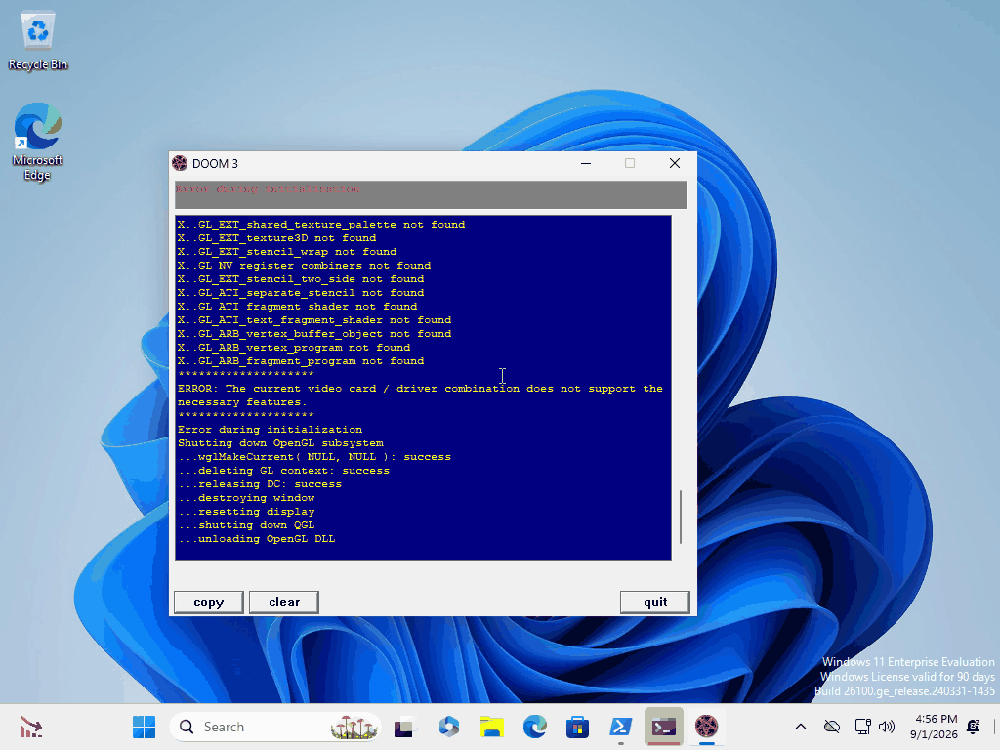
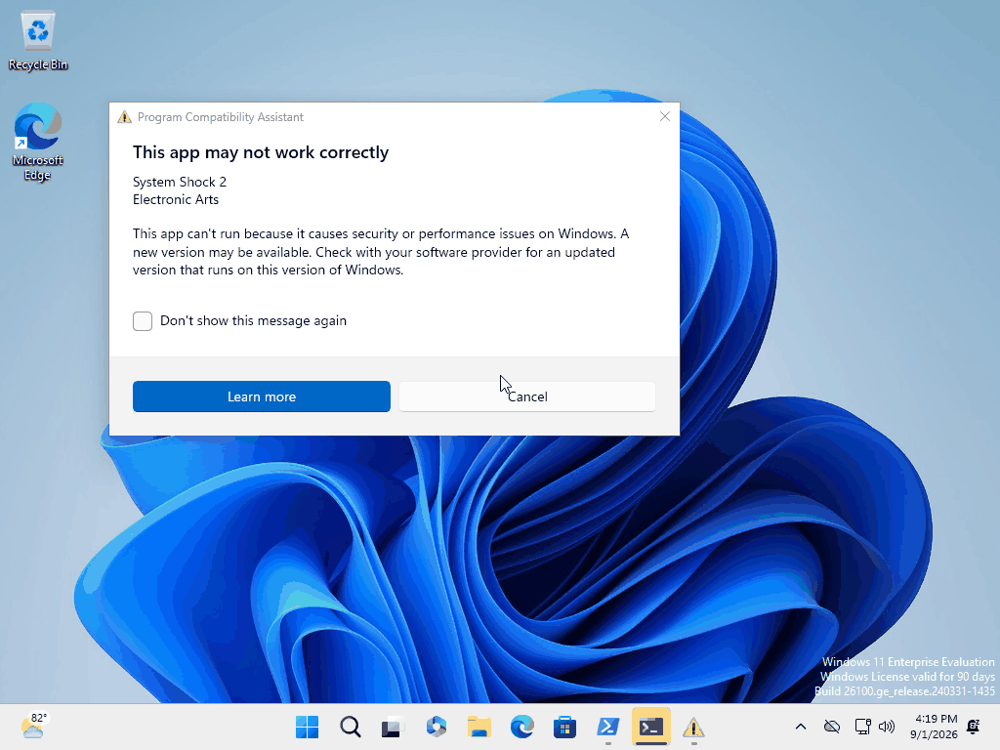
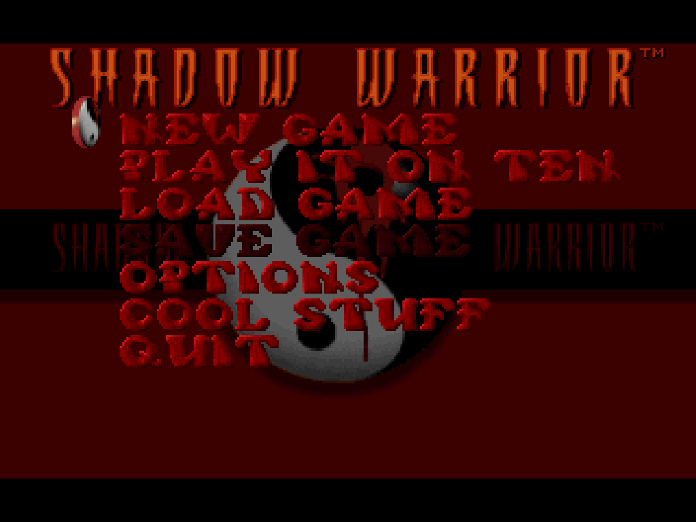
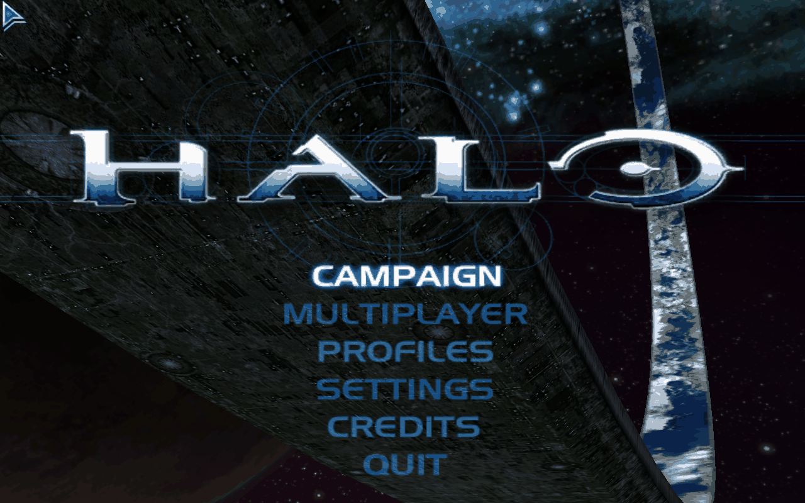
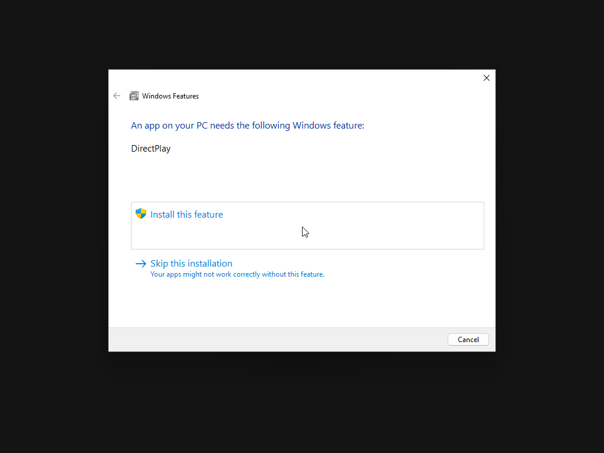
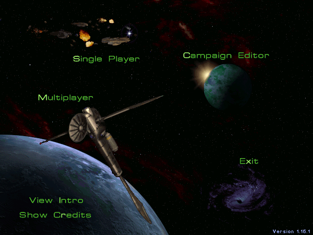

# The staged library on Windows 10/11 — a compatibility survey

**The fleet is XP/98/7. This document answers a different question: which of the
50 staged titles could the owner also play on his modern box (the OMEN,
`192.168.1.132`)?** Nothing here changes the fleet, and nothing here was run on
a fleet box.

Generated 2026-09-01. Static analysis by
`python3 scripts/fleet/win64-compat.py --json /mnt/retro-share/Files/Games-Library`
(tests: `tests/python/test_win64_compat.py`). Measurements on a purpose-built
Windows 11 VM — see [The rig](#the-rig) for what it can and cannot answer.

---

## Headline

| | titles |
|---|---|
| **RUNS** | **26** |
| **RUNS WITH CAVEATS** — runs, but needs a step the fleet does not do today | **12** |
| **BLOCKED** — no route from the staged tree | **8** |
| **UNTESTED** — the rig could not answer | **4** |
| total | **50** |

**About three quarters of the library — 38 of 50 — is playable on Windows 11
today**, 26 of them by double-clicking the staged shortcut and 12 after one
documented extra step (usually a registry import done the right way round, or
mounting a disc image).

**25 titles were MEASURED in a Windows 11 VM** with a screenshot of the running
game; **25 were ANALYSED only.** The two are never mixed below: every row says
which it is, and the analysed rows say which measured title they lean on.

### The biggest blocking causes

| cause | titles | is there a route? |
|---|---|---|
| **A live SafeDisc wrapper** | SystemShock2, MaxPayne, BF1942 (client only) | **No.** Not without replacing the executable. |
| **A 1997–2000 DirectDraw/D3D engine that cannot create its surface** | AliensVsPredator, RainbowSix, JediKnightDF2, JediKnightMotS | Only a community patch or a re-release. |
| **A dead middleware dependency** | ThiefGold (`lgvid.ax` video filter) | Community patch (NewDark). |

**The SafeDisc scare is mostly a false alarm, and that is the single most
useful finding here.** Six staged titles carry SafeDisc evidence — a `BoG_`
marker, an `stxt774`/`stxt371` section, a `.ICD`, or the v1 runtime DLLs.
**Only three of them are actually protected.** The other three ship an
executable whose wrapper was removed long before this library staged it, and
all three were measured playing on Windows 11. Marker ≠ verdict; see
[SafeDisc](#1-safedisc-the-marker-is-not-the-verdict).

---

## The rig

A **new** VM, built for this and nothing else. It does not touch
`~/retro-vm/xp3.qcow2`, which belongs to the XP build lane: separate qcow2,
separate monitor socket, separate VNC display, separate forwarded port.

| | |
|---|---|
| guest | **Windows 11 Enterprise Evaluation, 25H2, build 26200.6584, x64** |
| media | `26200.6584.250915-1905.25h2_ge_release_svc_refresh_CLIENTENTERPRISEEVAL_OEMRET_x64FRE_en-us.iso`, 7,092,807,680 bytes, fetched **direct from Microsoft** (`software-static.download.prss.microsoft.com`, reached from `aka.ms/Win11E-ISO-25H2-en-us`). No third-party ISO site was used. |
| install | Fully unattended via an `autounattend.xml` on a second CD — including the `HKLM\System\Setup\LabConfig` TPM/SecureBoot/RAM bypasses, so it installs on plain SeaBIOS/MBR with no TPM. No GUI clicking. |
| host | QEMU 10.2.1, `-enable-kvm -cpu host`, **8 vCPU / 8 GB** (capped deliberately — other agents share this host), q35 + AHCI, e1000e behind user-mode NAT. Never on `192.168.1.0/24`. |
| files in | Titles are streamed from the read-only share as a tar over `http://10.0.2.2:8099/tar/<Title>` and unpacked with Windows' own `System32\tar.exe`. **Every copy was verified by file count AND byte total against the source** — never by exit code, never by "N File(s) copied". |
| screenshots | `screendump` on the QEMU monitor, i.e. the actual framebuffer. This sees an exclusive-fullscreen DirectDraw/D3D surface, which a GDI grab inside the guest cannot — the fleet's long-standing "the screenshot comes back black" problem does not apply to any image in this document. Every RUNS claim below has a screenshot behind it and every screenshot was looked at. |

### The one thing this rig cannot answer

**There is no GPU and no vendor display driver — the guest runs on the
Microsoft Basic Display Adapter.** That has three consequences, and they bound
exactly which results are trustworthy:

* **Direct3D 9 and DirectDraw are fine to judge.** Modern Windows emulates
  DirectDraw and D3D≤9 in software *whatever* card is fitted, so WARP is close
  to representative. Thief 2 (D3D9), Tiberian Sun, Red Alert 2, StarCraft and
  Warcraft II all rendered correctly, palettes included.
* **Direct3D 8 has no software fallback at all.** Microsoft shipped
  `d3d9on12`; there is no `d3d8on12`. Hidden & Dangerous said so in as many
  words — *"Unable to initialize graphics. This program requires DirectX 8 or
  greater"* — and that failure is the rig's, not Windows'.
* **OpenGL is capped at the Microsoft software 1.1 implementation.** GLQuake,
  Quake II and Quake III Arena all rendered on it anyway. Doom 3 did not, and
  said exactly why:

  

  Every `GL_ARB_vertex_program` / `GL_ARB_fragment_program` line in that log is
  a VM artefact. **The OMEN has a real GPU with a real ICD**, so these titles
  are marked UNTESTED here rather than BLOCKED, and the analysis says they run.

---

## The table

`M` = **measured in the VM** (screenshot taken and inspected).
`A` = **analysis only** — headers, launch path and protection state, plus the
measured same-engine control named in the notes.

| # | title | verdict | M/A | deciding factor |
|---|---|---|---|---|
| 1 | AliensVsPredator | **BLOCKED** | M | DirectDraw surface creation fails. Its own log: `?&@#! no lpZBuffer surface`, `?&@#! no lpDDBackdrop surface`, then `ASSERTION FAILED! Expression: pSurface  File: ..\3dc\win95\alt_tab.cpp Line: 198`. Process stays up, `Responding=False`, nothing drawn. |
| 2 | BF1942 | **BLOCKED** (client) | M | **SafeDisc 2.80.010 owns the entry point of `Mods\bf1942\Mod.dll`** (`stxt371`). `BF1942.exe` exits 0 with no window — **and it still does with the disc image mounted**, so this is the wrapper, not the media. The dedicated server is a *different* story: `BF1942_w32ded.exe` runs and binds UDP 14567 + 22000. |
| 3 | Carmageddon1 | RUNS | A | DOSBox. `MAINPROG.EXE` is an LE image, but Windows never loads it — DOSBox does. Control: Shadow Warrior, measured. |
| 4 | Carmageddon2 | **RUNS** | M | Carries a SafeDisc **1.01.034** marker and an `.IIDKing` section, but the entry point is ordinary `.text` — residue, not protection. Plays: Stainless logo, then the attract-mode demo, fullscreen 640×480. |
| 5 | CounterStrike16 | RUNS WITH CAVEATS | A | GoldSrc, same engine as the measured Half-Life. Needs `install.reg` merged with `/reg:32`, and its OpenGL path needs a GPU ICD (the software renderer is the fallback). |
| 6 | Daggerfall | RUNS | A | DOSBox. |
| 7 | Descent1 | RUNS | A | DOSBox is the default shortcut; `d1x-rebirth.exe` is a clean Win32 PE. Either path works. |
| 8 | Descent2 | RUNS WITH CAVEATS | A | `d2x-rebirth.exe` (default) is clean Win32. The *"original Win95"* shortcut needs `d2disc.iso` mounted, and the fleet's mount launcher cannot do that on Windows — see [disc mounting](#5-mounting-a-disc). |
| 9 | Descent3 | RUNS | A | Clean Win32, no protection; D3D / OpenGL / Glide are all selectable so it can avoid the GL path. |
| 10 | DeusEx | **UNTESTED** | M | Starts, and `System\DeusEx.log` shows Direct3D initialising properly (`Generic 3D accelerator`, DXT1–5, 8 texture stages) — then it never presents a frame. Same engine as the measured Unreal Tournament, which rendered; the difference is the default renderer. **Retest on the OMEN.** |
| 11 | Doom3 | **UNTESTED** | M | Rig limit, stated by the game itself: `ERROR: The current video card / driver combination does not support the necessary features`, after `GL_ARB_vertex_program not found`. id Tech 4 needs a real ICD. Analysis: no protection, clean 32-bit PE, runs on Win10/11 on real hardware. |
| 12 | FarCry | RUNS | A | D3D9, 2004, and **no protection wrapper survives in the staged tree** — retail Far Cry was SafeDisc, so the staged executable has already been replaced. |
| 13 | HalfLife1 | RUNS WITH CAVEATS | M | Menu renders; the software renderer reaches in-game (`crossfire`, textures and sky correct). Two caveats, both measured: the **OpenGL** path answers *"The selected OpenGL mode is not supported by your video card"* without a GPU ICD, and `-soft -full` exits (windowed software is fine). The CD-key prompt appears until `install.reg` is merged — its key is HKCU, which is **not** redirected, so a plain import works for that half. |
| 14 | Halo | RUNS WITH CAVEATS | M | **The worked example of the `/reg:32` problem.** With `install.reg` imported by the default 64-bit `reg.exe`, Halo stops at its EULA — the 32-bit game cannot see `HKLM\SOFTWARE\Microsoft\Microsoft Games\Halo`. With `reg import ... /reg:32` it reaches the main menu, fullscreen 1280×800. |
| 15 | Halo2 | **UNTESTED** | A | **Do not assume Games for Windows LIVE.** Another session measured Halo 2 Vista reaching its main menu on `.246` (Windows 7 32-bit) on 2026-09-01, with no product-key prompt: `sldl_dll.dll` imports no `slc.dll`, so its licence store is self-contained and the "the service is dead" reasoning does not apply. Windows 11 is a much closer relative of Vista than XP is, and the two known gates are both satisfiable — the disc's XP-only 6 KB `dwmapi.dll` stub must *not* be placed beside the exe (it now ships as `dwmapi.dll.xpshim`, and Windows 11 has the real one), and `halo2.exe` needs `d3dx9_31.dll` from the DirectX redist, which is not in the tree. Never started on Windows 11. |
| 16 | HexenII | RUNS | A | Quake engine with both a software and a GL build staged; the software shortcut is the safe one. Control: Quake 1, measured on both renderers. |
| 17 | HiddenAndDangerous | **UNTESTED** | M | Rig limit: *"Unable to initialize graphics. This program requires DirectX 8 or greater."* There is no `d3d8on12`, so a driverless Windows cannot run any D3D8 title. Analysis: clean PE, no protection — expected to run on the OMEN. |
| 18 | JediAcademy | RUNS WITH CAVEATS | A | id Tech 3 (control: Quake III, measured). Needs `_disc\JediAcademy_CD1.iso` mounted — Windows 11 can do that itself. |
| 19 | JediKnightDF2 | **BLOCKED** | M | Raises Windows' *"An app on your PC needs the following Windows feature: DirectPlay"* prompt. **Enabling the DirectPlay optional feature did not stop it re-appearing**, and once dismissed the game holds the display mode and draws nothing. |
| 20 | JediKnightMotS | **BLOCKED** | A | Same engine, same DirectDraw + DirectPlay path as JK: Dark Forces II, which was measured broken. |
| 21 | MasterOfOrionII | RUNS | A | DOSBox. (`ORION95.EXE` in `launch.txt` is the *icon* source, not what runs.) |
| 22 | MaxPayne | **BLOCKED** | M | **SafeDisc 2.51.020 owns `MaxPayne.exe`'s entry point** (`stxt371`). Exit code 1, no window, no error dialog, nothing in the event log — it dies inside the wrapper before the game starts. |
| 23 | Postal | **RUNS** | M | Main menu, fullscreen. |
| 24 | Quake1 | **RUNS** | M | Both shortcuts. `WINQUAKE.EXE` in-game fullscreen 640×480; `GLQUAKE.EXE` in-game fullscreen 1024×768 on the *software* OpenGL. `QUAKE.EXE` (DOS) is in the tree and is never started by Windows. |
| 25 | Quake2Complete | **RUNS** | M | In-game fullscreen 1024×768. |
| 26 | Quake3-TeamArena | **RUNS** | M | Intro cinematic then the main menu, fullscreen 1280×800. This is the control for the whole id Tech 3 family. |
| 27 | RainbowSix | **BLOCKED** | M | Starts, takes 640×480, `Responding=True`, and holds a **solid black surface** for 36 s across three screenshots. This is the result most likely to change on real hardware — **retest on the OMEN before believing it.** |
| 28 | RedAlert2 | **RUNS** | M | `Ra2.exe` has `stxt774`/`stxt371` sections *and* a SafeDisc 2.05.030 marker, but its entry point is ordinary `.text` — residue. Main menu, fullscreen 1280×800. |
| 29 | RedFaction | RUNS WITH CAVEATS | A | Needs the disc, and **its image is `.bin`/`.cue` — the one format Windows cannot mount natively.** A third-party mounter is required for this title specifically. |
| 30 | RedneckRampage | RUNS | A | DOSBox. |
| 31 | ReturnToCastleWolfenstein | RUNS | A | id Tech 3 (control: Quake III, measured). |
| 32 | SeriousSamFirstEncounter | RUNS WITH CAVEATS | A | Needs `_disc\SeriousSamTFE.iso` mounted (Windows can). Serious Engine's GL path wants a real ICD; it has a D3D8 path too. |
| 33 | SeriousSamSecondEncounter | RUNS WITH CAVEATS | A | As above, with `SeriousSamTSE.iso`. |
| 34 | ShadowWarrior | **RUNS** | M | **The DOSBox control.** Main menu, fullscreen 1024×768. Its tree holds 20 DOS/LE images including `Sw.exe` and two 16-bit `Setup.exe`s; none of them is ever handed to the Windows loader. |
| 35 | Shogo | RUNS WITH CAVEATS | A | LithTech. Needs `_disc\Shogo.iso` mounted (Windows can). |
| 36 | SiNGold | RUNS | A | Quake 2 engine (control: Quake II, measured). |
| 37 | SoldierOfFortune | RUNS | A | Quake 2 engine. |
| 38 | SoldierOfFortune2 | RUNS WITH CAVEATS | A | id Tech 3; needs `_disc\sofii_1.iso` mounted. |
| 39 | StarCraft | RUNS WITH CAVEATS | M | Main menu, fullscreen 640×480, 8-bit palette correct — **but only after mounting the ISO by hand.** The fleet's own launcher fails first; see [disc mounting](#5-mounting-a-disc). |
| 40 | SystemShock2 | **BLOCKED** | M | **SafeDisc v1: `shock2.exe` is a loader and `SHOCK2.ICD` is the game.** Windows 11 hard-blocks it in the compatibility database — *"This app can't run because it causes security or performance issues on Windows"* — and when it does run it faults with `0xC000001D` (illegal instruction) inside `shock2.exe`. |
| 41 | Thief2 | **RUNS** | M | NewDark 1.26, Direct3D 9. Main menu, fullscreen 1280×800. |
| 42 | ThiefGold | **BLOCKED** | M | `THIEF.EXE` 1.9.0.0 (the **original** engine, not NewDark) crashes in `lgvid.ax`, the Looking Glass video filter, on the intro movie. Nothing renders. Thief 2 in the same library is NewDark and is fine — the fix for this one is the same NewDark patch, which is not staged. |
| 43 | TiberianSun | **RUNS** | M | Carries `GAME.ICD`, `SECDRV.SYS` and the whole SafeDisc v1 runtime — all residue: `GAME.EXE` imports `ddraw`/`dsound`/`binkw32`, i.e. it *is* the game, not a loader. Intro sequence and main menu, fullscreen 1280×800. |
| 44 | Turok2 | RUNS WITH CAVEATS | M | The launcher renders and its Direct3D Properties page opens, but the video-card list says *"Unknown card -- Select from list below"* — a 1998 hard-coded device list, plus no D3D6 device in the VM. **Retest on the OMEN.** |
| 45 | UT2004 | RUNS | A | Unreal 2, D3D8/9, clean PE. |
| 46 | UnrealGold | RUNS | A | Unreal 1 engine (control: Unreal Tournament, measured). |
| 47 | UnrealTournament | **RUNS** | M | The intro fly-through map, fullscreen 1280×800. `System\UnrealTournament.icd` is present — a SafeDisc v1 leftover; `UnrealTournament.exe` imports `core.dll`/`engine.dll`, so it is the game, not a loader. |
| 48 | UnrealTournament436 | RUNS | A | Same engine and same `.icd` residue as #47. |
| 49 | WarcraftII | **RUNS** | M | Title screen, fullscreen 640×480, 8-bit palette correct. **The fleet cannot screenshot this title at all** ("uncapturable by GDI on XP and Win7") — a framebuffer grab can, which is why there is an image for it here. |
| 50 | WarcraftOrcsAndHumans | RUNS | A | DOSBox. |

---

## Grouped: everything that is blocked, by cause

### These three are SafeDisc, and there is no Windows 10/11 route

**SystemShock2, MaxPayne, BF1942 (client).**

SafeDisc authenticates through `secdrv.sys`, a kernel driver Microsoft used to
ship *inside Windows*. It was disabled on Vista/7/8.1 by KB3086255 in 2015 and
**Windows 10 never shipped it at all**; it cannot be reinstated, because a
2000s-era unsigned kernel driver does not load on x64 Windows. Windows 11 also
carries a hard **block** for these binaries in its own application-compatibility
database, which fires before the game does:



**The fleet's answer to SafeDisc does not carry over.** On XP the fix is to
mount the image in DAEMON Tools, because DAEMON Tools replays the *disc*. The
half that is missing on Windows 10/11 is the *driver*, and no mounter supplies
that. Mounting BF1942's disc image changed nothing: the client still exited 0.

The only routes are to replace the executable — an official no-CD patch, a
source port, or a GOG/Steam re-release — which is a different class of change
from anything this library does today.

### These four are 1997–2000 engines that cannot get a surface

**AliensVsPredator, RainbowSix, JediKnightDF2, JediKnightMotS.**

All four are DirectDraw / early-Direct3D titles from before Windows had an
emulated DirectDraw. AvP names the failure precisely (`no lpZBuffer surface`);
Rainbow Six just goes black; Jedi Knight stalls on the DirectPlay feature
prompt and then draws nothing. **AvP and Jedi Knight are famously broken on
modern Windows** — that is knowledge, not measurement, and it is why community
patches and re-releases exist for both. Rainbow Six and Turok 2 are the two
results most contaminated by the rig's missing GPU; retest them on the OMEN
before treating them as settled.

### This one lost a dependency that no longer works

**ThiefGold** — crashes in `lgvid.ax`, the Looking Glass DirectShow video
filter, on the intro movie. The community fix is NewDark, the same patch Thief 2
in this library already has; it is not staged for Thief 1.

Halo 2 *was* in this group until 2026-09-01, on the assumption that Games for
Windows LIVE gates it. It does not: another session proved on `.246` that its
licence store is self-contained. That assumption was knowledge, not
measurement, and it was wrong — which is the argument for keeping the two apart
everywhere in this document.

---

## Five cross-cutting facts

### 1. SafeDisc: the marker is not the verdict

Six titles carry SafeDisc evidence; three are protected. What separates them is
**who owns the entry point**, and it took a measurement to learn that — the
first version of the analysis condemned all six.

| title | evidence | entry point | live? | measured |
|---|---|---|---|---|
| MaxPayne | `BoG_` 2.51.020, `stxt774`/`stxt371` | **inside `stxt371`** | **yes** | exits, code 1 |
| BF1942 `Mod.dll` | `BoG_` 2.80.010, `stxt*` | **inside `stxt371`** | **yes** | client exits 0 |
| SystemShock2 | `SHOCK2.ICD` + v1 runtime; `shock2.exe` imports only kernel32/user32/advapi32/version | v1 **loader** | **yes** | blocked + `0xC000001D` |
| Carmageddon2 | `BoG_` 1.01.034, `.IIDKing` section | `.text` | no — residue | **plays** |
| RedAlert2 | `BoG_` 2.05.030, `stxt*`, `drvmgt.dll`, `secdrv.sys` | `.text` | no — residue | **plays** |
| TiberianSun | `GAME.ICD` + full v1 runtime | `GAME.EXE` imports `ddraw`/`dsound` | no — residue | **plays** |
| UnrealTournament / …436 | `UnrealTournament.icd` | exe imports `core.dll`/`engine.dll` | no — residue | **plays** (UT99) |

Two traps are worth writing down because both were hit:

* **SafeDisc 1.x has no `stxt774`/`stxt371` section.** Those arrived with 2.x.
  Carmageddon 2 is SafeDisc 1.01.034 with a plain `.text`/`.rdata`/`.data`
  table, so a section-only detector calls it clean. The `BoG_ *90.0&!!` marker
  has to be searched for in every PE.
* **SafeDisc v1 leaves no marker in the file that matters.** `shock2.exe` has
  an ordinary MSVC entry point *because the loader is an ordinary MSVC
  program*; the protection is in `SHOCK2.ICD` next to it. The `.icd` + a
  loader-shaped import table is the only tell — and Tiberian Sun is the control
  proving the `.icd` alone is not enough.

### 2. 16-bit code: present everywhere, fatal nowhere

x64 Windows has no NTVDM — `CreateProcess` on an NE or plain-DOS MZ image fails
outright, with no shim and no feature to turn on. **71 sixteen-bit images live
in the staged library and not one of them is on a Windows launch path.**

The other half of the architecture question is a non-question: of **850 PE
binaries across the 50 trees, 850 are 32-bit x86 and none is 64-bit.** WoW64
runs all of them.

Seven titles (Carmageddon1, Daggerfall, Descent1, MasterOfOrionII,
RedneckRampage, ShadowWarrior, WarcraftOrcsAndHumans) are DOS games whose
shortcuts start **DOSBox**, an ordinary Win32 PE. The DOS payload is loaded by
the emulator, not by Windows, so the missing NTVDM never comes into it:



The rest of the 16-bit images are inert litter — 16-bit installers and
uninstallers (`_ISDEL.EXE`, `SETUP.EXE`) that the fleet never runs because it
stages **installed trees**, and 16-bit thunk DLLs (`clcd16.dll`, `mss16.dll`,
`Cms16.dll`, `pmpro16.dll`) that a 32-bit process cannot load and never tries
to. Staging installed trees turns out to be a large, accidental advantage on
modern Windows: there is no installer left to fail.

### 3. `install.reg` needs `/reg:32` — measured, not argued

**25 of the library's 30 `install.reg` files seed `HKLM\SOFTWARE\<vendor>` keys,
and every one of them will silently fail to take on x64 Windows if imported the
obvious way.** A 32-bit game reading `HKLM\SOFTWARE\Foo` is redirected to
`HKLM\SOFTWARE\WOW6432Node\Foo`; a 64-bit `reg.exe import` writes the
*un*-redirected key. The seed lands in a place the game will never look.

Halo is the clean demonstration. Default import:

```
> reg import C:\Games\Halo\install.reg
> reg query "HKLM\SOFTWARE\Microsoft\Microsoft Games\Halo" /reg:64
    Version       REG_SZ    1.10
    DigitalProductID  REG_BINARY  A4000000...
> reg query "HKLM\SOFTWARE\Microsoft\Microsoft Games\Halo" /reg:32
    ERROR: The system was unable to find the specified registry key or value.
```

…and Halo stops at its EULA. With `reg import C:\Games\Halo\install.reg
/reg:32` the same file lands in the 32-bit view and the game reaches its menu:



This is the same defect CLAUDE.md records for Rainbow Six on XP, running the
other way: there the problem was that `/reg:32` was *added* on Vista and XP's
`reg.exe` has no such switch.

Two exceptions worth knowing:

* **`HKCU\Software\<vendor>` is NOT redirected.** Half-Life's CD key is HKCU, so
  a plain import works for it — verified in the VM.
* **`WarcraftII\directplay-win64.reg` already names `Wow6432Node` itself**, so
  it wants the 64-bit importer and must *not* get `/reg:32`. Somebody already
  solved this for one title; the other 25 files have not caught up.

### 4. DirectPlay is not installed by default

**Seven titles depend on DirectPlay** — four import it directly
(JediKnightDF2, JediKnightMotS, MasterOfOrionII, Shogo) and three ship a
DirectPlay service-provider DLL in the tree (Carmageddon2, TiberianSun,
WarcraftII). On Windows 10/11 it is an **optional feature** ("Legacy
Components → DirectPlay"), off by default, and the first game to ask for it
gets this:



It installs cleanly and needs no reboot:

```powershell
Enable-WindowsOptionalFeature -Online -FeatureName DirectPlay -All -NoRestart
# RestartNeeded=False ; C:\Windows\SysWOW64\dplayx.dll now exists
```

Measured. Note that enabling it did **not** stop Jedi Knight re-raising the
prompt, so DirectPlay is necessary for that title and not sufficient.

### 5. Mounting a disc

Eleven titles need a mounted disc. **Windows 10/11 mounts `.iso` natively** —
`Mount-DiskImage -ImagePath ...`, no third-party software — and eight of the
eleven images are `.iso`. Measured on BF1942's disc (mounted as `F:`, label
`BF1942_1`) and StarCraft's (label `STARCRAFT`).

The three that are **not** `.iso` are `MaxPayne.bin`, `RedFaction_Disc2.bin` and
`System Shock 2 (USA).bin`. Windows cannot mount a `.bin`/`.cue`, so those need
a third-party mounter — and two of the three are SafeDisc-blocked anyway, so
**RedFaction is the only title where the image format is the deciding factor.**

**But the fleet's launcher template does not know any of this.** Its `finddisc`
routine looks for DAEMON Tools and WinCDEmu only, and on Windows 11 it stops
dead before the game starts:

```
StarCraft mount failure
NO DISC MOUNTER IS INSTALLED on this machine. Looked for Daemon Tools ...
and for WinCDEmu ... Install one - this is an INSTALL problem, not a mount problem.
```

That message is correct on the fleet and wrong here: the machine *does* have a
mounter, it is Windows. With the ISO mounted by hand, StarCraft runs:



---

## What the fleet could change (not done here — this was a survey)

1. **`provisioning/discmount/mount-launcher-template.bat` should try
   `PowerShell Mount-DiskImage` as a mounter of last resort** when the image is
   an `.iso` and neither DAEMON Tools nor WinCDEmu is present. That single
   change moves StarCraft, JediAcademy, Shogo, both Serious Sams,
   SoldierOfFortune2, Descent2 and BF1942's *server* from "fails at the
   launcher" to "runs" on any modern Windows box. It costs the fleet nothing:
   XP has no `Mount-DiskImage`, so the branch is never taken there.
2. **`gs_merge_reg()` imports `install.reg` with whatever `reg.exe` it finds.**
   On a 64-bit box that is the wrong view for 25 of the 30 files. The rule is
   simple and safe on XP too: if the file names `Wow6432Node`, use the 64-bit
   importer; otherwise use `/reg:32` where the switch exists.
3. **Nothing needs to change for the DOS lane.** It is the single most portable
   thing in the library.

---

## Reproducing this

```bash
# 1. Static sweep of the whole library (read-only; ~50 s over the share)
python3 scripts/fleet/win64-compat.py /mnt/retro-share/Files/Games-Library
python3 scripts/fleet/win64-compat.py --json /mnt/retro-share/Files/Games-Library > sweep.json

# 2. One title, in detail
python3 scripts/fleet/win64-compat.py --json \
    /mnt/retro-share/Files/Games-Library/SystemShock2

# 3. The two questions the older tools answer, kept separate
python3 scripts/fleet/discprotect.py exe   <binary>
python3 scripts/fleet/discprotect.py image <bin-or-iso>
```

The VM harness (`autounattend.xml`, the tar/command HTTP channel, the QEMU
monitor screenshot helper) lives outside the repo in `~/win-compat-vm/`. It is
a one-off measurement rig, not fleet tooling, and it is described in full in
[The rig](#the-rig) so it can be rebuilt from this document alone. The
Windows 11 evaluation licence in it expires after 90 days.

## What is NOT settled

* **DeusEx, Doom3, HiddenAndDangerous** — the rig has no GPU. Analysis says all
  three run; nobody has seen them.
* **Halo2** — never started on Windows 11 at all. It reaches its main menu on
  Windows 7, which is the strongest signal in the whole analysed half, and it
  is still not a measurement on Windows 11.
* **RainbowSix and Turok2** — measured as failing, but on a driverless display
  adapter. These two are the likeliest to change on the OMEN.
* **The other 25 analysed titles** were never started on Windows. Each leans on
  a measured same-engine control, which is good evidence and is not the same
  thing as having looked.
* **Multiplayer was not surveyed at all.** Every result above is single-player
  reaching a menu or a rendered frame.
