# voodoo-cleanroom — an open-source driver stack for 3dfx Voodoo cards

A driver stack for **3dfx Voodoo 2, 3, 4 and 5** cards on Windows XP, built
entirely from source we can read: 3dfx's own **Glide** (released under the 3dfx
Glide GPL in 2000), **Mesa 6.2.2**'s Glide driver (MIT, Brian Paul, via
sezero's MesaFX), and **our own display-driver code**. Every layer is source we
can fix, instrument and optimize. A retail binary gives us none of that.

This page is the whole documentation for the stack: what is in this directory,
how each layer works, how to build, deploy, debug and test it, what it
measured, every optimization and fix with its date, the known bugs, and where
it can run today. The other files in this directory are the detailed working
logs it links to.

> **Two 3dfx codebases live in this project; do not mix them up.** This
> directory is the **clean-room** stack. The sibling repo `~/development/retro-3dfx`
> holds the **vintage** stack, built from 3dfx's own leaked H5/Napalm driver
> source. That is a different display driver, a different OpenGL ICD (SGI/3dfx
> "SGL", versions 0.2.x and up) and a different build (Wine + MSVC). Both lanes
> are ours to build, deploy, fix and optimize (user directive 2026-09-23), and
> every fix, deploy and benchmark row must say which lane it belongs to. See
> [Telling the stacks apart](#18-telling-the-stacks-apart) and the Driver Stack
> Map in [`../CLAUDE.md`](../CLAUDE.md).

---

## Contents

1. [Status at a glance](#1-status-at-a-glance)
2. [Where it can run today](#2-where-it-can-run-today)
3. [Architecture](#3-architecture)
4. [What is in this directory](#4-what-is-in-this-directory)
5. [Layer 3 — the OpenGL ICD (MesaFX fork)](#5-layer-3--the-opengl-icd-mesafx-fork)
6. [Layer 2 — Glide (3dfx GPL fork)](#6-layer-2--glide-3dfx-gpl-fork)
7. [Layer 1 — the display driver tracks](#7-layer-1--the-display-driver-tracks)
8. [Building](#8-building)
9. [Configuration reference](#9-configuration-reference)
10. [Deploying](#10-deploying)
11. [Debugging](#11-debugging)
12. [Tests](#12-tests)
13. [Benchmarks](#13-benchmarks)
14. [Screenshots](#14-screenshots)
15. [Change history — optimizations, fixes and changes, with dates](#15-change-history--optimizations-fixes-and-changes-with-dates)
16. [Known bugs and open issues](#16-known-bugs-and-open-issues)
17. [Roadmap](#17-roadmap)
18. [Telling the stacks apart](#18-telling-the-stacks-apart)
19. [Provenance and licenses](#19-provenance-and-licenses)
20. [Document index](#20-document-index)

---

## 1. Status at a glance

State as of **2026-09-23**. The hardware in this fleet moves between boxes; the
generated [`../docs/fleet-inventory.md`](../docs/fleet-inventory.md) is the only
trustworthy source for which card is in which machine right now.

| Component | Current build | State | Last proven on hardware |
|---|---|---|---|
| **OpenGL ICD** (MesaFX 6.2.2 fork) | **0.1.61**, built 2026-09-04, 2,757,140 B | **Working.** Source = fork `492a0d8` (0.1.33) + `patches/mesafx-voodoo2-icd.patch` (0.1.41–0.1.60) | **Voodoo 2**, `.171`, 0.1.60, 2026-08-29 (Quake II 57.2 fps). Voodoo 3, `.124`, up to 2026-08-11 |
| **Glide 3, Voodoo 3 (`h3`)** | `glide3x_h3.dll` = `glide3x.dll`, 855,150 B, built 2026-09-12 | Works: renders Quake III (2026-07-22) at parity with retail Glide (2026-07-23). **This rebuild has never been run on hardware** | Voodoo 3, `.124`, July 2026 (then 787,186 B) |
| **Glide 3, Voodoo 4/5 (`h5`)** | `glide3x_h5.dll`, 989,027 B, built 2026-09-12 | **Broken — do not ship.** Hard-froze the V5 6000 on 2026-09-04. Carries a TLS inline-asm bug found 2026-09-23 ([§16](#16-known-bugs-and-open-issues)) | never |
| **Glide 3, Voodoo 2 (`cvg`)** | `glide3x_cvg.dll`, 845,530 B | Built, **not yet deployed** (`.171` runs the stock 3dfx Glide 3.03.00) | never |
| **Glide 2** (`h3`, `cvg`) | `glide2x.dll` 798,501 B · `glide2x_cvg.dll` 831,246 B | Built. A 2026-08-04 build ran Unreal Gold's Glide renderer on `.124`, but its XP bring-up guards (`79ee51e`) were never pushed and **the current build lacks them** ([§15.4](#154-what-was-lost-and-why)) | Voodoo 3, `.124`, 2026-08-04 (a build that no longer exists) |
| **Display driver — `vcr-disp`** | none (cannot compile) | **Skeleton.** Escape server written but its request layout does not match Glide's; no GDI chassis | never |
| **Display driver + D3D HAL — fxD3D** (`../scripts/3dfx/`) | `fxd3ddd.dll`, ~45 KB | **Code-complete through milestone M4c-2, host-tested only.** Voodoo 3 register backend only | never |
| **Stopgap display driver — `vcr-disp-h5`** | prebuilt `3dfxv3d.dll` / `3dfxv3m.sys` | Vintage H5 source, **Voodoo 3 INF only** (`DEV_0005`) | Voodoo 3, `.124`, July–August 2026 |

**In one sentence:** the ICD is mature and measured, the Voodoo 3 Glide works,
the Voodoo 2 lane runs on stock Glide, the Voodoo 4/5 Glide does not work yet,
and there is no working clean-room display driver — on every card that needs
one we still borrow the vintage H5 or AmigaMerlin display driver.

---

## 2. Where it can run today

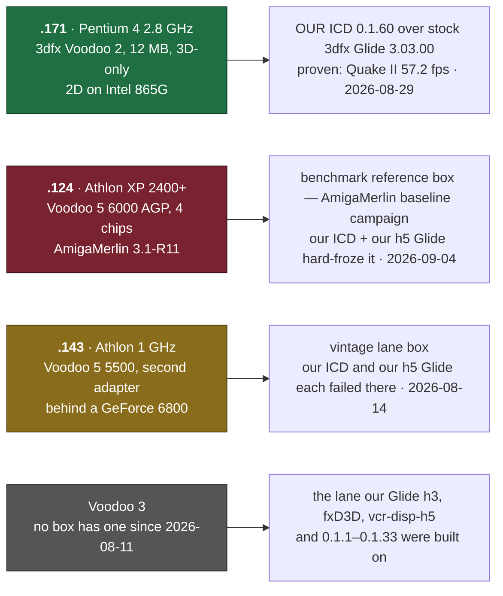

| Box | Card | Can our stack run there? |
|---|---|---|
| **`.171`** | Voodoo 2, 12 MB (4 MB frame buffer + 2 × 4 MB texture). 3D-only, INF `Class=MEDIA`, so it never shows as a display adapter. A second Voodoo 2 was removed 2026-08-28/30 | **Yes — the one proven box today.** The ICD runs over the stock Glide. No display driver is needed (the Intel 865G keeps 2D), so this is the only box where the whole 3D path can be ours without a display driver. Our `glide3x_cvg.dll` is built and waiting to be deployed |
| **`.124`** | Voodoo 5 6000 (Strange God AGP reproduction, `121A:0009`, 4 VSA-100 chips) on AmigaMerlin 3.1-R11 | **Not yet.** It is the reference box for the running AmigaMerlin benchmark campaign ([`../docs/v56k-benchmark-plan.md`](../docs/v56k-benchmark-plan.md)); leave its driver alone while that runs. Our ICD over our h5 Glide hard-froze the V5 6000 (then in `.191`) on 2026-09-04. The low-risk next test is our ICD over AmigaMerlin's own Glide ([§17](#17-roadmap)) |
| **`.143`** | Voodoo 5 5500, second adapter behind a GeForce 6800 | The vintage lane's box. On 2026-08-14 **both open layers failed there, independently**: our ICD over the known-good retail Glide stopped at the mode set, and our h5 Glide hung at init under other ICDs (`retro-3dfx/OPEN-STACK-ON-VSA100.md` §7) |
| none | Voodoo 3 | The card this stack was built on (`.124`, July–August 2026) was **removed 2026-08-11**. Every Voodoo 3 result below is historical until one is refitted |

---

## 3. Architecture

### 3.1 The three layers

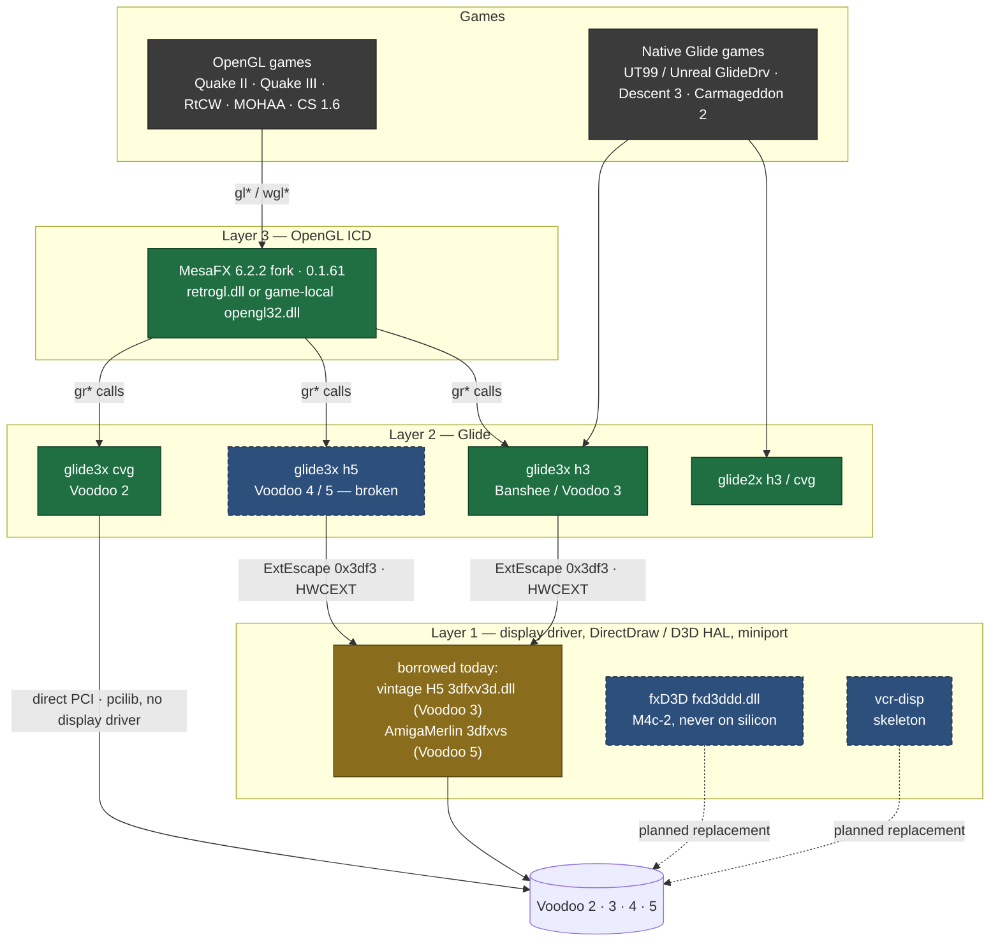

Green is ours and working, blue-dashed is ours and unfinished, amber is
borrowed from someone else's driver.

- **Layer 3 — the OpenGL ICD.** Turns OpenGL into Glide calls. Mesa does the
  transform and lighting on the CPU; the Voodoo only rasterizes. It is built as
  a drop-in `opengl32.dll`, not a real Windows ICD ([§5](#5-layer-3--the-opengl-icd-mesafx-fork)).
- **Layer 2 — Glide.** 3dfx's own low-level API, one build per chip family.
  On the Voodoo 3/4/5 it cannot touch the card by itself: it asks the display
  driver, through `ExtEscape`, for the card's details and for the card's memory
  mapped into the game's process ("HWCEXT", [§6.2](#62-how-glide-finds-the-card-on-windows-xp)).
  The Voodoo 2 build maps the card directly through a small PCI library.
- **Layer 1 — the display driver.** Owns the card, the desktop, mode changes,
  DirectDraw and Direct3D, and answers Glide's escapes. We do not have a working
  one of our own yet ([§7](#7-layer-1--the-display-driver-tracks)).

### 3.2 How a frame gets from a game to the card

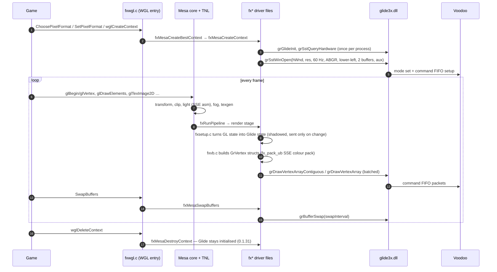

---

## 4. What is in this directory

Tracked in git:

| Path | What it is |
|---|---|
| `README.md` | This page |
| `VERSION`, `.buildnum` | Version = `VERSION` (`0.1`) + `.` + `.buildnum` (now `61`). `build-mesafx-retail.sh` increments `.buildnum` on every build |
| `build-stack.sh` | Clones the two forks into `build/`, builds every Glide lane, applies `patches/mesafx-*.patch`, builds the ICD. [§8.2](#82-build-stacksh--every-glide-lane-and-the-icd) |
| `build-mesafx-retail.sh` | Rebuilds only the ICD, stamps the next `0.1.N` into `GL_RENDERER`, links the retail Glide naming. [§8.3](#83-build-mesafx-retailsh--the-shipping-icd) |
| `patches/mesafx-voodoo2-icd.patch` | **All ICD work from 0.1.41 to 0.1.60** (the Voodoo 2 lane). Applied to the fork clone by `build-stack.sh`; it is not in any fork commit |
| `patches/h5-bringup-wip.patch` | Three h3 fixes ported to the h5 Glide tree. **Not applied by anything** (§16) |
| `tools/glideprobe.c` | Step-by-step Glide bring-up probe that survives a machine lock-up ([§11.3](#113-glideprobe--which-glide-call-hung-the-machine)) |
| `deploy/deploy171.py` | Stages the ICD (and optionally our Voodoo 2 Glide) into Quake II's folder on `.171`, verifies each upload by md5, `--rollback` |
| `deploy/q2bench171.py` | Quake II timedemo A/B on `.171`, quiesced, median of runs 2..N, writes JSON to `deploy/bench-results/` (gitignored) |
| `deploy/q2bench.py` | Older Quake II timedemo runner (kills the game and deletes the log first, parses only the last session) |
| `deploy/gfxbench_voodoo3_baseline.csv` | A 30-frame `gfxbench` Glide sweep from the Voodoo 3 — proof the Glide path works, not a performance number ([§13](#13-benchmarks)) |
| `vcr-disp/` | Our own display-driver skeleton ([§7.1](#71-vcr-disp--our-cooperative-display-driver-skeleton)) |
| `vcr-disp-h5/` | Prebuilt vintage H5 display driver package used as a stopgap on the Voodoo 3 ([§7.3](#73-vcr-disp-h5--the-stopgap)) |
| `CHANGELOG.md` | ICD version-by-version log with measurements (0.1.1 → 0.1.60) |
| `OPTIMIZATIONS.md` | Voodoo 3 optimization log (`.124`, July 2026) |
| `OPTIMIZATIONS-VOODOO2.md` | Voodoo 2 optimization log (`.171`, August 2026) — the most current working log |
| `OPTIMIZATION-RESEARCH.md` | Research notes behind the optimization choices |
| `REVIEW-FINDINGS.md` | A code review of the ICD and what came of each item |
| `DEBUGGING-NOTES.md` | The long-form debugging trail (ICD + Glide bring-up) |
| `RUNNING-GAMES.md` | The first per-game recipes (2026-07-16; historical) |
| `TOOLCHAIN-BOOTSTRAP.md` | Installing the mingw cross toolchain without root |
| `FORKS.md` | Fork provenance and licenses |

Not tracked (gitignored, created by the build scripts):

| Path | What it is |
|---|---|
| `build/retro3dfx-gl/` | Clone of [`voidsstr/retro3dfx-gl`](https://github.com/voidsstr/retro3dfx-gl) (MesaFX). Driver code in `src/mesa/drivers/glide/fx*.c` |
| `build/retro3dfx-glide/` | Clone of [`voidsstr/retro3dfx-glide`](https://github.com/voidsstr/retro3dfx-glide), branch `glide-devel-sezero` |
| `build/nasm-install/` | nasm 2.16.03, built from source when the host has none |
| `out/` | Build outputs ([§8.4](#84-build-outputs)) and `out/sdk/` (Glide 3 headers + import libraries) |

Elsewhere in the repo:

| Path | What it is |
|---|---|
| `../scripts/3dfx/` | **fxD3D** — our clean-room display driver + DirectDraw/Direct3D HAL + kernel Glide backend (`fxd3ddd.dll`), plus `gfxbench/`, `3dfxctl/`, `glide-sdk/` (headers and the retail import library `libglide3x_retail.dll.a`) |
| `../tests/native/test_fx_*.c`, `test_glide*.c` | Host regression tests for ICD and Glide fixes ([§12](#12-tests)) |
| `../tests/python/test_glide_artifact_naming.py`, `test_voodoo2_cvg_stack.py` | Build-pipeline regression tests |
| `../benchmarks/` | Per-run JSON of every `driver-bench` run, plus quality screenshots |
| `../.claude/skills/voodoo3-driver-dev/`, `driver-install/`, `driver-bench/` | The operating procedures for building, deploying and benchmarking this stack |
| `../docs/3dfx-d3d-hal-design.md`, `../docs/3dfx-gbkernel-design.md` | fxD3D and kernel-Glide design documents |

---

## 5. Layer 3 — the OpenGL ICD (MesaFX fork)

### 5.1 What it is

A fork of **Mesa 6.2.2's Glide driver** (`src/mesa/drivers/glide/`), from
sezero's [MesaFX-6.2](https://github.com/sezero/MesaFX-6.2), forked at sezero's
last commit `fd191eb` (2023-02-02). Our changes sit on top as fork commits up to
`492a0d8` (0.1.33), then as `patches/mesafx-voodoo2-icd.patch` (0.1.41–0.1.60).

**It is not a real Windows ICD.** It is built with `FX=1`, which produces a
**drop-in `opengl32.dll`** that exports `gl*`, `wgl*` and the GDI pixel-format
functions itself; it has no `Drv*` entry points and is never registered under
`OpenGLDrivers`. A game uses it because it is loaded **by name**:

- as a game-local `opengl32.dll` (a DLL next to the exe wins over `system32`,
  and `opengl32` is not a KnownDLL on these boxes), or
- as `retrogl.dll`, named by the game's own driver cvar (`r_glDriver` in id
  Tech 3, `gl_driver` in Quake II).

The renderer string identifies every build:

```
Mesa Glide v0.62 Voodoo3 (tm) [voodoo-cleanroom 0.1.61]
Mesa Glide v0.62 Voodoo2 [voodoo-cleanroom 0.1.61]
```

Builds before the directory rename stamped `[retro3dfx 0.1.N]`. The "Mesa"
prefix is kept on purpose: QuakeWorld keys off it.

### 5.2 Source files

All in `build/retro3dfx-gl/src/mesa/drivers/glide/`.

| File | Responsibility |
|---|---|
| `fxwgl.c` | WGL and GDI entry points: the pixel-format table, `wglCreateContext`/`DeleteContext`/`MakeCurrent`, `wglGetProcAddress` (our table first, then Mesa's), gamma and swap-control WGL extensions, font bitmaps, the `DllMain` load marker |
| `fxapi.c` | Glide bring-up (`fxQueryHardware`), board selection, resolution choice, board open (`grSstWinOpen`/`Ext`), destroy, swap, `fxCloseHardware`; our default gamma, dither and swap settings |
| `fxdd.c` | Mesa driver hooks: clear, bitmap, read/draw pixels, `GetString` (renderer and extension string), context init (texture limits, pending buffers, pipeline), the extension list, the "can the hardware do this?" check |
| `fxtris.c` | Primitive rasterization tables, clipped-polygon path, software fallbacks, `fxRunPipeline`; our batched submission (0.1.3) |
| `fxvb.c`, `fxvbtmp.h` | Build Glide `GrVertex` structs from Mesa's vertex buffers; `fx_pack_ub` colour packing (0.1.2) |
| `fxsetup.c`, `fxsetup.h` | GL state → Glide state: texture, combiners, blend, depth, stencil, fog; our shadow cache (0.1.5, 0.1.52); `FX_PROFILE` counters; Voodoo 4/5 combiner paths in `fxsetup.h` |
| `fxddtex.c` | Texture formats, `TexImage`/`SubImage`, `TexEnv` (applies `GL_TEXTURE_LOD_BIAS_EXT`), palettes |
| `fxtexman.c` | Texture memory manager: per-TMU allocator, least-recently-used eviction, split and both-TMU placement, unified texture memory on Voodoo 4/5 |
| `fxddspan.c` | Span functions for the software fallbacks (frame buffer, Z16/Z24, stencil) |
| `fxglidew.c/h` | Glide wrappers: board type from `GR_HARDWARE`, capability flags from `GR_EXTENSION` |
| `fxg.c/h` | Optional Glide call tracer (`FX_TRAP_GLIDE`, compile-time) and resolution of Glide extension functions |
| `fxwindow.c` | Ours: windowed Glide through DirectDraw (opt-in, unfinished) |
| `fxrlog.h` | Ours: the crash-safe `C:\retrogl.log` tracer |
| `fxopengl.def`, `fx.rc` | Export list and version resource |

### 5.3 Pixel formats

| # | Colour | Buffers | Depth | Stencil | Alpha | Offered on |
|---|---|---|---|---|---|---|
| 1 | RGB565 | single | 16 | – | – | all |
| 2 | RGB565 | double | 16 | – | – | all |
| 3 | ARGB1555 | single | 16 | – | 1-bit | all (ours; upstream offered only 1–2 below Voodoo 4) |
| 4 | ARGB1555 | double | 16 | – | 1-bit | all (ours) |
| 5 | ARGB8888 | single | 24 | 8 | 8 | Voodoo 4/5 only |
| 6 | ARGB8888 | double | 24 | 8 | 8 | Voodoo 4/5 only |

A 24/32-bit request becomes 32-bit on Voodoo 4/5 and 16-bit on everything
older. **Known bug:** formats 3–4 are chosen for apps that ask for alpha, but on
a Voodoo 3 the board can only be opened as RGB565, so context creation then
fails ([§16](#16-known-bugs-and-open-issues)).

### 5.4 Extensions

| Extension | When advertised |
|---|---|
| `EXT_secondary_color`, `ARB_point_sprite`, `EXT_texture_lod_bias`, `EXT_blend_func_separate`, `EXT_texture_env_add`, `EXT_stencil_wrap`, `EXT_multi_draw_arrays`, `ARB_vertex_buffer_object` | always |
| `WGL_3DFX_gamma_control`, `WGL_EXT_swap_control`, `WGL_EXT/ARB_extensions_string` | always (appended to the string) |
| `EXT_paletted_texture`, `EXT_shared_texture_palette` | default on; `FX_NO_PALETTED_TEXTURE` hides them |
| `ARB_multitexture` | two TMUs and no `FX_NO_MULTITEXTURE` |
| `EXT_point_parameters` | **off since 0.1.44** (not accelerated; withdrawing it gave +12.2% on the Voodoo 2); `FX_POINT_PARAMS` restores it |
| `SGIS_multitexture` | off; `FX_SGIS_MULTITEXTURE` opts in (0.1.41) |
| `ARB/EXT_texture_env_combine` | **only with Glide's COMBINE extension, i.e. Voodoo 4/5.** Never on a Voodoo 3 — lightmap/overbright games render dark there ([§16](#16-known-bugs-and-open-issues)) |
| `EXT_blend_subtract`, `EXT_blend_equation_separate` | Voodoo 4/5 (PIXEXT) |
| `ARB_texture_compression`, `3DFX_texture_compression_FXT1`, `EXT_texture_compression_s3tc`, `NV_blend_square` | Voodoo 4/5 |
| `EXT_fog_coord` | Voodoo 2 and later |
| `ARB/NV_vertex_program` | only with `MESA_FX_ALLOW_VP` |

### 5.5 What differs per card

| | Voodoo 2 (`cvg`) | Voodoo 3 (`h3`) | Voodoo 4/5 (`h5`, Napalm) |
|---|---|---|---|
| Colour depth | 16-bit | 16-bit | 16 or 32-bit |
| Board open | `grSstWinOpen`, RGB565 | `grSstWinOpen`, RGB565 | `grSstWinOpenExt` with a pixel format that encodes AA |
| TMUs | 2 (ARB_multitexture) | 2 | 1 per chip |
| Colour order | BGR | RGB | RGB |
| Texture size limit | queried (`GR_MAX_TEXTURE_SIZE`, 256) | queried (256) | queried (2048) |
| Multi-chip | Voodoo 2 SLI appends " SLI" to the renderer string | – | `SSTH3_SLI_AA_CONFIGURATION` × chip count selects SLI/AA and the pixel format; no " SLI" suffix |

### 5.6 Windowed Glide (opt-in, unfinished)

`FX_WINDOWED=1` (or `MESA_GLX_FX=w…`) renders into DirectDraw surfaces through
Glide's `grSurface*Ext` functions and blits to the window on each swap
(`fxwindow.c`, 0.1.23–0.1.30, for GoldSrc/Counter-Strike). All surfaces must be
created **before** the rendering surface is set, or it faults. The path is
incomplete — `grSurfaceSetAux` faulted, the back buffer is always 565, the swap
interval is ignored — and Counter-Strike ended up running fullscreen instead.
It is off by default and falls back to fullscreen if it fails.

---

## 6. Layer 2 — Glide (3dfx GPL fork)

### 6.1 The lanes

3dfx's tree has one Glide per chip family. We build five of them:

| Output | Tree | Chip family | Talks to the card through |
|---|---|---|---|
| `glide3x_h3.dll` (= `glide3x.dll`) | `glide3x/h3` | Banshee / Voodoo 3 ("Avenger") | the display driver (HWCEXT escapes) |
| `glide3x_h5.dll` | `glide3x/h5` | Voodoo 4 / 5 ("Napalm", VSA-100) | the display driver (HWCEXT escapes) |
| `glide3x_cvg.dll` | `glide3x/cvg` | Voodoo 2 | direct PCI mapping via `swlibs/newpci/pcilib` |
| `glide2x.dll` | `glide2x/h3` (`H4=1`) | Banshee / Voodoo 3, Glide 2 API | the display driver |
| `glide2x_cvg.dll` | `glide2x/cvg` | Voodoo 2, Glide 2 API | direct PCI |

`sst1` (Voodoo Graphics / Rush) exists in the tree and is not built. Every DLL
exports **all four symbol spellings** of each function — `grFoo`, `grFoo@N`,
`_grFoo@N` and `_grFoo` — so it can be loaded by our ICD, by retail MSVC-built
games that import `_grFoo@N` (Unreal's GlideDrv, Carmageddon 2), and by anything
else ([§8.2](#82-build-stacksh--every-glide-lane-and-the-icd)).

> **h3 and h5 export exactly the same names.** That is why dropping the h5 DLL
> in as `glide3x.dll` on a Voodoo 3 "works" at load time and then hangs in
> `grGlideInit` — the 2026-07-25 naming trap. `out/glide3x.dll` is always the
> h3 build now, enforced by `../tests/python/test_glide_artifact_naming.py`.

### 6.2 How Glide finds the card on Windows XP

On XP the h3 and h5 builds never touch PCI. Everything goes through
`ExtEscape` calls to the display driver ("HWCEXT", defined in
`minihwc/hwcext.h`). Escape codes: `0x3df3`, `0xfd3` (old), and `0x13df3`
(the XP-legal code).

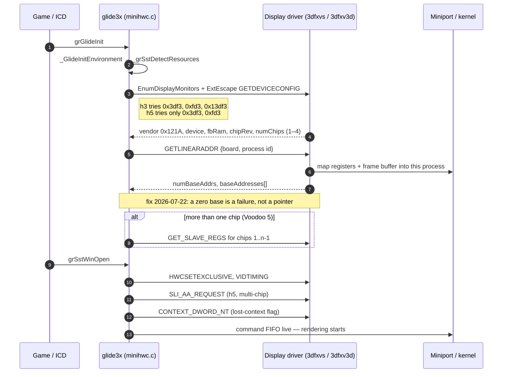

What Glide needs from any display driver, ours included:

- answer **GETDEVICECONFIG** with vendor `0x121A`;
- return **non-zero bases mapped into the calling process** from **GETLINEARADDR**;
- on multi-chip boards, answer **GET_SLAVE_REGS** and **SLI_AA_REQUEST**;
- optionally **CONTEXT_DWORD_NT** (both lanes fall back to a dummy flag).

The request is `{contextID, which, optData}` and the result is
`{resStatus, optData}`. Our own `vcr-disp` currently gets this layout wrong
([§7.1](#71-vcr-disp--our-cooperative-display-driver-skeleton)).

**Order matters on the vintage H5 driver:** its `hwcAllocContext` creates the
per-process state without mapping memory, so the h3 lane sends one
`GETLINEARADDR` **before** `ALLOCCONTEXT` (fix `8b6eb5f`, 2026-07-22; base0 went
from `0` to `0x07090000` on `.124`). The h5 lane sends no `ALLOCCONTEXT` during
init, so it does not need that step.

### 6.3 Multi-chip, SLI and anti-aliasing (h5 only)

Glide — not the display driver — reads the topology from
`SSTH3_SLI_AA_CONFIGURATION` (`gpci.c`) and then asks the driver to program it
with `SLI_AA_REQUEST`:

| Value | Meaning | Valid on |
|---|---|---|
| 0 | force single chip | all |
| 1 | single chip, 2× AA | all |
| 2 | default: all available SLI, no AA | all |
| 3 / 4 | 2× / 4× AA | 2-chip |
| 5 | 4-way SLI | 4-chip |
| 6 | 4-way SLI + 2× AA | 4-chip |
| 7 | 2-way SLI + 4× AA | 4-chip |
| 8 | 8× AA, no SLI | 4-chip |

The code has paths for 4-way SLI and 4×/8× AA; 4-way SLI with 2× AA is marked
"doesn't work yet" in 3dfx's own source. **None of the multi-chip path has
worked in our build yet** — see the h5 bugs in [§16](#16-known-bugs-and-open-issues).

### 6.4 Where Glide reads its settings

The process environment first, then the registry (HKCU, then HKLM):

| Lane | Registry key |
|---|---|
| h5 on XP | `HKLM\SYSTEM\CurrentControlSet\Services\3dfxvs\Device0\glide`, or `...\banshee\Device0\glide` if there is no `3dfxvs` service |
| h3 on XP | `HKLM\SYSTEM\CurrentControlSet\Services\3Dfx\Device0\glide` |
| cvg | environment only |

---

## 7. Layer 1 — the display driver tracks

Every Voodoo except the Voodoo 2 needs a display driver, and we do not yet have
a working one of our own. Three things live in this layer:

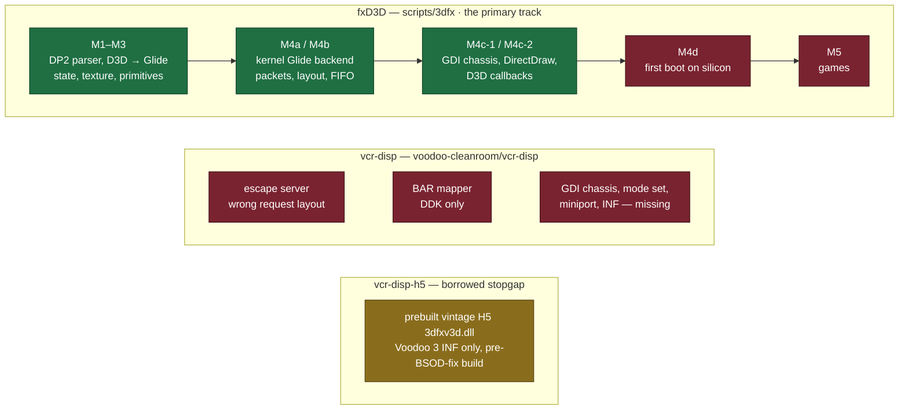

### 7.1 `vcr-disp` — our cooperative display-driver skeleton

The idea: a display driver of our own whose main job is to **answer Glide's
HWCEXT escapes**, so our unmodified Glide can drive the card while Windows keeps
the desktop through us. Modelled on the open Device3Dfx (Linux), RISCyVoodoo
(NT) and vmdisp9x — read for structure, not copied.

What exists (2026-09-23):

| File | Contents |
|---|---|
| `vcr_hwcext.h` | The escape contract: codes `0x3df3`/`0xfd3`/`0x13df3`, opcodes, device IDs `0003`/`0005`/`0009` |
| `disp_escape.c` | `r3dfx_escape_dispatch()` — answers GETDRIVERVERSION, GETDEVICECONFIG, GETLINEARADDR, ALLOCCONTEXT, exclusive/restore and context queries; everything else fails. `DrvEscape` wrapper under `HAVE_DDK` |
| `disp_hw.c` | Under `HAVE_DDK`: reads BAR0/BAR1, maps BAR0 with `MmMapIoSpace`, maps both into the caller through `\Device\PhysicalMemory` + `ZwMapViewOfSection`. Hard-codes Voodoo 3 values (16 MB) |
| `SOURCES`, `disp.def`, `vcr-disp.inf` | DDK build file, export list (`DrvEnableDriver`), INF binding `DEV_0005`/`DEV_0009` |

What is wrong or missing — it **cannot compile and would not work if it did**:

1. **The request/response layout does not match Glide's** (`{contextID, which, optData}` in, `{resStatus, optData}` out). It reads `contextID` as the opcode and writes results with no `resStatus`.
2. It **does not answer** `LINEAR_MAP_OFFSET` or `FIFOINFO`, which Glide sends.
3. `SOURCES` lists `disp_enable.c` and `disp_modeset.c`, **which do not exist**; `disp.def` exports a `DrvEnableDriver` that is not written; function names between the two `.c` files do not match; `PDEV_context` is defined nowhere.
4. A GDI display DLL may import only `win32k.sys`, but `disp_hw.c` calls `Zw*`/`MmMapIoSpace` — that code belongs in a miniport, which does not exist.
5. The INF copies a `retro3dfx-mp.sys` that does not exist and has no `InstalledDisplayDrivers`.
6. No test covers any of it.

`../scripts/3dfx/driver/nt/chassis.c` already has a working clean-room GDI
chassis that could be reused here.

### 7.2 fxD3D (`../scripts/3dfx/`) — the fuller clean-room display driver

`fxd3ddd.dll` is a real DirectX 6/7 **Direct3D + DirectDraw HAL** with a
**kernel-mode Glide backend** (it programs the card from the display driver
itself, no HWCEXT, no user-mode Glide). Milestones M1 to M4c-2 are done and
host-tested; it links (~45 KB). It has **never been loaded on a card** (M4d),
and its register backend (`gbkernel.c`, `hw/h3hw.h`) is **Voodoo 3 only** —
there is no Voodoo 3 in the fleet now and no H5 backend, so M4d currently has
no hardware to run on.

- Build: the Windows 2000 DDK under Wine (`~/development/retro-3dfx/toolchain-3dfx/prefix/drive_c/clfxd3d.bat`) or on a fleet box (`provisioning/ddk/build_driver.py`). It must be a NATIVE-subsystem image importing only `WIN32K.SYS`; never cross-build it with mingw.
- Host tests: `make -C ../scripts/3dfx test` (DP2 parser, D3D→Glide translation, kernel-backend packet/layout/state/FIFO/surface logic). Note this target also rebuilds a tracked test binary and cross-builds `fxdbg.exe`.
- Load selector: `InstalledDisplayDrivers` under the **active PnP Display-class instance key** (`...\Control\Class\{4D36E968-E325-11CE-BFC1-08002BE10318}\NNNN`). Editing `Services\...\Device0` or `Control\Video` does nothing.
- On-card bring-up tool: `fxdbg` escapes `FXDBG_PROBE/CLEAR/TRI/TEX/READBACK`. **Known bug:** `FXDBG_TEX` is `0x3DF3`, the same code as Glide's HWCEXT escape ([§16](#16-known-bugs-and-open-issues)).
- Design: [`../docs/3dfx-d3d-hal-design.md`](../docs/3dfx-d3d-hal-design.md), [`../docs/3dfx-gbkernel-design.md`](../docs/3dfx-gbkernel-design.md), [`../scripts/3dfx/README.md`](../scripts/3dfx/README.md).

### 7.3 `vcr-disp-h5` — the stopgap

A prebuilt **vintage** H5 display-driver package, kept here so the Voodoo 3
stack could be deployed from one place: `3dfxv3d.dll` (display, WFP-safe
rename), `3dfxv3m.sys` (miniport), `voodoo3-wfp.inf`, `updrv.exe`
(byte-identical to `retro-3dfx/toolchain-3dfx/dist/3dfx-voodoo3-wfp-20260722/`).
It is **not clean-room code**, its INF binds **only the Voodoo 3** (`DEV_0005`),
and its source is not vendored here (the `src/` directory the old README
mentioned is gitignored and absent). Rebuild it in `retro-3dfx`.

---

## 8. Building

### 8.1 Prerequisites

- Linux host with the **mingw cross toolchain** `i686-w64-mingw32-gcc` (gcc 13)
  and a host `gcc`. No root? [`TOOLCHAIN-BOOTSTRAP.md`](TOOLCHAIN-BOOTSTRAP.md)
  installs it under `$HOME/toolchain-mingw` with `apt-get download` + `dpkg -x`.
- `nasm` — built automatically (2.16.03) if missing.
- `git`, network access to GitHub for the first clone.
- The retail Glide import library `../scripts/3dfx/glide-sdk/lib/libglide3x_retail.dll.a` (tracked).

### 8.2 `build-stack.sh` — every Glide lane and the ICD

```bash
cd voodoo-cleanroom
./build-stack.sh               # default work dir ./build, outputs in ./out
./build-stack.sh --debug       # glide3x lanes with GDBG debug logging (§11.4)
```

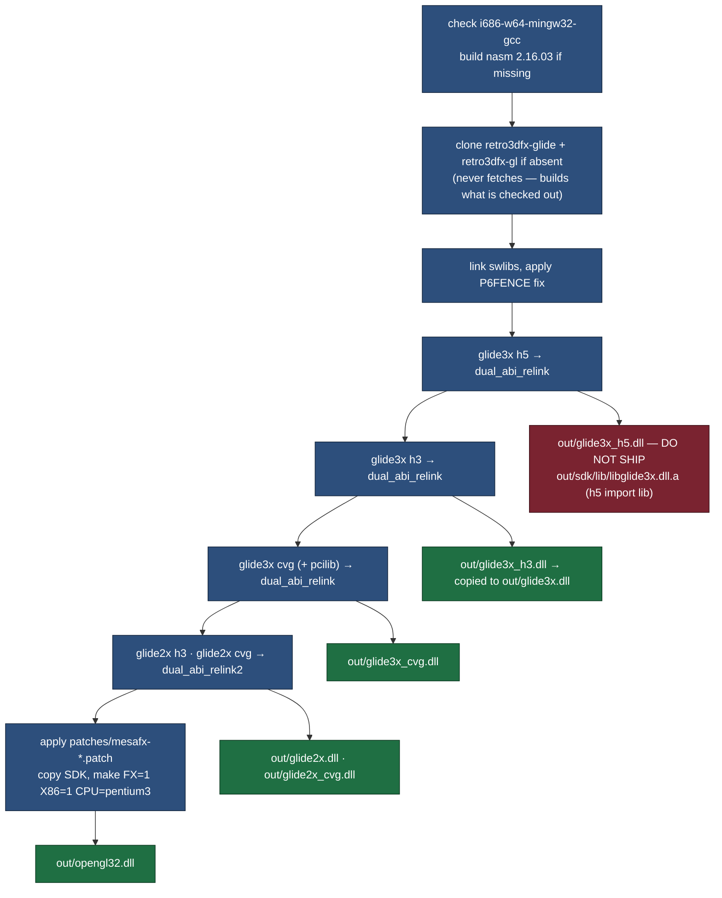

What each step does, and the traps it encodes:

- **Dual-ABI relink** (`dual_abi_relink`, 2026-07-21). The Makefiles give each
  function two names (`grFoo`, `grFoo@N`). The relink adds `_grFoo@N` (and the
  linker's `_grFoo` alias) — the names MSVC-built games and the retail ICD ABI
  import — and relinks every object with **`-static-libgcc`**, because the
  retro boxes have no `libgcc_s_dw2-1.dll` (Glide lanes since 0.1.60, ICD since
  0.1.52).
- **Compiler flags**: `-O2 -ffast-math -march=pentium3 -mtune=pentium3 -mfpmath=sse`
  (`-mtune=pentium4` for cvg). The result **needs SSE**: it faults
  (`c000001d`) on an SSE-less CPU such as a K7 "Thunderbird"/K75. Lowering
  `-mfpmath` alone does not remove SSE; `-march` must be lowered too
  (`../tests/python/test_voodoo2_cvg_stack.py`).
- **The cvg relink must include the `pcilib` objects**, or it emits no DLL.
- **No header dependency tracking** in the Glide Makefiles: after editing a
  header, delete the `.o` files or the change does not reach the DLL.
- **It never fetches or checks out.** An existing clone is built as it stands,
  uncommitted edits included — which is how the uncommitted h5 `hwcMapBoard`
  guard got into `out/glide3x_h5.dll`.
- **The ICD step does not `make clean`.** On 2026-09-12 nothing had changed, so
  it re-copied the previous retail-ABI build: today `out/opengl32.dll` is
  byte-identical to `out/opengl32_retail.dll` (md5 `bcf0b1bd…`). Because every
  Glide lane exports all four spellings, either link works with either Glide.
- Logs: `/tmp/mesa_build.log`, `/tmp/dual_abi_relink*.log`.

### 8.3 `build-mesafx-retail.sh` — the shipping ICD

```bash
./build-stack.sh               # once: SDK headers + patched fork
./build-mesafx-retail.sh       # → out/opengl32_retail.dll, next 0.1.N
```

1. Checks the cross compiler, the retail import library and `out/sdk/include`.
2. Clones `retro3dfx-gl` if missing (it does **not** apply the patches — run
   `build-stack.sh` first).
3. Copies the SDK headers and the **retail** import library (`_grFoo@N` naming)
   into the fork.
4. Bumps `.buildnum` and injects `[voodoo-cleanroom 0.1.N]` into the renderer
   string in `fxapi.c` (aborts if the injection fails).
5. `make clean` then `make -f Makefile.mgw FX=1 X86=1 CPU=pentium3 TUNE=pentium4`.
6. Copies the result to `out/opengl32_retail.dll`, `out/opengl32_retail_v0.1.N.dll`
   and `out/opengl32_retail.dll.ver`.
7. Checks with `objdump -p` that `_grBufferSwap@4` is imported.

Effective flags: `-Wall -O2 -ffast-math -march=pentium3 -mtune=pentium4 -mfpmath=sse
-DNDEBUG -DFX -DUSE_X86_ASM -DUSE_MMX_ASM -DUSE_SSE_ASM -DUSE_3DNOW_ASM`, linked
`-shared -static-libgcc` against `gdi32` and `glide3x`.

**Always check the artifact, not the flags:**

```bash
i686-w64-mingw32-objdump -p out/opengl32_retail.dll | grep "DLL Name"
#   glide3x.dll  GDI32.dll  KERNEL32.dll  msvcrt.dll  USER32.dll   <- nothing else
strings -a out/opengl32_retail.dll | grep voodoo-cleanroom
#   Mesa %s v0.62 %s%s [voodoo-cleanroom 0.1.61]
```

A stray `libgcc_s_dw2-1.dll` import makes `LoadLibrary` fail on a retro box with
no diagnostic at all, and the game silently falls back to Microsoft's software
OpenGL.

### 8.4 Build outputs

Current contents of `out/` (built on the dev host; md5 prefixes let you check a
deployed copy):

| File | Size | Built | md5 | What it is |
|---|---|---|---|---|
| `opengl32_retail.dll` | 2,757,140 | 2026-09-04 | `bcf0b1bd` | **The ICD, 0.1.61** — deploy this one |
| `opengl32_retail_v0.1.61.dll` | 2,757,140 | 2026-09-04 | `bcf0b1bd` | versioned copy for rollback |
| `opengl32.dll` | 2,757,140 | 2026-09-12 | `bcf0b1bd` | same bytes (see §8.2) |
| `glide3x.dll` | 855,150 | 2026-09-12 | `218d52ce` | = `glide3x_h3.dll` |
| `glide3x_h3.dll` | 855,150 | 2026-09-12 | `218d52ce` | Voodoo 3 Glide 3 — not yet run on hardware since this rebuild |
| `glide3x_h5.dll` | 989,027 | 2026-09-12 | `1f1473bd` | Voodoo 4/5 — **do not ship** |
| `glide3x_cvg.dll` | 845,530 | 2026-09-12 | `19eab086` | Voodoo 2 Glide 3 (adds `grTexDownloadTableExt`) |
| `glide2x.dll` | 798,501 | 2026-09-12 | `d9507504` | Voodoo 3 Glide 2 |
| `glide2x_cvg.dll` | 831,246 | 2026-09-12 | `234d4015` | Voodoo 2 Glide 2 |
| `glideprobe.exe` | 444,819 | 2026-09-12 | `854b6da9` | built by hand, see §11.3 |
| `sdk/include/*.h`, `sdk/lib/libglide3x.dll.a`, `libglide3x_cvg.dll.a` | | 2026-09-12 | | Glide 3 SDK (headers from the h5 tree; the h5 import library — names are identical across lanes) |

The Glide DLLs keep their symbol tables (release builds, not stripped), which
is why they are ~800 KB.

---

## 9. Configuration reference

### 9.1 ICD environment variables

The ICD reads the process environment. Values marked "(Glide)" are read through
Glide's `grGetRegistryOrEnvironmentStringExt`, so they can also live in the
Glide registry key (§6.4).

| Variable | Default | Effect |
|---|---|---|
| `FX_GLIDE_SWAPINTERVAL` | `0` | Swap interval passed to `grBufferSwap`. Read with the ICD's own C runtime (0.1.6) because retail Glide snapshots its environment at load |
| `FX_GLIDE_SWAPPENDINGCOUNT` (Glide) | `2` (0–6) | `grSetNumPendingBuffers` |
| `FX_GLIDE_NUM_TMU` (Glide) | hardware | `1` disables the second TMU (and multitexture) |
| `SSTH3_SLI_AA_CONFIGURATION` (Glide) | `0` | Voodoo 4/5 SLI/AA topology (§6.3) → pixel format |
| `FX_GLIDE_SHUTDOWN` | unset | Set: call `grGlideShutdown` when the last context goes (pre-0.1.31 behaviour) |
| `FX_GAMMA` | `1.3` | Gamma ramp at context creation; `1.0` or `0` leaves the ramp alone; identity restored on exit |
| `FX_DITHER` | 4×4 | `0` keeps Glide's 2×2 dither |
| `FX_LOD_BIAS` | `-0.5` | Texture LOD bias on single-texture setups; `0` disables |
| `FX_NO_PALETTED_TEXTURE` | unset | Hide the paletted-texture extensions |
| `FX_NO_MULTITEXTURE` | unset | Hide `ARB_multitexture` (and SGIS) |
| `FX_POINT_PARAMS` | unset | Re-advertise `EXT_point_parameters` |
| `FX_SGIS_MULTITEXTURE` | unset | Advertise `GL_SGIS_multitexture` (needs two TMUs) |
| `FX_SGIS_NO_CLIENTTEX` | unset | SGIS shim skips `glClientActiveTextureARB` |
| `FX_WINDOWED` / `MESA_GLX_FX=w` | off | Windowed Glide (§5.6) |
| `FX_WINDOWED_LOG` = path | off | Trace `fxWinOpen` to a file |
| `FX_WINDOWED_NOAUX`, `FX_WINDOWED_ZAUX` | off | No aux surface / DirectDraw Z-buffer as aux |
| `FX_PROFILE` | off | Per-frame cost breakdown to `C:\retrogl.log` every 100 frames (§11.2) |
| `FX_TRACE_TEX` | off | Texture uploads and unsupported formats to stderr |
| `MESA_FX_INFO` | off | Verbose stats; value starting `r` also redirects stderr to `%TEMP%\MESA.LOG`. Costs frame rate |
| `MESA_FX_ALLOW_VP` | off | Advertise vertex programs |
| `MESA_FX_IGNORE_PALEXT` / `PIXEXT` / `TEXFMT` / `CMBEXT` / `MIREXT` / `TEXUMA` / `TEXUS2` | off | Mask a Glide extension capability (upstream switches) |
| `MESA_FX_NOSNAP`, `MESA_FX_POINTCAST`, `MESA_FX_MAXLOD` | off | Upstream compatibility switches |
| `MESA_CODEGEN`, `MESA_NO_ASM`, `MESA_NO_MMX`, `MESA_NO_3DNOW`, `MESA_NO_SSE`, `MESA_DEBUG`, `MESA_VERBOSE` | | Mesa core switches |

Documented in older logs but **not in the current source**:
`FX_GLIDE_REFRESH_RATE`, `SSTV2_REFRESH_RATE`, `MESA_FX_REFRESH`, `FX_CURSOR`,
`FX_DUMP_FRONT` (from 0.1.34/0.1.35, see §15.4).

### 9.2 Glide environment variables worth knowing

| Variable | Lane | Effect |
|---|---|---|
| `GDBG_FILE`, `GDBG_LEVEL` | all | Debug trace file and levels — **only in `--debug` builds** (§11.4) |
| `FX_GLIDE_NO_SPLASH` | all | No 3dfx splash |
| `FX_GLIDE_REFRESH` | h5 | Refresh rate |
| `FX_GLIDE_NUM_CHIPS` | h5 | Lower the chip count the driver reported |
| `FX_GLIDE_AA_SAMPLE`, `FX_GLIDE_FORCE_OLD_AA`, `FX_GLIDE_ANALOG_SLI`, `FX_GLIDE_SLI_BAND_HEIGHT` | h5 | AA/SLI overrides |
| `FX_GLIDE_V56K_DAC_FIX` | h5 | Voodoo 5 6000 DAC gamma fix (on by default for 4 chips with ≥4 samples) |
| `FX_GLIDE_BPP` | h5 | Forced output depth — **always reset to 0 by a bug** (§16) |
| `FX_GLIDE_DEVICEID`, `FX_GLIDE_FBRAM`, `FX_GLIDE_TMU_MEMSIZE` | h3/h5 | Override detected board facts |
| `SSTH3_GRXCLOCK`, `SSTH3_MEMCLOCK`, `SSTH3_*GAMMA` | h3/h5 | Clocks and gamma |
| `SSTV2_*` (≈100), `SST_VREZ_*` | cvg | Voodoo 2 init, video and timing overrides; `SSTV2_INITDEBUG_FILE` is compiled into retail Glide too |

---

## 10. Deploying

### 10.1 The rule that decides everything: game-local wins

Windows loads a DLL from the game's own folder before `system32`, and
`opengl32` is not a KnownDLL here. So **the copy next to the game is the one
that runs.** Deploy to every place a game will look, keep a backup of what you
replace, and verify with the renderer string, never with the file size.

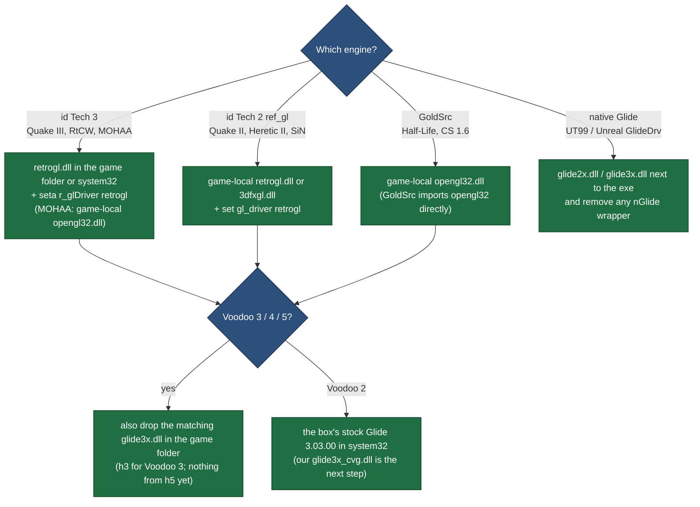

Never touch `system32\opengl32.dll` or its `dllcache` copy — that is Windows'
own OpenGL and is protected by WFP.

### 10.2 Voodoo 2 (`.171`) — the current lane

```bash
python3 deploy/deploy171.py            # retrogl.dll into C:\Games\Quake2Complete, config backed up
python3 deploy/deploy171.py --glide    # also our glide3x_cvg.dll as the game's glide3x.dll
python3 deploy/deploy171.py --rollback # remove both, restore config.cfg
BENCH_HOST=192.168.1.x python3 deploy/deploy171.py   # another box
```

Every upload is checked by UPLOAD → DOWNLOAD → md5 on the host. Nothing goes in
`system32`, no registry, no reboot — rollback is one delete.

### 10.3 Every game on a box — `driver-install`

The `driver-install` skill's `game_sweep.py <host> --flavor cleanroom
[--apply --kill]` finds every `opengl32`/`3dfxgl`/`3dfxogl`/`glide2x`/`glide3x`/`ddraw`
copy on every drive, classifies each by md5, replaces GL loaders with our ICD
(keeping `.pre` backups), replaces Glide shadows with ours, retires wrapper
DLLs and switches UT99 to GlideDrv. **Its built-in artifact paths are stale**
(`game_sweep.py:65-70` looks in `build/opengl32.dll` and `scripts/3dfx/out/`);
point it at `out/opengl32_retail.dll` and `out/glide3x*.dll`.

### 10.4 Display driver

Only relevant when a clean-room display driver exists (fxD3D M4d). The load
selector is `InstalledDisplayDrivers` under the active Display-class instance
key; the durable route is a proper Display INF installed through SetupAPI
(`updrv.exe`) — the `deploy-3dfx-driver` skill automates that for the vintage
package. **Check activation (`LICSTATUS`) and use `scripts/fleet/safe-reboot.py`
for the reboot** — never a bare `REBOOT` (see `../CLAUDE.md`).

---

## 11. Debugging

### 11.1 `C:\retrogl.log` — the ICD tracer

`fxrlog.h` appends one line per event and **opens, flushes and closes the file
on every line**, so the log survives a crash. It records:

- a `DllMain` PROCESS_ATTACH line — tells "the game never loaded our ICD" apart
  from "loaded but failed before any GL call" (GoldSrc resolves exports with
  `GetProcAddress`, invisible to per-call tracing);
- a banner with process id, host exe and **which `glide3x.dll` was loaded**;
- every step of pixel-format selection and context creation;
- the exact `grSstWinOpen` arguments and return value — the usual failure point;
- every failure branch.

It is always on (there is no switch) and writes to the root of `C:`. This
tracer root-caused the whole July games bring-up.

### 11.2 `FX_PROFILE=1` — where the frame goes

Every 100 frames, a `PROF` line in `C:\retrogl.log`: setup calls, single/double-TMU
setups, texture-combine calls issued vs skipped by the shadow, pipeline runs and
vertices, and rdtsc cycle costs (in thousands) of setup, pipeline, immediate
mode and the blocking swap. This is how the Voodoo 2 multitexture cost was
proven to be outside our driver (0.1.58).

### 11.3 `glideprobe` — which Glide call hung the machine

`tools/glideprobe.c` calls Glide one step at a time and writes each step to disk
with `FlushFileBuffers` **before** the next call, so after a hard lock-up the
last line names the call that did it. It loads Glide at run time, so it works
with AmigaMerlin's DLL or ours.

```bash
# build (dev host)
i686-w64-mingw32-gcc -O1 -o out/glideprobe.exe tools/glideprobe.c \
    -Iout/sdk/include -lgdi32 -luser32
# run (on the box)
glideprobe.exe --noopen                         # safe board-health check: stops before grSstWinOpen
glideprobe.exe --res 1024x768 --refresh 85      # full open, 3 clear+swap, close
glideprobe.exe --dll C:\path\glide3x.dll --log C:\glideprobe.log
```

Steps: load the DLL → `grGlideGetVersion` → `grGlideInit` → board count →
`grSstSelect(0)` → chips (`GR_NUM_FB`) → `grGetString` → (unless `--noopen`)
a message-pumping window → `grSstWinOpen` → clear/swap ×3 → close → shutdown.
Last line `RESULT: ok` / `probe-ok-noopen` / `winopen-refused`.

Caveats: `--aa` sets `SSTH3_SLI_AA_CONFIGURATION` in-process, which msvcrt's
`getenv` probably does not see (set it before launch or in the registry).
Against **our** h5 DLL even `--noopen` is not safe — `grGlideInit` itself hits
the TLS bug (§16). The V5 6000 benchmark sweep uses `glideprobe --noopen` as its
board-health check with AmigaMerlin's Glide.

### 11.4 Glide's own debug trace (`GDBG`)

```bash
./build-stack.sh --debug      # glide3x lanes built with -DGDBG_INFO_ON -DGLIDE_DEBUG
```

then on the box, in the environment or the Glide registry key (§6.4):
`GDBG_FILE=C:\glide.log` and `GDBG_LEVEL=80` (minihwc HWCEXT traffic,
`grSstSelect`, `grGlideInit`) or `+80,+280-281` (also resource detection).
Lines are `fflush`ed but not `FlushFileBuffers`ed, so a hard lock-up can lose the
last few — pair it with glideprobe. **Release builds (everything in `out/`)
compile this out.**

### 11.5 Other tools

- **Voodoo 5 per-chip register recorder** — `../scripts/benchmarks/v56k_diag.py ring`
  runs `fxscan2` (from `retro-3dfx/tools/v56k`), which reads each chip's scanout
  registers over the driver's `HWCEXT_GET_SLAVE_REGS` escape. The only recorder
  that sees a Glide fullscreen session on AmigaMerlin. Start it before the game.
- **Dr Watson** — `v56k_diag.py watson` decodes a crash; `quiet` suppresses the
  crash dialog that otherwise sits behind the fullscreen surface and makes a
  crash look like a hang.
- **`gfxbench`** (`../scripts/3dfx/gfxbench/`, `push_gfxbench.py`) — headless
  Glide sweep across modes.

### 11.6 Screenshot capture on Glide

GDI capture of a Glide fullscreen surface is unreliable (it reads the desktop
frame buffer, not the 3D scanout): the engine must take the picture —
`screenshotJPEG` in Quake III, `Shot` in UE1. Prove rendering with the
in-engine `GL_RENDERER`, a timedemo, or `C:\retrogl.log`, not with a GDI grab.

---

## 12. Tests

```bash
bash ../tests/run_all.sh          # everything we own, natively, in seconds
make -C ../scripts/3dfx test      # fxD3D host tests
```

The native tests copy the fixed logic into the test (the forks are not built
in the test environment), cite the source file and fix version, and assert
**both the fixed and the old buggy value**:

| Test | Fix it protects | Version / date |
|---|---|---|
| `tests/native/test_fx_pack_ub.c` | Branchless SSE colour pack equals the old round-and-clamp (`fxvbtmp.h`) | ICD 0.1.2 |
| `tests/native/test_fx_best_refresh.c` | Monitor-max refresh snapped to Glide's rates | ICD 0.1.34 — **code lost**, see §15.4 |
| `tests/native/test_fx_cursor_overlay.c` | Software cursor never writes transparent pixels, clips at edges | ICD 0.1.35 — **code lost**, see §15.4 |
| `tests/native/test_glide_linaddr_guard.c` | h3 `hwcMapBoard` rejects `rv≤0`, `resStatus≠1`, zero base | Glide `2387787`, 2026-07-22 |
| `tests/native/test_glide2x_mapboard_guards.c` | glide2x h3 guards + clearing `linearInfo.initialized` on reject | glide2x `79ee51e`, 2026-08-04 — **code lost**, see §15.4 |
| `tests/python/test_glide_artifact_naming.py` | `out/glide3x.dll` is always the h3 build | naming trap, 2026-07-25 |
| `tests/python/test_voodoo2_cvg_stack.py` | `-mfpmath=387` alone keeps SSE; cvg relink needs pcilib; SGIS stays opt-in; the Voodoo 2 patch shape | 0.1.41–0.1.60, 2026-08-29 |
| `scripts/3dfx` `make test` | fxD3D DP2 parser, D3D→Glide glue, kernel-backend packets/layout/state/FIFO/surfaces | M1–M4c-2 |

**Fixes that still have no test:** swap-interval default (0.1.6), vertex
batching (0.1.3), LOD bias (0.1.11), gamma/dither/alpha formats (~0.1.20–0.1.22),
Quake II Glide binding (0.1.19), the vid_restart fix (0.1.31), the h3 TLS
accessor fix (`a71eb3f`), and anything in the h5 lane. (`wglGetProcAddress`
order, `point_parameters`, `-static-libgcc` and the SSE warning are covered by
`test_voodoo2_cvg_stack.py`.)

> **Three tests guard code that no longer exists.** `test_fx_best_refresh.c`,
> `test_fx_cursor_overlay.c` and `test_glide2x_mapboard_guards.c` copy the
> logic of fixes that were lost (§15.4), so they pass while the shipped build
> lacks the fix. They document the intended behaviour; they are not evidence
> the build has it.

---

## 13. Benchmarks

**Every number for this stack was measured on hardware it no longer runs on,
except `.171`'s Voodoo 2.** The Voodoo 3 left `.124` on 2026-08-11, and the
stack has never produced a number on a Voodoo 5. Treat this section as the
record of what the code achieved, not of what a box does today.

All rows are 16-bit colour. **Hybrid** = our ICD over AmigaMerlin's retail
`glide3x` and a borrowed display driver (the usual July configuration).
**Self-built** = our ICD over a `glide3x` and display driver built from the
*vintage* H5 source (the 2026-07-17 "ALL-RETRO3DFX" milestone). **Our Glide** =
our ICD over our own h3 Glide fork.

### 13.1 Voodoo 3 (`.124`, Pentium III 845 MHz, July–August 2026)

| Game / demo | Resolution | Stack | ICD | fps | Source |
|---|---|---|---|---|---|
| Quake III `timedemo four` | 640×480 | self-built | 0.1.6 | **58.8** | `../benchmarks/*allours-retro3dfx-0.1.6.json`, CHANGELOG |
| Quake III four | 1024×768 | self-built | 0.1.6 | **51.3** | same |
| Quake III four | 640×480 | hybrid | 0.1.31 | 58.5 typical (63 runs) | `../benchmarks/` |
| Quake III four | 800×600 | hybrid | 0.1.31 | 58.3 | `../benchmarks/` |
| Quake III four | 1024×768 | hybrid | 0.1.31 | 50.9 typical / 51.3 best | `../benchmarks/` |
| Quake III four | 1152 / 1280×1024 / 1600×1200 | hybrid | 0.1.30 | 42.7 / 33.2 / 22.9 | `../benchmarks/` |
| Quake III four, sound off, quiet box | 640×480 | our Glide | 0.1.31 | 66–67 | OPTIMIZATIONS.md |
| Quake III four, sound on, **our Glide** | 640 / 800 / 1024 | our Glide | 0.1.31 | 46.0 / 44.3 / 39.2 | `retro-3dfx/DRIVER-STACK-ASSESSMENT.md` §3 |
| Quake III four, sound on, same-conditions A/B | 640×480 | our Glide vs retail Glide | 0.1.31 | **46.0 vs 46.3** | OPTIMIZATION-RESEARCH.md (2026-07-23) |
| Quake II `demo1` | 640×480 | hybrid | 0.1.31 | **96.8** best / 96.3 typical | `../benchmarks/` |
| Quake II demo1 | 800 / 960 / 1024 | hybrid | 0.1.30–31 | 69.5 / 51.1 / 47.1 | `../benchmarks/` |
| Quake II demo1 | 1152 / 1280×960 / 1600×1200 | hybrid | 0.1.30 | 38.3 / 31.6 / 20.8 | `../benchmarks/` |
| Quake II demo1, **our Glide** | 640×480 | our Glide | 0.1.31 | 88.4 | DRIVER-STACK-ASSESSMENT §3 |
| RtCW `wolfbench` | 640 / 800 / 1024 | hybrid | 0.1.31 | 56.3 / 48.1 / 31.9 | `../benchmarks/` |
| UT99 UTbench (OpenGLDrv) | 640 / 800 / 1024 | hybrid | 0.1.31 | 35.6 / 31.0 / 27.4 best | `../benchmarks/` |
| UT99 DM-Deck16][ in game | 1024×768 | hybrid | 0.1.22 | ~67 | DEBUGGING-NOTES, `../benchmarks/SUMMARY.md` |

What the Voodoo 3 numbers say:

- **The ICD is the lever.** With our ICD fixed on top, swapping the kernel
  driver and Glide between AmigaMerlin and the vintage H5 build changes almost
  nothing (Quake III 640: 58.9–59.1 vs 59.1; Quake II 640: 96.6 vs 96.7). Quake
  II at 640×480 is **96.7 fps on our ICD vs 75.7 on the stock 3dfx MiniGL
  (+28%)**; RtCW at 1024 rose from 25.2 to 31.9 (+27%) across ICD versions.
- **Our Glide is at parity with retail Glide** when measured under the same
  conditions (46.0 vs 46.3 fps, 2026-07-23). An earlier "78–94% of retail"
  figure compared runs taken under different conditions — see §15.6.
- **The swap-interval fix alone was +32% at 1024×768** (0.1.6).
- Era reference: a Voodoo 3 3000 with 3dfx's own ICD, Quake III 1024: 44.3.

### 13.2 Voodoo 2 (`.171`, Pentium 4 2.8 GHz, 2026-08-28 → 29)

Quake II `demo1`, vsync off (`gl_swapinterval 0`, `cl_maxfps 1000`), 689 frames,
median of runs 2..N:

| Renderer | 512×384 | 640×480 | 800×600 |
|---|---|---|---|
| stock 3dfx MiniGL (`3dfxgl`) — the bar | | **90.7** | |
| our ICD at first run (0.1.41) | | 51.0 | |
| **our ICD 0.1.60 (shipping)** over stock Glide 3.03.00 | 80.5 | **57.2** | 37.2 |
| our ICD 0.1.60, `r_fullbright 1` (ceiling test) | | 92.9 | |
| Intel 865G onboard (control, different GPU) | | 58.8 | |

The frame is 2.4 ms of CPU and 15.1 ms of fill; Quake II touches each pixel
about 5 times and the CPU is idle ~69% of the time. **The card's fill rate is
the wall**, and the remaining gap to the MiniGL is the lightmap pass
(6.72 ms, 38% of the frame), which the MiniGL does in a single multitexture
pass. Detail: [`OPTIMIZATIONS-VOODOO2.md`](OPTIMIZATIONS-VOODOO2.md).

### 13.3 Voodoo 5 (none yet)

Not benchmarked. On the V5 5500 (2026-08-14) the vintage lane's tuned 0.4.0 ICD
scored 159.5 fps in Quake II 640 against 93.5 for AmigaMerlin's own ICD (itself
Mesa 6.3); our ICD produced no number there — neither over retail Glide nor over
our h5 Glide. On the V5 6000 our ICD over our h5 Glide hard-froze the box
(2026-09-04). The V5 6000 campaign's reference numbers, which our stack will be
compared against, are AmigaMerlin 3.1-R11 on `.124`
([`../docs/v56k-benchmark-plan.md`](../docs/v56k-benchmark-plan.md)).

### 13.4 How results are recorded

The `driver-bench` skill (`../.claude/skills/driver-bench/run_bench.py`) writes
every run to the SpecPicks database: one row per measurement in
`retro_benchmark_runs`, with a required `driver_stack` JSON (display driver,
glide3x, ICD, ICD version, `GL_RENDERER`, `stack_composition` =
`ALL-RETRO3DFX` / `HYBRID` / `RETAIL`, and the fork SHA of the change), plus a
JSON copy in `../benchmarks/`. **Known bug:** its version regex still expects
`[retro3dfx x.y.z]`, so a current build is recorded as `driver_version=unknown`
unless `--driver-version` is passed (§16).

---

## 14. Screenshots

Every frame below was **rendered by our OpenGL ICD on the Voodoo 3 in `.124`**
and captured by the game engine itself (Quake's `screenshot`/`timedemo`
capture, 640×480, 16-bit). Their provenance was re-derived on 2026-09-23 from
the commit that added each file and the benchmark JSON of the run that wrote
it, and a second reviewer tried and failed to refute each attribution.

**Two honest limits.** In all of them the Glide underneath was **not our Glide
fork** — it was AmigaMerlin's retail `glide3x.dll` (the "hybrid" stack of
July). And **no screenshot exists of our own Glide rendering, or of anything on
the Voodoo 2** — capturing those is on the list for the next hardware session.
The ICD's default gamma 1.3 is loaded into the card's DAC, so it is not visible
in an engine capture; these frames show geometry, texturing and filtering, not
the gamma change.

<table>
<tr>
<td width="50%">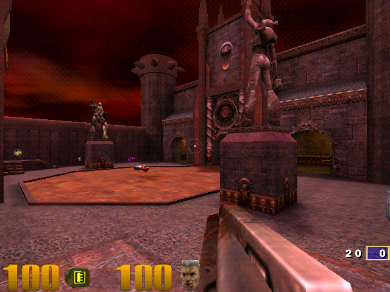</td>
<td width="50%">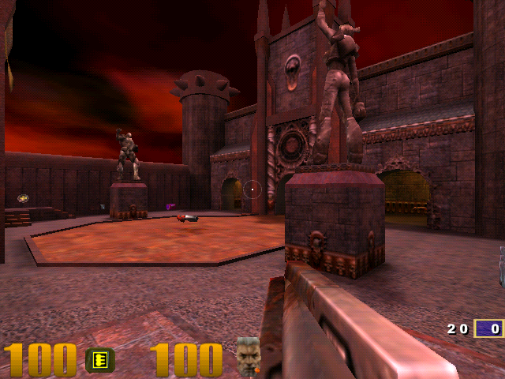</td>
</tr>
<tr>
<td><b>Quake III Arena, q3dm1 — ICD 0.1.5, 2026-07-16.</b> Our ICD over AmigaMerlin's XP display driver and <code>glide3x</code>. The "pristine" reference every later capture was diffed against.</td>
<td><b>Quake III Arena, q3dm1 — ICD 0.1.6, 2026-07-17.</b> The self-built-stack milestone: our ICD over the vintage H5 display driver built from source, with a non-clean-room <code>glide3x</code> (most likely the AmigaMerlin copy in the game folder). Mean difference from 0.1.5: 4.1/255 (animation only).</td>
</tr>
<tr>
<td>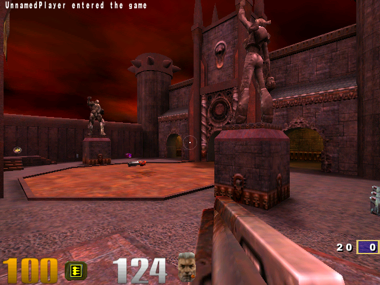</td>
<td>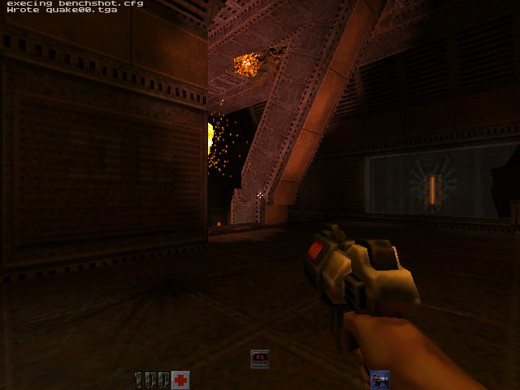</td>
</tr>
<tr>
<td><b>Quake III Arena, q3dm1 — ICD 0.1.30, 2026-07-18.</b> The "stable quality baseline" after the review round (gamma/dither defaults, alpha formats, −0.5 LOD bias), over AmigaMerlin's <code>glide3x</code> and the vintage H5 display driver.</td>
<td><b>Quake II, base1 — ICD 0.1.16, 2026-07-18.</b> The first Quake II frames on our ICD (<code>gl_driver retrogl</code>), over AmigaMerlin's <code>glide3x</code> staged next to <code>quake2.exe</code>. The two console lines at the top are the engine confirming its own capture.</td>
</tr>
</table>

Other images in `../benchmarks/` and `~/development/retro-3dfx/optimized/` look
similar but are **not** this stack: `quality_q3dm1_16bit_max.png`,
`_32bit_max.png`, `_exp32.png` and `quality_menu.png` are the vintage SGL ICD on
the Voodoo 5 5500 (`.143`); everything in `retro-3dfx/optimized/` — including
files named `…_0.1.1.png` to `…_0.1.4.png`, which use the vintage lane's own
early 0.1.x numbering — is the vintage lane; `quality_shot.png` is an unmerged
0.1.10 experiment.

---

## 15. Change history — optimizations, fixes and changes, with dates

Every change, fix, optimization and rejected experiment, with its date, the
version it shipped in, what it measurably did, and whether it is in the build
today. Compiled on 2026-09-23 from the fork histories, this repo's history,
`CHANGELOG.md`, the optimization logs, the benchmark JSONs and
`retro-3dfx/FINDINGS.md`, and every date was re-checked against its source by a
second reviewer. Measurements are Quake III `timedemo four` or Quake II
`demo1`, 16-bit; "V3" = `.124`'s Voodoo 3 (Pentium III 845 MHz), "V2" =
`.171`'s Voodoo 2 (Pentium 4 2.8 GHz).

**Status key:** ✅ in the current build · ⚙️ in the build, off by default ·
❌ rejected / reverted · ⚠️ **lost** — shipped once, in no source today ·
📝 written, not applied · 📌 historical event.

### 15.1 Timeline

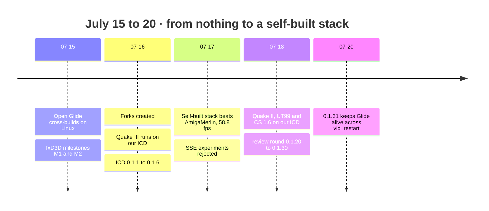

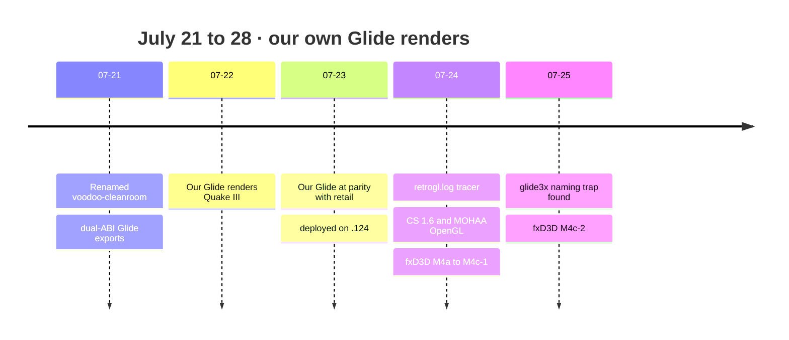

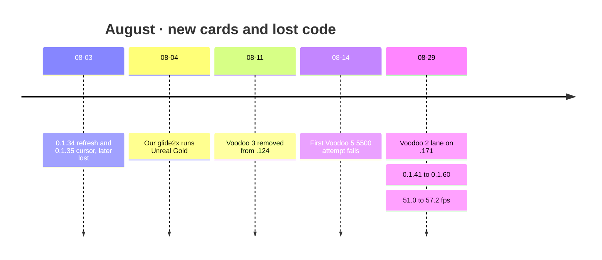

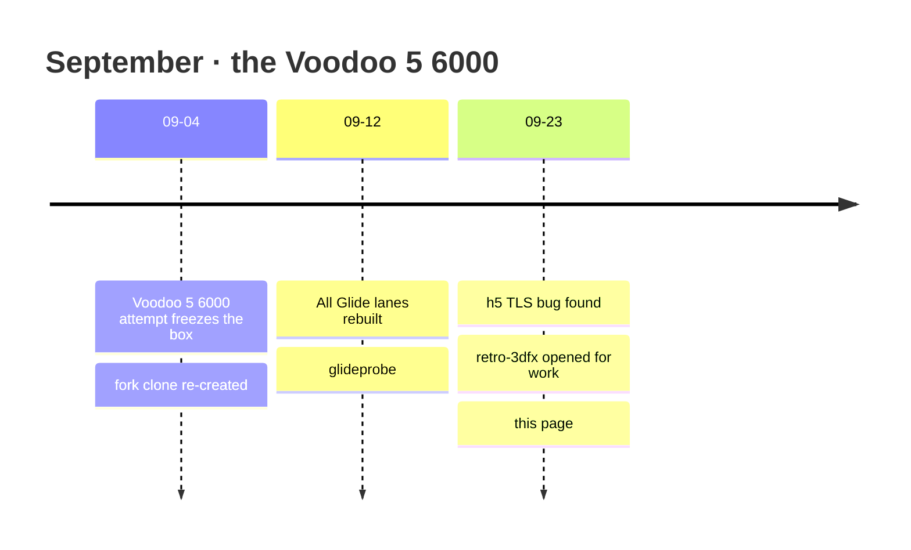

### 15.2 OpenGL ICD (MesaFX fork)

| Date | Version | Change | Kind | Measured effect | Status |
|---|---|---|---|---|---|
| 2026-07-16 | — | Forked MesaFX-6.2 at `fd191eb`; builds with mingw gcc 13 (`8da4e93`) | build | — | ✅ |
| 2026-07-16 | — | **Retail-ABI relink** (`build-mesafx-retail.sh`): the ICD binds retail `glide3x`'s `_grFoo@N` names | fix | Quake III on the V3 moves from Microsoft's software GL to hardware — first accelerated frame through our ICD | ✅ |
| 2026-07-16 | 0.1.1 | Version stamp in `GL_RENDERER`; baseline | build | Q3 53.7 / 50.4 / 38.7 fps at 640 / 800 / 1024 (hybrid, untuned) | ✅ |
| 2026-07-16 | 0.1.2 | `-march=pentium3 -mfpmath=sse`; branchless SSE colour pack `fx_pack_ub` (7 sites) | optimization | Q3 640: 53.7 → 54.2 (+0.9%); 1024 flat. **The ICD now needs SSE** | ✅ tested |
| 2026-07-16 | 0.1.3 | Batched triangles: one `grDrawVertexArrayContiguous` per buffer; 768-vertex indexed chunks | optimization | Q3 640: 57.6 → 58.1 (+0.9%, tuned env). Not a "vertex cache" — that label belongs to the vintage lane's 0.1.3 | ✅ |
| 2026-07-16 | 0.1.4 | Set swap defaults with `_putenv` before `grGlideInit` | optimization | **None** — retail Glide snapshots its environment at DLL load | ✅ (inert) |
| 2026-07-16 | 0.1.5 | Glide state shadow cache (clamp, filter, mipmap, source, colour/alpha combine) | optimization | Q3 640: 54.2 → 54.9 (+1.3%; the CHANGELOG says +0.7%) | ✅ |
| 2026-07-16 | 0.1.6 | Read `FX_GLIDE_SWAPINTERVAL` with our own C runtime, default 0 | fix | Makes the swap-interval win stick: Q3 1024 **38.7 → 51.3 (+32%)**, 640 +7%. Cause: a machine-wide `FX_GLIDE_SWAPINTERVAL=1` | ✅ |
| 2026-07-17 | 0.1.6 | 📌 "ALL-RETRO3DFX" milestone: our ICD + H5-source `glide3x` + H5-source display driver replace AmigaMerlin | milestone | Q3 **58.8** @640, **51.3** @1024 — +32.6% over the untuned hybrid at 1024, +16% over the era 3dfx ICD (44.3) | 📌 |
| 2026-07-17 | 0.1.7 | `-O3 -funroll-loops` | experiment | 58.7 vs 58.8 — nothing | ❌ |
| 2026-07-17 | 0.1.8 | SSE 4-wide clip test + `rcpps` perspective divide | experiment | **37.9 vs 58.8 (−35%)** | ❌ |
| 2026-07-17 | 0.1.9 | Same, transpose-load fixed | experiment | 38.8 @640 — still a regression | ❌ |
| 2026-07-17 | 0.1.10 | SSE `movaps` viewport emit | experiment | 58.5–58.7 vs 58.8 — nothing | ❌ |
| 2026-07-17 | 0.1.11 | Default −0.5 texture LOD bias (`FX_LOD_BIAS`) | quality | Sharper textures, no fps cost | ✅ (bug I4) |
| 2026-07-18 | 0.1.12–0.1.19 | Quake II `ref_gl` hang: diagnostic traces; pump window messages before `grSstWinOpen` | fix | Pump kept (no change on its own); a display-mode reset tried and reverted | ✅ / ❌ |
| 2026-07-18 | 0.1.16 | Quake II: stage the known-good `glide3x.dll` beside `quake2.exe` | deploy fix | Q2 640: **95.5 on our ICD vs 75.7 on the stock 3dfx MiniGL (+26%)** | 📌 |
| 2026-07-18 | 0.1.16–0.1.20 | `FX_NO_PALETTED_TEXTURE`, `FX_NO_MULTITEXTURE`, `FX_TRACE_TEX` knobs | diagnostic | — | ⚙️ |
| 2026-07-18 | 0.1.20–0.1.21 | Code review round: default gamma 1.3, forced 4×4 dither, ARGB1555 pixel formats, `wglUseFontBitmapsW`, `MESA.LOG` guard, debug output gated | quality/fix | No fps cost (Q3 58.6–59.1, Q2 95.5–96.6 @640) | ✅ (bug I3) |
| 2026-07-18 | 0.1.22 | Fix the Quake II regression the alpha formats caused: map 24/32-bit requests by board type | fix | Q2 640: 76.8 → 95.4/96.7 | ✅ |
| 2026-07-18 | 0.1.22 | UT99 on our ICD (`System\opengl32.dll`) instead of Microsoft's software GL | deploy | ~67 fps in game at 1024 vs single digits | 📌 |
| 2026-07-18 | 0.1.23–0.1.30 | Windowed Glide path (`fxwindow.c`, `FX_WINDOWED`, `FX_WINDOWED_LOG`) | feature | Fullscreen unaffected; the windowed path never completed | ⚙️ |
| 2026-07-20 | 0.1.31 | **Keep Glide initialised across context re-creation** (`vid_restart` wedge); `FX_GLIDE_SHUTDOWN=1` restores the old behaviour | fix | No regression (Q2 96.0, Q3 58.7 @640) | ✅ |
| 2026-07-21 | 0.1.31 | 📌 Stability campaign, 4 engines × 3 resolutions, zero crashes | validation | Q2 96.5/69.5/47.1 · Q3 ~58/~58/50.9 · RtCW 56.0/48.1/31.8 · UT99 35.6/24.4/23.0 | 📌 |
| 2026-07-21 | 0.1.31 | 📌 Hexen II runs on our ICD where its bundled MiniGL crashes | validation | 109.9 fps @640, 48.7 @1024 | 📌 |
| 2026-07-21 | 0.1.32 | Renderer brand `[retro3dfx 0.1.N]` → `[voodoo-cleanroom 0.1.N]` | build | — | ✅ |
| 2026-07-24 | 0.1.32 | `C:\retrogl.log` crash-safe tracer | diagnostic | Root-caused the July games bring-up | ✅ (always on, I7) |
| 2026-07-24 | 0.1.33 | `DllMain` load marker → **CS 1.6 and MOHAA OpenGL on our ICD** via a game-local `opengl32.dll` | diagnostic | `grSstWinOpen` + `wglCreateContext` succeed for `hl.exe` and `MOHAA.exe` | ✅ |
| 2026-08-03 | 0.1.34 | Fullscreen at the monitor's highest refresh instead of 60 Hz (`fxBestRefresh`) | fix | CS 1.6: 60 → 100 Hz | ⚠️ **lost** |
| 2026-08-03 | 0.1.35 | Software cursor in fullscreen Glide (`fxDrawCursorOverlay`, `FX_CURSOR`) + `FX_DUMP_FRONT` | fix | CS 1.6 menu cursor visible | ⚠️ **lost** |
| 2026-08-04 | 0.1.35 | 19 stale game-local ICD copies found and updated on `.124` | deploy | every game reports `[voodoo-cleanroom 0.1.35]` | 📌 |
| 2026-08-29 | 0.1.41 | **Voodoo 2 lane**: the ICD runs on `.171` over the stock Glide 3.03.00; `GL_SGIS_multitexture` shim (opt-in) | milestone | Q2 640: 51.0 (stock MiniGL 90.7, Intel 865G 58.8) | ✅ / ⚙️ |
| 2026-08-29 | 0.1.42 | `wglGetProcAddress` searches our table before Mesa's (glapi invents stubs for unknown names) | fix | SGIS path goes from never finishing to 30.9 fps | ✅ |
| 2026-08-29 | 0.1.44 | **Stop advertising `GL_EXT_point_parameters`** (not accelerated) | optimization | Q2 V2 640: **51.0 → 57.2 (+12.2%)**, zero variance | ✅ |
| 2026-08-29 | 0.1.52 | `-static-libgcc`; separate `-march`/`-mtune`; `grTexCombine` shadowed; `FX_PROFILE` | build/diag | Neutral (57.2); prevents a silent `LoadLibrary` failure | ✅ |
| 2026-08-29 | 0.1.52 | Five theories for the multitexture cost: TMU thrash (34.0 → 34.1), client-texture flush (32.0 → 32.9), per-vertex texcoords (31.9 → 32.3), `MESA_CODEGEN` (57.1 vs 57.2), partial texture download (ceiling +0.7%) | experiments | none explains it | ❌ |
| 2026-08-29 | 0.1.58 | Whole-frame profiler: SGIS off 17.5 ms vs on 31.2 ms; "cost is not in our driver" — **retracted in 0.1.60** | diagnostic | — | ⚙️ |
| 2026-08-29 | 0.1.60 | Ceiling tests: `r_fullbright 1` → 92.9 fps; the lightmap pass is 6.72 ms, 38% of the frame | diagnostic | Single-pass multitexture would beat the MiniGL (+62% ceiling) | 📌 |
| 2026-09-04 | 0.1.61 | Renderer re-stamp only (no code change); the fork clone was re-created the same day | build | — | ✅ |

### 15.3 Glide fork and build pipeline

| Date | Where | Change | Kind | Measured effect | Status |
|---|---|---|---|---|---|
| 2026-07-15 | `scripts/3dfx/build-glide.sh` | First cross-build of 3dfx's GPL Glide on Linux; `--add-stdcall-alias`, no `dlltool -U` | build/fix | `gfxbench.exe` loads and `grGlideInit` runs on the V3 | ✅ |
| 2026-07-15 | docs | Diagnosis: our Glide's NT path needs HWCEXT escapes the 2001 retail XP driver does not answer | diagnostic | `grGlideInit` fails in detection | 📌 |
| 2026-07-16 | fork `d378d44` | Fork created at `ee38094`; P6FENCE fix for 64-bit build hosts | build | host offset generator builds | ✅ |
| 2026-07-21 | `build-stack.sh` `15f4dad` | **Dual-ABI relink** — every Glide exports `grFoo`, `grFoo@N`, `_grFoo@N`, `_grFoo` (392 exports for glide3x) | fix | our ICD loads over our Glide (65 imports satisfied) | ✅ |
| 2026-07-22 | fork `2387787` | h3 `hwcMapBoard`: a failed escape or zero base is an error | fix | fault at `0x14717` becomes a clean error | ✅ tested |
| 2026-07-22 | fork `8b6eb5f` | h3: `GETLINEARADDR` before `ALLOCCONTEXT` | fix | base0 `0` → `0x07090000` | ✅ |
| 2026-07-22 | fork `a71eb3f` | h3: `TlsGetValue` accessor, NT lost-context fallback, `grGetString` guard | fix | **Quake III renders on our ICD over our Glide** | ✅ |
| 2026-07-23 | `build-stack.sh` `dcb71c4` | Glide built `-march=pentium3 -mfpmath=sse` | optimization | neutral (46.0 vs 46.0) | ✅ |
| 2026-07-23 | — | Same-conditions A/B: **our Glide 46.0 vs retail 46.3** (sound on) → our Glide becomes `.124`'s deployed Glide. CS 1.6 needs it: only ours exports `grAADrawTriangle@24` | milestone | parity; 66–67 fps with sound off, box quiet | 📌 |
| 2026-07-23 | — | Cull-aware triangle de-batch; MMX texture download | experiments | 67.0/67.5 vs 67.5/67.2; 27/27/28 ms both ways | ❌ |
| 2026-07-25 | — | **Naming trap**: `out/glide3x.dll` was the h5 build and hung `grGlideInit` on the V3 | diagnostic | games render again with the 787,186 B h3 build | 📌 |
| 2026-07-28 | `build-stack.sh` `906ad02` | h5 ships only as `glide3x_h5.dll`; the deploy name is always the h3 copy | fix | — | ✅ tested |
| 2026-08-04 | `build-stack.sh` `809c567` | glide2x dual-ABI relink | fix | Unreal Gold's GlideDrv binds our glide2x | ✅ |
| 2026-08-04 | fork `79ee51e` | glide2x h3 XP bring-up guards (prime, zero-base, clear `initialized`) | fix | Unreal Gold's Glide renderer ran on the V3 (then wedged under load) | ⚠️ **lost — never pushed** |
| 2026-08-14 | `31e753c` | Rootless toolchain bootstrap; h5 ports parked in `patches/h5-bringup-wip.patch` | build | — | 📝 |
| 2026-08-29 | `fe76ba4` | Voodoo 2 lanes `glide3x_cvg.dll`, `glide2x_cvg.dll`; the relink must include `pcilib` | feature | built, never deployed | ✅ tested |
| 2026-08-29 | `b15a75d` | `-static-libgcc` on every Glide relink | fix | no `libgcc_s_dw2-1.dll` import | ✅ tested |
| 2026-08-29 | `a9d8e42` | Documented: `-mfpmath=387` alone still emits SSE; `-march` must drop too | build | `glide3x_cvg` has 2,840 SSE instructions | ✅ tested |
| 2026-09-04 | — | Fork clone re-created from GitHub; whole stack rebuilt | build | — | 📌 |
| 2026-09-12 | working tree | h5 `hwcMapBoard` zero-base guard (uncommitted hand edit, compiled into the current `glide3x_h5.dll`) | fix | never run on hardware | 📝 |
| 2026-09-12 | `out/` | All Glide lanes rebuilt; `glide3x.dll` is now 855,150 B | build | not yet run on hardware | ✅ |
| 2026-09-23 | review | h5 TLS inline-asm bug (H1) and five more h5 init defects (H3–H7) | diagnostic | — | open (§16) |

### 15.4 What was lost, and why

Three changes shipped and verified on hardware are **in no source today**, only
in the CHANGELOG and — for the first two — in regression tests that copy the
logic, so those tests stay green while the fix is missing:

| Change | Shipped | Why it is gone |
|---|---|---|
| ICD 0.1.34 `fxBestRefresh` — monitor-max refresh (CS 1.6: 60 → 100 Hz) | 2026-08-03 | Never committed to the fork or to a patch; the fork clone was re-created from GitHub on 2026-09-04. `fxapi.c` passes `GR_REFRESH_60Hz` again in every build since (0.1.41 → 0.1.61) |
| ICD 0.1.35 `fxDrawCursorOverlay` + `FX_DUMP_FRONT` | 2026-08-03 | same |
| Glide fork `79ee51e` — glide2x XP bring-up guards | 2026-08-04 | Never pushed; absent from both local clones and from GitHub |

**Lesson, now a rule:** a fork change is not done until it is pushed to the
fork or captured in `patches/`; `build-stack.sh` builds whatever is checked out
and a re-clone silently drops the rest. The uncommitted h5 `hwcMapBoard` guard
is exposed to exactly this today.

### 15.5 Display driver, tooling and hardware

| Date | Change | Status |
|---|---|---|
| 2026-07-15 | fxD3D M1 (`gfxbench` harness) and M2 (D3D → Glide HAL core); DDK provisioning so a fleet box can build `fxd3ddd.dll` | ✅ |
| 2026-07-16 | `vcr-disp` escape server and BAR mapper written; first `gfxbench` sweep on the V3 (48.7–62.1 fps, on AmigaMerlin's Glide) | 📝 |
| 2026-07-16 | `benchmarks/ingest.py` + SpecPicks tracking; `deploy-3dfx-driver` skill and `updrv.exe` (vintage package installer) | ✅ |
| 2026-07-17 | `driver-bench` skill: one-command benchmark/optimize/track loop | ✅ |
| 2026-07-21 | Directory renamed `retro3dfx/` → `voodoo-cleanroom/`, `retro3dfx-disp` → `vcr-disp`; `vcr-disp-h5` stopgap created; regression suite created | ✅ |
| 2026-07-21 | `voodoo3-wfp.inf` rename package makes the vintage H5 display driver load durably under our ICD (games back: Q2 96.6, Q3 58.6 @640) | 📌 vintage enabler |
| 2026-07-23 | fxD3D M3: `fxd3ddd.dll` links against the Windows 2000 + DX7 DDK under Wine | ✅ |
| 2026-07-24 | fxD3D M4a (real DP2 stream translator, fuzz-clean), M4b (kernel Glide backend), M4c-1 (attach + escape ladder); M4d attempt #1 set the wrong registry keys and never activated | ✅ / 📌 |
| 2026-07-25 | fxD3D M4c-2: DirectDraw surfaces and present — code-complete, never on a card | ✅ |
| 2026-07-27 | `fxdbg.exe` bring-up tool | ✅ |
| 2026-07-28 | fxD3D lands in git (`906ad02`); `driver-install` skill with per-game sweep; a BSOD 0x8E traced to the vintage `3dfxv3d.dll` — the copy in `vcr-disp-h5/dist/` is still the pre-fix build | ✅ / 📌 |
| 2026-08-04 | `voodoo3-driver-dev` skill; "never edit `retro-3dfx`" policy (withdrawn 2026-09-23) | ✅ / ❌ |
| 2026-08-11 | **Voodoo 3 removed from `.124`** — the Voodoo 3 lane loses its hardware | 📌 |
| 2026-08-14 | First Voodoo 5 5500 attempt (`.143`): our ICD over retail Glide **and** the vintage ICD over our h5 Glide both fail — the two open layers fail independently on VSA-100 | 📌 |
| 2026-08-28/30 | Voodoo 2 pair fitted to `.171`, one removed two days later | 📌 |
| 2026-09-04 | **Our ICD + our h5 Glide hard-froze the Voodoo 5 6000** (then in `.191`); power cycle needed | 📌 |
| 2026-09-12 | `glideprobe`; finding that AmigaMerlin 3.1-R11's own OpenGL ICD is also MesaFX (Mesa 6.3) | ✅ |
| 2026-09-15 | Voodoo 5 6000 moved into `.124` (the benchmark campaign's host 2) | 📌 |
| 2026-09-23 | `retro-3dfx` opened for build/deploy/fix work; fxD3D `0x3DF3` escape collision found; this README rewritten from a code audit | ✅ |

### 15.6 Corrections to earlier claims

Kept here so an old number is not re-quoted:

- **"Our Glide runs at 78–94% of retail."** That compared our Glide's
  2026-07-22 sweep against reference runs taken under other conditions. The
  same-ICD, same-conditions A/B on 2026-07-23 measured **46.0 vs 46.3 fps —
  parity**.
- **"0.1.3 = vertex cache."** 0.1.3 is batched triangle submission. The vertex
  cache is the vintage lane's 3dfxopt 0.1.3.
- **The 2026-07-17 "all ours" milestone** used an H5-source `glide3x` from the
  vintage tree, not our Glide fork, which first rendered five days later.
- **0.1.5's gain** was +1.3% (54.2 → 54.9), not +0.7%.
- **Gamma/dither/alpha formats** landed around 0.1.20–0.1.22, not 0.1.30 as
  `OPTIMIZATIONS.md` says; 0.1.30 was the windowed path.

---

## 16. Known bugs and open issues

Found by code review and, where stated, confirmed on the binary. "Found" is the
date the defect was first written down.

### 16.1 Blocking the Voodoo 4/5 (h5 Glide)

| # | Defect | Where | Found | Effect |
|---|---|---|---|---|
| H1 | **`getThreadValueFast()` inline asm is broken.** With `"=a"(t)` as operand `%0`, the asm reads `fs:[eax]` from whatever is in `eax`, adds the TEB constant `0x18` where `_GlideRoot.tlsOffset` belongs, and never uses the TLS offset. Confirmed in `out/glide3x_h5.dll`: `mov %fs:(%eax),%eax; add $0x18,%eax; mov (%eax),%eax` — **365** such reads (plus 2 ordinary C-runtime `%fs` reads; the h3 build has only those 2) | `glide3x/h5/glide3/src/fxglide.h` ~2760 | 2026-09-23 (disassembly) | Every `GR_DCL_GC` reads a garbage pointer. h5's `grSstSelect` runs one **inside `grGlideInit`**, so the h5 DLL faults or wedges before any rendering. The same asm was the real cause of the Voodoo 3 crash that `a71eb3f` fixed by switching h3 to `TlsGetValue` (whose comment gives a different, wrong reason). **The prime suspect for the 2026-09-04 V5 6000 freeze** |
| H2 | The h3 fixes are not in h5: the `TlsGetValue` accessor and the `grGetString` `gc->bInfo` guard. `patches/h5-bringup-wip.patch` carries them and is **applied by nothing**; its third hunk conflicts with the uncommitted h5 `hwcMapBoard` guard | `patches/h5-bringup-wip.patch` | 2026-08-14 | As H1 |
| H3 | A failed board map is reported through the Glide error callback and init continues if that callback returns. The default callback exits the process, so today this ends the game cleanly; any application with a returning callback would continue into `hwcInitRegisters` with a zero base | `gpci.c` ~1100 | 2026-09-23 | Fault instead of a clean error, for apps with their own callback |
| H4 | `GET_SLAVE_REGS` result is not zeroed, its return is not checked, zero slave bases are accepted | `minihwc.c` ~1936 | 2026-09-23 | Multi-chip boards map garbage for chips 1–3 |
| H5 | `SLI_AA_REQUEST`'s return value is ignored and the log prints a constant `retVal=TRUE` | `minihwc.c` ~4797 | 2026-09-23 | A refused SLI/AA setup looks like success |
| H6 | `monitorEnum` probes only escapes `0x3df3` and `0xfd3`, never the XP code `0x13df3` (h3 tries all three) | `minihwc.c` ~1199 | 2026-09-23 | A driver answering only the XP code shows no board |
| H7 | `outputBpp != 32 \|\| outputBpp != 15` is always true, so `FX_GLIDE_BPP` is always reset to 0 | `gpci.c` ~1783 | 2026-09-23 | Forced 32-bpp/AA output never works |

### 16.2 Display driver

| # | Defect | Where | Found |
|---|---|---|---|
| D1 | `vcr-disp` request/response layout does not match Glide's HWCEXT structs; does not compile (missing files, mismatched names, undefined `PDEV_context`); kernel calls in a GDI DLL; no miniport; no test | `vcr-disp/` | 2026-09-23 |
| D2 | fxD3D's `FXDBG_TEX` escape is `0x3DF0+3 = 0x3DF3` — **Glide's HWCEXT code.** With `fxd3ddd` active, any Glide app's probe would draw a test quad | `scripts/3dfx/driver/nt/gbkdebug.h` | 2026-09-23 |
| D3 | `fxd3d.inf` is unusable: undecorated services section, no `InstalledDisplayDrivers`/DefaultSettings, copies files that are never built | `scripts/3dfx/driver/fxd3d.inf` | acknowledged in `chassis.c` |
| D4 | fxD3D's kernel backend, `vcr-disp`'s constants and `vcr-disp-h5`'s INF are **Voodoo 3 only**; there is no Voodoo 3 in the fleet | several | 2026-08-11 onward |

### 16.3 OpenGL ICD

| # | Defect | Where | Effect |
|---|---|---|---|
| I1 | **Refresh is hard-coded to 60 Hz**, and the 0.1.34 fix (monitor-max refresh) and 0.1.35 software cursor **exist in no source** — only in the CHANGELOG and in their tests | `fxapi.c` ~342 | Every fullscreen game runs at 60 Hz |
| I2 | No `texture_env_combine` on the Voodoo 3 (h3 Glide has no COMBINE extension and nobody implemented it) | `fxdd.c` | Lightmap/overbright games (Quake III overbright, SoF, JK2) render dark (REVIEW-FINDINGS C2) |
| I3 | The ARGB1555 pixel formats (3–4) are picked for alpha requests, but a Voodoo 3 can only open RGB565, so context creation fails later | `fxwgl.c`, `fxapi.c` ~709 | The "alpha PFD" compat fix moved the failure instead of removing it |
| I4 | Default LOD bias −0.5 is re-applied on every single-TMU setup (overwriting a bias the app set) and **not** applied on the two-TMU path | `fxsetup.c` | Inconsistent sharpness between single- and multi-texture passes |
| I5 | The `grTexCombine` shadow (0.1.52) can go stale on Voodoo 4/5, where `grTex*CombineExt` writes the same registers without updating it | `fxsetup.h` ~665 | A later identical combine call can be skipped wrongly |
| I6 | Windowed path: a later init failure calls `grSstWinClose` instead of `fxWinClose` (leaks DirectDraw); back buffer always 565; swap interval ignored | `fxapi.c` ~909, `fxwindow.c` | Only when `FX_WINDOWED` is set |
| I7 | `C:\retrogl.log` is always on, with no switch | `fxrlog.h` | A write to `C:\` on every event |
| I8 | `getenv` on every call in the SGIS shim and in `TexImage2D` (`FX_TRACE_TEX`) | `fxwgl.c`, `fxddtex.c` | Small per-call cost |
| I9 | The patch puts `fxp_*` counters into core Mesa (`tnl/t_vtx_api.c`), so a non-FX build no longer links; the Makefile default `CPU=pentium` contradicts `-mfpmath=sse` | patch, `Makefile.mgw` | Build hygiene |
| I10 | The window procedure is restored from `WindowFromDC` of a possibly stale HDC | `fxwgl.c` ~457 | REVIEW-FINDINGS B3/B4, not done |

### 16.4 Tooling and documentation

| # | Defect | Where |
|---|---|---|
| T1 | `driver-bench` parses the version with `\[retro3dfx ([0-9.]+)\]`; current builds stamp `[voodoo-cleanroom …]`, so runs record `driver_version=unknown` | `.claude/skills/driver-bench/run_bench.py:875`, `benchmarks/ingest.py` |
| T2 | `game_sweep.py` looks for the ICD and Glide in paths that no longer exist | `.claude/skills/driver-install/game_sweep.py:65-70` |
| T3 | `build-stack.sh` never fetches, builds uncommitted edits, does not `make clean` the ICD, and labels the glide2x h3 build "(Napalm)" | `build-stack.sh` |
| T4 | `v56k_bench.py` treats our `glide3x_h5.dll` as dangerous (refuses unless `--allow-open-glide`) — correct until H1 is fixed | `../scripts/benchmarks/v56k_bench.py` |
| T5 | Commit `79ee51e` cited by the CHANGELOG for the glide2x bring-up is not in the fork on GitHub | CHANGELOG |
| T6 | Several docs still describe `.124` as a Voodoo 3 (see the index in §20) | various |

---

## 17. Roadmap

### 17.1 Voodoo 5 6000 bring-up (after the AmigaMerlin campaign on `.124`)

`.124` is the reference box for the AmigaMerlin benchmark campaign, so nothing
here runs until that campaign's matrix is done or the user frees the box. Each
gate uses the least risky change first, and every attempt runs with the
flight recorders armed (`glideprobe` log, `v56k_diag.py ring` and `quiet`), so a
hang names its call instead of costing a blind power cycle.

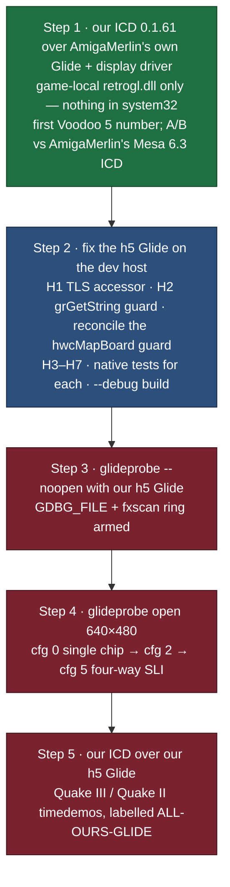

Step 1 is also the cheapest experiment on the V5 6000 lock-ups: if the stalls
follow AmigaMerlin's Glide with our ICD on top, the fault is below the ICD.

### 17.2 Voodoo 2 (`.171`)

1. Deploy our `glide3x_cvg.dll` (`deploy171.py --glide`) and A/B it against the
   stock Glide 3.03.00 — the first fully-ours 3D path on any box.
2. The remaining gap to the MiniGL (57.2 vs 90.7) is the lightmap pass. The
   `SGIS_multitexture` path costs more than it saves (57.2 → 32.0), and 0.1.58
   showed that cost is not in our driver; the next suspect is Glide itself,
   which step 1 lets us measure.

### 17.3 ICD

1. Restore 0.1.34/0.1.35 (monitor-max refresh, software cursor) from the logic
   their tests still carry.
2. Fix I3 (alpha formats on Voodoo 3), I4 (LOD bias on both TMU paths), I5, I7
   (make `C:\retrogl.log` switchable).
3. Add tests for the fixes listed at the end of §12.
4. `texture_env_combine` on the Voodoo 3 (I2), if a Voodoo 3 returns to the fleet.

### 17.4 Display driver

1. Decide between fxD3D and `vcr-disp` — fxD3D is far ahead; `vcr-disp` could
   reuse its GDI chassis.
2. Fix D2 (move the `fxdbg` escapes out of `0x3DF0..0x3DF3`) and D3 (a real
   Display INF).
3. An H5 (VSA-100) backend for the kernel Glide, so M4d has hardware to run on.

### 17.5 Tooling

Fix T1 (`driver-bench` version regex) and T2 (`game_sweep.py` paths) before the
next benchmark or deploy of this stack.

---

## 18. Telling the stacks apart

| | **This stack** — clean-room MesaFX | **Vintage lane** — `retro-3dfx` SGL |
|---|---|---|
| Origin | Mesa 6.2.2 (Brian Paul, MIT) + 3dfx GPL Glide | 3dfx's leaked/released H5 source; SGI 1991–97 OpenGL |
| ICD files | `src/mesa/drivers/glide/fx*.c` | `SST_*.c`, `sst_export.c`, `__glSST*` |
| Build | mingw gcc 13 on Linux | Wine + MSVC / Windows 2000 DDK |
| ICD size / version | ~2.7 MB / **0.1.x** | ~704 KB / **0.2.x and up** |
| Renderer string | `Mesa Glide v0.62 … [voodoo-cleanroom 0.1.N]` (older: `[retro3dfx 0.1.N]`) | `3Dfx … [retro3dfx 0.x]` |
| Display driver | fxD3D / vcr-disp (unfinished); borrows H5 or AmigaMerlin | its own H5 display driver + D3D HAL + miniport |
| Tests | `../tests/` | `retro-3dfx/tests/` (`predeploy.sh`, `d3dlab` goldens) |

**AmigaMerlin** (3.1-R11 on `.124`) is a third, retail driver — the stable
yardstick both lanes are measured against. Its own OpenGL ICD reports
`Mesa Glide v0.63` (Mesa 6.3); ours reports `v0.62`.

---

## 19. Provenance and licenses

| Our repository | Upstream | Fork point | License |
|---|---|---|---|
| [voidsstr/retro3dfx-gl](https://github.com/voidsstr/retro3dfx-gl) | [sezero/MesaFX-6.2](https://github.com/sezero/MesaFX-6.2) | `fd191eb` (2023-02-02) | MIT / Mesa |
| [voidsstr/retro3dfx-glide](https://github.com/voidsstr/retro3dfx-glide) | [sezero/glide](https://github.com/sezero/glide) | `ee38094` | 3dfx Glide Source Code General Public License (the 2000 open release) |
| `vcr-disp/`, `../scripts/3dfx/` | — | — | our original code, modelled on Device3Dfx, RISCyVoodoo and vmdisp9x |
| `vcr-disp-h5/dist/` | 3dfx H5 driver source (vintage lane) | — | **not clean-room** — a borrowed stopgap |

Both upstream licenses allow redistribution; the forks keep the upstream
license files. Details: [`FORKS.md`](FORKS.md).

---

## 20. Document index

| Document | Covers | Current? |
|---|---|---|
| [`CHANGELOG.md`](CHANGELOG.md) | ICD 0.1.1 → 0.1.60, with measurements | yes (0.1.34/0.1.35 entries describe lost code) |
| [`OPTIMIZATIONS-VOODOO2.md`](OPTIMIZATIONS-VOODOO2.md) | Voodoo 2 lane on `.171` | **yes — most current** |
| [`OPTIMIZATIONS.md`](OPTIMIZATIONS.md) | Voodoo 3 lane on `.124` | historical (card gone) |
| [`OPTIMIZATION-RESEARCH.md`](OPTIMIZATION-RESEARCH.md) | Research behind the optimizations | historical |
| [`REVIEW-FINDINGS.md`](REVIEW-FINDINGS.md) | ICD code review | partly done (§16) |
| [`DEBUGGING-NOTES.md`](DEBUGGING-NOTES.md) | ICD + Glide bring-up trail | historical, still the best narrative |
| [`RUNNING-GAMES.md`](RUNNING-GAMES.md) | First per-game recipes | historical (2026-07-16) |
| [`TOOLCHAIN-BOOTSTRAP.md`](TOOLCHAIN-BOOTSTRAP.md) | Rootless mingw toolchain | yes |
| [`FORKS.md`](FORKS.md) | Fork provenance | yes |
| [`vcr-disp/README.md`](vcr-disp/README.md), [`vcr-disp-h5/README.md`](vcr-disp-h5/README.md) | Pointers into §7 | yes |
| [`../scripts/3dfx/README.md`](../scripts/3dfx/README.md) | fxD3D build and test | partly stale (says `.124` = Voodoo 3) |
| [`../docs/3dfx-d3d-hal-design.md`](../docs/3dfx-d3d-hal-design.md), [`../docs/3dfx-gbkernel-design.md`](../docs/3dfx-gbkernel-design.md) | fxD3D design | design current; hardware targets stale |
| [`../docs/3dfx-glide-hardware-init.md`](../docs/3dfx-glide-hardware-init.md) | Why our Glide could not init on the 2001 retail driver (July) | historical |
| [`../docs/game-render-modes.md`](../docs/game-render-modes.md) | Game × renderer matrix on the Voodoo 3 | historical |
| `~/development/retro-3dfx/FINDINGS.md` | The running findings log for both lanes | yes |
| `~/development/retro-3dfx/DRIVER-STACK-ASSESSMENT.md` | Our stack vs AmigaMerlin vs vintage (2026-08-14) | yes |
